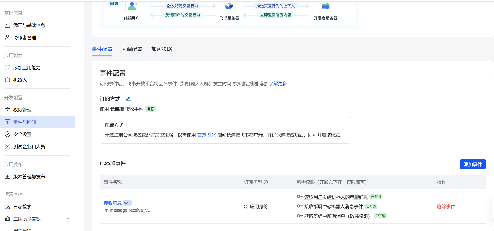
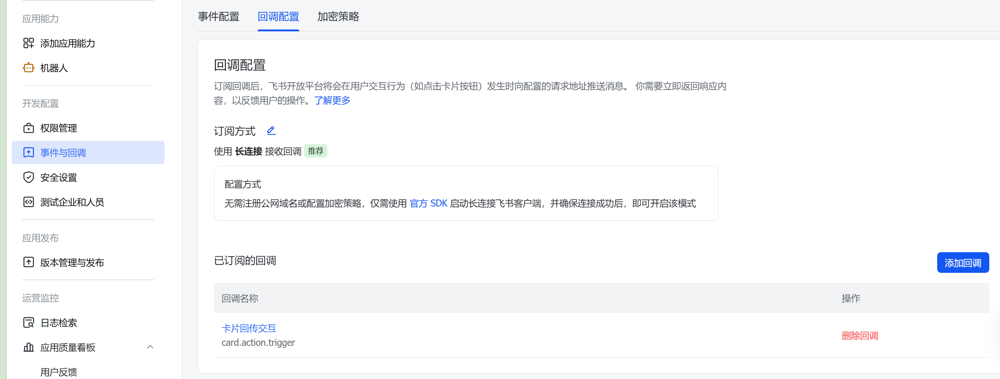

# INSTALL

`openrelay` 的安装与最小启动流程。默认所有命令都在仓库根目录执行。

## 1. 安装依赖

只运行服务时：

```bash
uv sync
```

需要本地测试或开发时再安装额外依赖：

```bash
uv sync --extra dev
```

## 2. 复制环境变量

```bash
cp .env.example .env
```

`.env.example` 现在只保留代码真实读取的配置项。

硬必需只有两个：

```env
FEISHU_APP_ID=cli_xxx
FEISHU_APP_SECRET=xxx
```

常见但非必需的补充项：

```env
WORKSPACE_ROOT=~
WORKSPACE_DEFAULT_DIR=~/Projects
MAIN_WORKSPACE_DIR=~/Projects
DEVELOP_WORKSPACE_DIR=~/Projects

DEFAULT_BACKEND=codex
DEFAULT_SAFETY_MODE=danger-full-access # workspace-write需要单独做一个审批卡片 目前已加入开发计划
CODEX_CLI_PATH=codex
```

说明：

- `PORT` 默认是 `3000`
- `DATA_DIR` 默认是 `./data`
- `FEISHU_BOT_OPEN_ID` 不是硬必需，启动时会尝试自动解析

## 3. 启动服务

```bash
uv run openrelayd
```

默认以飞书长连接模式工作，此时 `openrelay` 只绑定 `127.0.0.1`。

## 4. 检查健康状态

```bash
curl http://127.0.0.1:3000/health
```

## 5. 接入飞书

在飞书开放平台开启长连接接收后，`openrelay` 就可以作为你本机 Codex 的远程对话入口使用。

### 事件回调

事件订阅与回调界面可参考下面两张配置截图：





### Bot 权限

当前飞书端 bot 权限配置如下：

```json
{
  "scopes": {
    "tenant": [
      "aily:message:read",
      "aily:message:write",
      "application:application.app_message_stats.overview:readonly",
      "application:application.contacts_range:write",
      "block:message",
      "cardkit:card:read",
      "cardkit:card:write",
      "contact:contact",
      "contact:contact.base:readonly",
      "contact:contact:update_department_id",
      "contact:contact:update_user_id",
      "contact:department.base:readonly",
      "contact:department.hrbp:readonly",
      "contact:department.organize:readonly",
      "contact:functional_role",
      "contact:functional_role:readonly",
      "contact:group",
      "contact:group:readonly",
      "contact:job_family",
      "contact:job_family:readonly",
      "contact:job_level",
      "contact:job_level:readonly",
      "contact:job_title:readonly",
      "contact:role:readonly",
      "contact:unit",
      "contact:unit:readonly",
      "contact:user.assign_info:read",
      "contact:user.base:readonly",
      "contact:user.department:readonly",
      "contact:user.dotted_line_leader_info.read",
      "contact:user.email:readonly",
      "contact:user.employee:readonly",
      "contact:user.employee_id:readonly",
      "contact:user.employee_number:read",
      "contact:user.gender:readonly",
      "contact:user.id:readonly",
      "contact:user.job_family:readonly",
      "contact:user.job_level:readonly",
      "contact:user.phone:readonly",
      "contact:user.subscription_ids:write",
      "contact:user.user_geo",
      "contact:work_city:readonly",
      "corehr:offboarding.checklist_status_message:read",
      "corehr:offboarding.status_message_v2:read",
      "corehr:offboarding.update_field_message:read",
      "corehr:person.emergency_contact:read",
      "corehr:person.emergency_contact:write",
      "im:app_feed_card:write",
      "im:biz_entity_tag_relation:read",
      "im:biz_entity_tag_relation:write",
      "im:chat",
      "im:chat.access_event.bot_p2p_chat:read",
      "im:chat.announcement:read",
      "im:chat.announcement:write_only",
      "im:chat.chat_pins:read",
      "im:chat.chat_pins:write_only",
      "im:chat.collab_plugins:read",
      "im:chat.collab_plugins:write_only",
      "im:chat.managers:write_only",
      "im:chat.members:bot_access",
      "im:chat.members:read",
      "im:chat.members:write_only",
      "im:chat.menu_tree:read",
      "im:chat.menu_tree:write_only",
      "im:chat.moderation:read",
      "im:chat.tabs:read",
      "im:chat.tabs:write_only",
      "im:chat.top_notice:write_only",
      "im:chat.widgets:read",
      "im:chat.widgets:write_only",
      "im:chat:create",
      "im:chat:delete",
      "im:chat:moderation:write_only",
      "im:chat:operate_as_owner",
      "im:chat:read",
      "im:chat:readonly",
      "im:chat:update",
      "im:datasync.feed_card.time_sensitive:write",
      "im:message",
      "im:message.group_at_msg:readonly",
      "im:message.group_msg",
      "im:message.p2p_msg:readonly",
      "im:message.pins:read",
      "im:message.pins:write_only",
      "im:message.reactions:read",
      "im:message.reactions:write_only",
      "im:message.urgent",
      "im:message.urgent.status:write",
      "im:message.urgent:phone",
      "im:message.urgent:sms",
      "im:message:readonly",
      "im:message:recall",
      "im:message:send_as_bot",
      "im:message:send_multi_depts",
      "im:message:send_multi_users",
      "im:message:send_sys_msg",
      "im:message:update",
      "im:resource",
      "im:tag:read",
      "im:tag:write",
      "im:url_preview.update",
      "im:user_agent:read",
      "mail:user_mailbox.mail_contact.mail_address:read",
      "mail:user_mailbox.mail_contact.phone:read",
      "mail:user_mailbox.mail_contact:read",
      "mail:user_mailbox.mail_contact:write",
      "mail:user_mailbox.message.address:read",
      "mail:user_mailbox.message.body:read",
      "mail:user_mailbox.message.subject:read",
      "mail:user_mailbox.message:readonly"
    ],
    "user": []
  }
}
```
