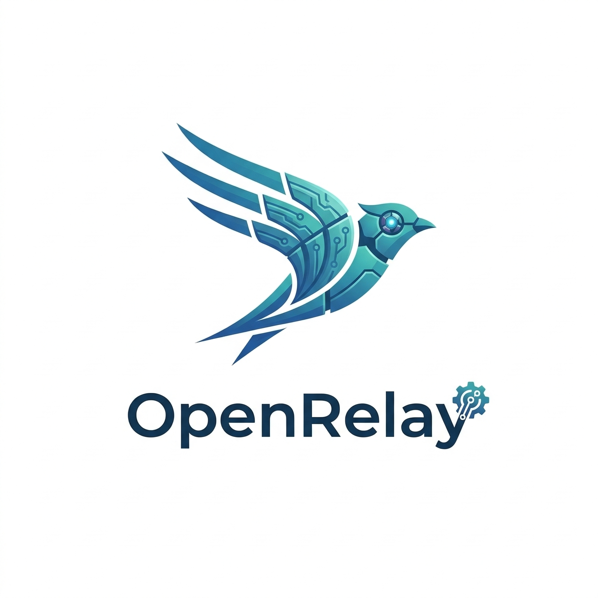

<div align="center">
  

# openrelay

### Your coding agent, relayed into Feishu.

Remote control `Codex` from Feishu with real session continuity, thread-aware follow-ups, workspace switching, and streaming replies that feel like a real terminal instead of a toy bot.

<p>
  
  
  
  
</p>
</div>

## Why this exists

Most “chat to code” bots break the moment the task becomes real:

- they lose session state
- they hide the agent runtime behind fake chat abstractions
- they can't switch workspaces cleanly
- they make long-running work unreadable inside messaging apps

`openrelay` takes the opposite path.

It turns Feishu into a serious remote cockpit for local coding-agent sessions:

- resume real backend threads instead of replaying prompts
- keep session scope stable across Feishu threads
- switch between `main` and `develop` workspaces on demand
- stream progress and final answers back into Feishu cards
- keep the runtime backend-neutral so the product is not welded to one provider forever

Today, the main production path is `Codex app-server`. A minimal `Claude` adapter is already wired into the same runtime shape for future expansion.

## What makes it feel different

### 1. Real session continuity
`/resume` binds Feishu back to native backend sessions. `openrelay` does not pretend a fresh prompt is the same thing as continuing a real agent thread.

### 2. Thread-first remote workflow
In Feishu, you can stay inside a thread, send follow-ups while a run is still active, stop the current run, and keep the task moving without dropping context.

### 3. Workspace-aware execution
Use `/main`, `/stable`, `/develop`, `/cwd`, and directory shortcuts to move the agent between working trees without turning session state into spaghetti.

### 4. Backend-neutral runtime core
Feishu transport, runtime orchestration, agent runtime semantics, backend adapters, and persistence are separated cleanly. That means the product can evolve without rewriting everything around one CLI.

### 5. Built for actual long tasks
Streaming, typing, session locking, follow-up merging, command routing, and local state persistence are all first-class parts of the design.

## What you get

- Feishu webhook mode and WebSocket mode
- streaming card replies with final answer convergence
- session panel for sessions, directories, commands, and status
- session binding between relay sessions and native backend sessions
- image message forwarding into the coding-agent input pipeline
- local SQLite state for sessions, aliases, dedup, shortcuts, and bindings
- health endpoint at `/health`

## Architecture in one screen

`openrelay` is structured around five layers:

1. `feishu/` - platform ingress, cards, typing, streaming
2. `runtime/` - command routing, session orchestration, execution flow
3. `agent_runtime/` - backend-neutral turn, event, approval, transcript semantics
4. `backends/` - provider adapters such as Codex and Claude
5. `storage/` + `session/` - SQLite state and relay-to-backend bindings

If you want the full breakdown, see `docs/architecture.md`.

## Quick start

### 1. Install dependencies

```bash
uv sync --extra dev
```

### 2. Create your env file

```bash
cp .env.example .env
```

Start with these fields:

```env
PORT=3000
DATA_DIR=./data
WORKSPACE_DIR=/absolute/path/to/your/workspace
MAIN_WORKSPACE_DIR=/absolute/path/to/main/worktree
DEVELOP_WORKSPACE_DIR=/absolute/path/to/develop/worktree

FEISHU_APP_ID=cli_xxx
FEISHU_APP_SECRET=xxx
FEISHU_CONNECTION_MODE=websocket
FEISHU_BOT_OPEN_ID=ou_xxx
FEISHU_STREAM_MODE=card

MODEL_BACKEND=codex-cli
CODEX_CLI_PATH=codex
CODEX_SANDBOX=workspace-write
CODEX_SESSIONS_DIR=~/.codex/sessions
```

Notes:

- `websocket` mode is the default and keeps `openrelay` bound to `127.0.0.1`
- webhook mode registers `WEBHOOK_PATH` and listens on `0.0.0.0`
- `CODEX_SQLITE_HOME` can isolate relay-driven Codex state from your normal interactive Codex home
- `FEISHU_ALLOWED_OPEN_IDS` and `FEISHU_ADMIN_OPEN_IDS` provide an app-side permission layer

### 3. Run the server

```bash
uv run openrelayd
```

### 4. Check health

```bash
curl http://127.0.0.1:3000/health
```

### 5. Connect Feishu

- If `FEISHU_CONNECTION_MODE=websocket`, enable long-connection delivery in Feishu and no webhook URL is needed.
- If `FEISHU_CONNECTION_MODE=webhook`, point Feishu to:

```text
http://your-host:3000/feishu/webhook
```

## Command surface

### Session and navigation
- `/panel [sessions|directories|commands|status]`
- `/resume [latest|thread_id|local_session_id]`
- `/compact [thread_id|local_session_id]`
- `/status`
- `/help`

### Workspace control
- `/main [reason]`
- `/stable [reason]`
- `/develop [reason]`
- `/cwd [path]`
- `/cd [path]`
- `/shortcut list|add|remove|cd`

### Runtime control
- `/stop`
- `/clear`
- `/model [name|default]`
- `/sandbox [read-only|workspace-write|danger-full-access]`
- `/backend [list|name]`
- `/ping`
- `/restart` (admin only)

## The intended workflow

1. Open Feishu and start from `/panel` or a direct task message.
2. Let `openrelay` bind the current scope to a backend session.
3. Continue in-thread for follow-ups instead of re-explaining the task.
4. Use `/resume` when you need to jump back into an older native agent thread.
5. Use `/main`, `/develop`, or `/cwd` when the execution surface needs to move.

This is the key idea: Feishu is the control surface, but the backend session remains real.

## Current backend status

### Codex
- first-class path
- connects through `codex app-server`
- native session reuse is part of the primary product flow

### Claude
- adapter exists
- currently minimal and not feature-parity with Codex yet

## Local development

```bash
uv run pytest
```

Useful files:

- `src/openrelay/server.py`
- `src/openrelay/runtime/orchestrator.py`
- `src/openrelay/agent_runtime/service.py`
- `src/openrelay/backends/codex_adapter/`
- `docs/architecture.md`

## Why people may care

Because remote coding from chat only becomes useful when it preserves the things that matter:

- session identity
- execution locality
- follow-up continuity
- readable streaming output
- explicit workspace boundaries

That is the bet behind `openrelay`.

If you want your coding agent to survive real work instead of demo prompts, this repo is for you.
