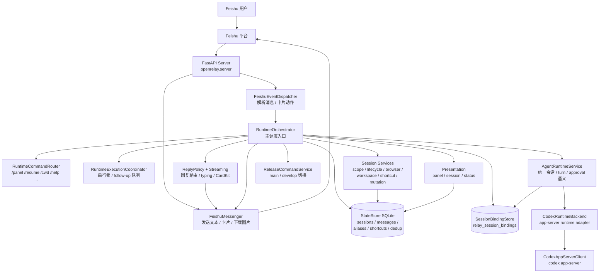
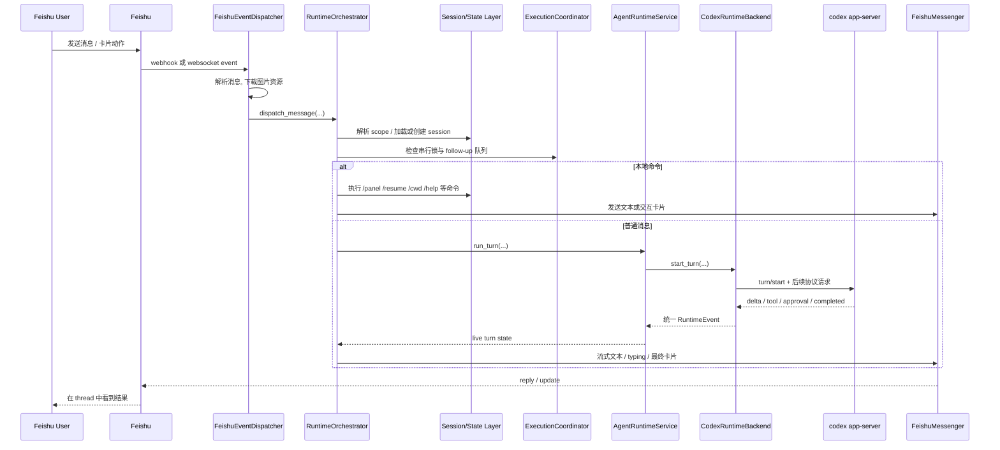

# openrelay 架构图

更新时间：2026-03-16

本文按当前仓库实现整理 `openrelay` 的运行时结构。重点不是历史设计目标，而是代码里已经存在的主路径、分层和依赖关系。

## 总览

## 主路径

## 当前分层说明

- `server` 层负责启动 `FastAPI`、装配 `StateStore`、`FeishuMessenger`、`RuntimeOrchestrator`，并根据 `FEISHU_CONNECTION_MODE` 决定走 webhook 还是 websocket。
- `feishu` 层负责外部平台适配：事件解析、消息资源下载、文本与交互卡片发送，不承载 runtime 语义。
- `runtime` 层是主调度中枢，负责命令分流、执行串行化、follow-up 合并、回复策略、流式状态和重启/帮助/panel 等产品行为。
- `session` + `storage` 层负责本地状态：session 指针、消息摘要、scope alias、目录快捷方式，以及 relay session 到 backend native session 的绑定关系。
- `agent_runtime` 层把 provider-specific 协议收敛成统一的 session / turn / approval 语义；当前内置实现是 `CodexRuntimeBackend`。
- `backends` 层现在主要承担 provider transport / adapter 职责；当前默认执行路径已经统一收敛到 `CodexRuntimeBackend -> CodexAppServerClient`。
- `presentation` 层只负责把 session、panel、status 等状态投影成 Feishu 卡片或文本，不直接理解底层 provider 协议。

## 关键目录

- `src/openrelay/server.py`：应用装配与进程入口
- `src/openrelay/feishu/`：Feishu 接入、消息解析、发送与流式卡片
- `src/openrelay/runtime/`：主调度、命令路由、执行协调、回复策略
- `src/openrelay/session/`：session scope、workspace、resume、binding
- `src/openrelay/storage/`：SQLite 状态存储
- `src/openrelay/agent_runtime/`：统一 runtime 事件、模型、reducer、service
- `src/openrelay/backends/`：provider adapter 与 `codex app-server` 客户端
- `src/openrelay/presentation/`：Feishu 面板与状态展示

## 当前结构特征

- 对外产品入口已经统一成 `Feishu -> RuntimeOrchestrator`。
- 对内 provider 接入已经以 `agent runtime` 为唯一主路径收敛。
- 持久化分成两类：
  - `StateStore` 保存本地产品状态与轻量上下文。
  - `SessionBindingStore` 保存 relay session 与 backend native session 的绑定。
- 回复链路和执行链路已明确分离：
  - 执行侧处理 session、turn、approval、串行化。
  - 回复侧处理 thread 路由、typing、CardKit streaming 和最终消息落点。
