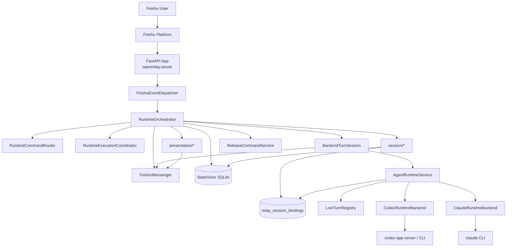
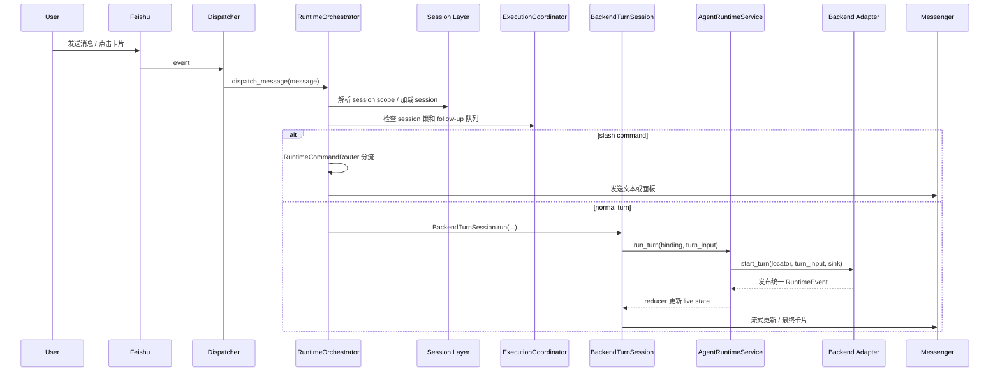

# openrelay Architecture

更新时间：2026-03-16

本文按当前仓库实现重写，描述 `openrelay` 现在真实存在的系统结构，而不是历史方案或未落地设计。

## 1. 系统定位

`openrelay` 是一个把 Feishu 对话壳层接到远程 coding agent runtime 的服务。

当前系统的目标不是实现“某个单独 backend 的 webhook 转发器”，而是提供一条稳定主路径：

- Feishu 负责用户入口、消息承载和交互卡片
- runtime 负责会话调度、命令分流、串行执行和回复策略
- agent runtime 负责统一 backend-neutral 的会话 / turn / approval / tool / completion 语义
- backend adapter 负责把具体 provider 协议翻译为统一 runtime event
- storage 负责本地产品状态和 relay-to-backend 会话绑定

当前默认 backend 仍然是 `codex`，`claude` 已以同构 adapter 形式接入，但能力仍是最小实现。

## 2. 顶层结构

## 3. 启动与装配

应用入口是 [`src/openrelay/server.py`](/home/Shaokun.Tang/Projects/openrelay/src/openrelay/server.py)。

启动时完成以下装配：

- 加载 `AppConfig`
- 创建 `StateStore`
- 创建 `FeishuMessenger`
- 创建 `RuntimeOrchestrator`
- 创建 `FeishuEventDispatcher`
- 根据 `FEISHU_CONNECTION_MODE` 选择 webhook 或 websocket 接入方式

`RuntimeOrchestrator` 是系统主装配点，位于 [`src/openrelay/runtime/orchestrator.py`](/home/Shaokun.Tang/Projects/openrelay/src/openrelay/runtime/orchestrator.py)。

它在构造时会进一步装配：

- session 相关服务：`SessionBrowser`、`SessionLifecycleResolver`、`SessionScopeResolver`、`SessionWorkspaceService`、`SessionShortcutService`、`SessionMutationService`
- runtime 行为服务：`RuntimeCommandRouter`、`RuntimeExecutionCoordinator`、`RuntimeReplyPolicy`、`RuntimeHelpService`、`RuntimePanelService`、`RuntimeRestartController`
- presentation：`SessionPresentation`、`RuntimeStatusPresenter`、`RuntimePanelPresenter`、`LiveTurnPresenter`
- backend 运行时：`SessionBindingStore`、`AgentRuntimeService`、各 backend adapter

也就是说，`server` 只负责应用进程和协议入口，真正的产品行为都由 `RuntimeOrchestrator` 接管。

## 4. 分层与职责

### 4.1 `feishu/`

`feishu` 层只负责平台接入，不负责 runtime 语义。

主要职责：

- 解析 Feishu webhook / websocket event
- 把消息、图片、卡片动作转成 `IncomingMessage`
- 发送文本、图片、交互卡片
- 提供 typing 和 streaming 卡片更新能力

关键文件：

- [`src/openrelay/feishu/dispatcher.py`](/home/Shaokun.Tang/Projects/openrelay/src/openrelay/feishu/dispatcher.py)
- [`src/openrelay/feishu/messenger.py`](/home/Shaokun.Tang/Projects/openrelay/src/openrelay/feishu/messenger.py)
- [`src/openrelay/feishu/streaming.py`](/home/Shaokun.Tang/Projects/openrelay/src/openrelay/feishu/streaming.py)
- [`src/openrelay/feishu/reply_card.py`](/home/Shaokun.Tang/Projects/openrelay/src/openrelay/feishu/reply_card.py)

### 4.2 `runtime/`

`runtime` 层是主调度中枢。

它不直接理解 provider 的底层协议，而是负责把 Feishu 输入收敛为产品行为：

- 判断是否为本地命令还是普通消息
- 根据 session scope 解析会话归属
- 用串行锁保护每个 session 的运行
- 在 active run 期间接收 follow-up 或审批回复
- 把 runtime live state 投影为 Feishu streaming / final reply

关键文件：

- [`src/openrelay/runtime/orchestrator.py`](/home/Shaokun.Tang/Projects/openrelay/src/openrelay/runtime/orchestrator.py)
- [`src/openrelay/runtime/commands.py`](/home/Shaokun.Tang/Projects/openrelay/src/openrelay/runtime/commands.py)
- [`src/openrelay/runtime/execution.py`](/home/Shaokun.Tang/Projects/openrelay/src/openrelay/runtime/execution.py)
- [`src/openrelay/runtime/turn.py`](/home/Shaokun.Tang/Projects/openrelay/src/openrelay/runtime/turn.py)
- [`src/openrelay/runtime/interactions/controller.py`](/home/Shaokun.Tang/Projects/openrelay/src/openrelay/runtime/interactions/controller.py)

### 4.3 `agent_runtime/`

`agent_runtime` 层是当前架构收敛后的核心抽象。

它定义统一运行时语义：

- session locator / summary / transcript
- turn input
- runtime event
- approval request / decision
- live turn state
- reducer 和 event hub

这一层把 backend-specific 协议隔离在 adapter 后面，让上层只消费统一事件和状态。

关键文件：

- [`src/openrelay/agent_runtime/models.py`](/home/Shaokun.Tang/Projects/openrelay/src/openrelay/agent_runtime/models.py)
- [`src/openrelay/agent_runtime/events.py`](/home/Shaokun.Tang/Projects/openrelay/src/openrelay/agent_runtime/events.py)
- [`src/openrelay/agent_runtime/reducer.py`](/home/Shaokun.Tang/Projects/openrelay/src/openrelay/agent_runtime/reducer.py)
- [`src/openrelay/agent_runtime/service.py`](/home/Shaokun.Tang/Projects/openrelay/src/openrelay/agent_runtime/service.py)

### 4.4 `backends/`

`backends` 层只承担 adapter 和 transport 责任。

当前内置 backend：

- `codex`
    - 描述位于 [`src/openrelay/backends/registry.py`](/home/Shaokun.Tang/Projects/openrelay/src/openrelay/backends/registry.py)
    - adapter 位于 [`src/openrelay/backends/codex_adapter/backend.py`](/home/Shaokun.Tang/Projects/openrelay/src/openrelay/backends/codex_adapter/backend.py)
    - 通过 `CodexSessionClient + CodexRpcTransport + CodexProtocolMapper` 接到 `codex app-server`
- `claude`
    - adapter 位于 [`src/openrelay/backends/claude_adapter/backend.py`](/home/Shaokun.Tang/Projects/openrelay/src/openrelay/backends/claude_adapter/backend.py)
    - 当前通过 `ClaudeSessionClient + ClaudeCliTransport + ClaudeResponseMapper` 接到 CLI
    - 能力集仍然最小，更多是同构接口占位，而不是完整 parity

backend 只需要实现 `AgentBackend` 协议，不允许把 provider method / item type 上浮到 runtime 主层。

### 4.5 `session/` 与 `storage/`

这两层负责本地产品状态。

`storage.StateStore` 提供 SQLite 持久化，保存：

- `sessions`
- `session_pointers`
- `messages`
- `dedup`
- `session_key_aliases`
- `directory_shortcuts`

`session.SessionBindingStore` 额外维护：

- `relay_session_bindings`

这个表把 relay session 和 backend native session 绑定起来，使 Feishu 侧会话与 provider 原生会话能持续对应。

关键文件：

- [`src/openrelay/storage/state.py`](/home/Shaokun.Tang/Projects/openrelay/src/openrelay/storage/state.py)
- [`src/openrelay/session/store.py`](/home/Shaokun.Tang/Projects/openrelay/src/openrelay/session/store.py)
- [`src/openrelay/session/lifecycle.py`](/home/Shaokun.Tang/Projects/openrelay/src/openrelay/session/lifecycle.py)
- [`src/openrelay/session/scope/resolver.py`](/home/Shaokun.Tang/Projects/openrelay/src/openrelay/session/scope/resolver.py)

### 4.6 `presentation/`

`presentation` 层只负责状态投影，不直接理解 provider 协议。

它把 session 状态、runtime live state、panel 信息转成：

- Feishu 文本
- process panel 文案
- 最终回复卡片
- session 列表或状态展示

关键文件：

- [`src/openrelay/presentation/live_turn.py`](/home/Shaokun.Tang/Projects/openrelay/src/openrelay/presentation/live_turn.py)
- [`src/openrelay/presentation/session.py`](/home/Shaokun.Tang/Projects/openrelay/src/openrelay/presentation/session.py)
- [`src/openrelay/presentation/panel.py`](/home/Shaokun.Tang/Projects/openrelay/src/openrelay/presentation/panel.py)
- [`src/openrelay/presentation/runtime_status.py`](/home/Shaokun.Tang/Projects/openrelay/src/openrelay/presentation/runtime_status.py)

## 5. 运行主路径

### 5.1 消息入口

入口细节：

- `FeishuEventDispatcher` 先把平台事件规范化成 `IncomingMessage`
- `RuntimeOrchestrator.dispatch_message()` 先做去重、权限检查、空消息过滤
- 然后根据消息上下文构造 `session_key`
- `SessionLifecycleResolver` 负责决定该消息落到哪个 `SessionRecord`
- `RuntimeExecutionCoordinator` 负责每个 session 单线程运行，并处理 follow-up 输入

### 5.2 本地命令路径

如果消息以 `/` 开头，优先进入 `RuntimeCommandRouter`。

当前命令能力主要包括：

- `/help`
- `/status`
- `/resume`
- `/restart`
- workspace / shortcut / release 相关控制命令

这条路径大多不触发 backend turn，而是直接读写本地 session 状态、binding 状态或展示层投影。

### 5.3 普通 turn 路径

普通消息会进入 `BackendTurnSession`：

1. 给 session 打标签并保存用户消息
2. 启动 typing 和 streaming
3. 确保存在 `RelaySessionBinding`
4. 调用 `AgentRuntimeService.run_turn()`
5. 订阅 runtime event，并不断更新 `LiveTurnPresenter` 快照
6. 如遇审批，交给 `RunInteractionController`
7. turn 结束后保存 assistant 回复并发送最终卡片

`BackendTurnSession` 是 runtime 和 agent runtime 之间的桥，不再承担 provider-specific 协议翻译。

## 6. 统一运行时模型

当前 runtime 主层围绕 `agent_runtime` 的统一模型工作，而不是围绕 backend 原始协议工作。

核心模型位于 [`src/openrelay/agent_runtime/models.py`](/home/Shaokun.Tang/Projects/openrelay/src/openrelay/agent_runtime/models.py)：

- `SessionLocator`
- `SessionSummary`
- `SessionTranscript`
- `TurnInput`
- `ApprovalRequest`
- `ApprovalDecision`
- `ToolState`
- `LiveTurnViewModel`

核心机制：

- backend adapter 将 provider 输出映射为 `RuntimeEvent`
- `LiveTurnRegistry` 使用 reducer 把 event 流折叠为 `LiveTurnViewModel`
- `AgentRuntimeService` 负责 backend 选择、binding 同步、approval 跟踪和 event hub 分发

这意味着：

- `runtime/` 不需要理解 codex 的 method 名
- `presentation/` 不需要理解 backend schema
- 新 backend 只要实现统一事件翻译，就能挂到既有主路径上

## 7. 状态与持久化模型

### 7.1 `StateStore`

`StateStore` 是本地产品状态库，不是 backend transcript 的完整镜像。

它主要保存：

- 当前有哪些 relay session
- 每个 base scope 当前指向哪个 active session
- 本地缓存的消息摘要
- Feishu 消息去重记录
- session key alias
- 目录快捷方式

另外，数据库路径在启动时会自动把旧 `agentmux.sqlite3` 迁移成 `openrelay.sqlite3`。

### 7.2 `SessionBindingStore`

`SessionBindingStore` 保存另一类状态：relay session 与 backend native session 的对应关系。

绑定记录包含：

- `relay_session_id`
- `backend`
- `native_session_id`
- `cwd`
- `model`
- `safety_mode`
- `feishu_chat_id`
- `feishu_thread_id`

这使得系统同时保留两种身份：

- 本地产品身份：relay session
- backend 原生身份：native session

用户侧最终看到的可恢复会话，已经更多围绕 backend native session 展示；本地 relay session 主要承担编排和持久化责任。

## 8. 交互与审批

审批交互由 [`src/openrelay/runtime/interactions/controller.py`](/home/Shaokun.Tang/Projects/openrelay/src/openrelay/runtime/interactions/controller.py) 统一处理。

当前支持的统一审批类型：

- `command`
- `file_change`
- `permissions`
- `user_input`

处理方式：

- backend event 产生 `ApprovalRequest`
- `BackendTurnSession` 捕获后调用 `RunInteractionController.request_approval()`
- 控制器负责发卡片、等待按钮或线程文本回复
- 得到 `ApprovalDecision` 后回传给 `AgentRuntimeService.resolve_approval()`

也就是说，Feishu 交互层只处理统一审批语义，不再持有旧的 provider request 桥接接口。

## 9. Backend 接入约束

一个 backend 若要接入当前体系，至少要完成三件事：

1. 实现 `AgentBackend`
2. 把 provider 输出映射为统一 `RuntimeEvent`
3. 让 `SessionSummary` / `SessionTranscript` / `ApprovalRequest` / `LiveTurnViewModel` 的最小闭环成立

当前两个内置 backend 的状态：

- `codex`
    - 是当前完整主路径
    - 支持 session list / read / compact / reasoning stream / plan update / command approval / file change approval
- `claude`
    - 已接入统一接口
    - 仍以最小 capability 运行
    - 更多是为同构 runtime 主线预留，而不是等价替代 codex

## 10. 当前架构特征

截至当前代码，架构已经形成以下收敛：

- 对外入口统一为 `Feishu -> RuntimeOrchestrator`
- 对内运行时统一为 `agent_runtime` 语义，而不是 provider-specific 协议
- backend legacy bridge 已删除，adapter 成为唯一接入点
- presentation 与 backend schema 解耦
- session 本地状态与 backend native 绑定分离存储
- 运行控制、审批交互、最终投影已经形成闭环

同时也有明确边界：

- `codex` 仍是默认且最完整的 backend
- `claude` 虽已接入，但功能覆盖仍有限
- `RuntimeOrchestrator` 仍然承担大量装配责任，是后续继续拆分的主要候选点
- [`src/openrelay/backends/codex_adapter/app_server.py`](/home/Shaokun.Tang/Projects/openrelay/src/openrelay/backends/codex_adapter/app_server.py) 仍然偏大，是 backend 内部后续可继续清理的热点

## 11. 代码导航

如果要继续阅读代码，推荐从下面顺序进入：

1. [`src/openrelay/server.py`](/home/Shaokun.Tang/Projects/openrelay/src/openrelay/server.py)
2. [`src/openrelay/runtime/orchestrator.py`](/home/Shaokun.Tang/Projects/openrelay/src/openrelay/runtime/orchestrator.py)
3. [`src/openrelay/runtime/turn.py`](/home/Shaokun.Tang/Projects/openrelay/src/openrelay/runtime/turn.py)
4. [`src/openrelay/agent_runtime/service.py`](/home/Shaokun.Tang/Projects/openrelay/src/openrelay/agent_runtime/service.py)
5. [`src/openrelay/agent_runtime/reducer.py`](/home/Shaokun.Tang/Projects/openrelay/src/openrelay/agent_runtime/reducer.py)
6. [`src/openrelay/backends/codex_adapter/backend.py`](/home/Shaokun.Tang/Projects/openrelay/src/openrelay/backends/codex_adapter/backend.py)
7. [`src/openrelay/session/store.py`](/home/Shaokun.Tang/Projects/openrelay/src/openrelay/session/store.py)
8. [`src/openrelay/storage/state.py`](/home/Shaokun.Tang/Projects/openrelay/src/openrelay/storage/state.py)

这条路径基本能覆盖当前系统的主干结构。
