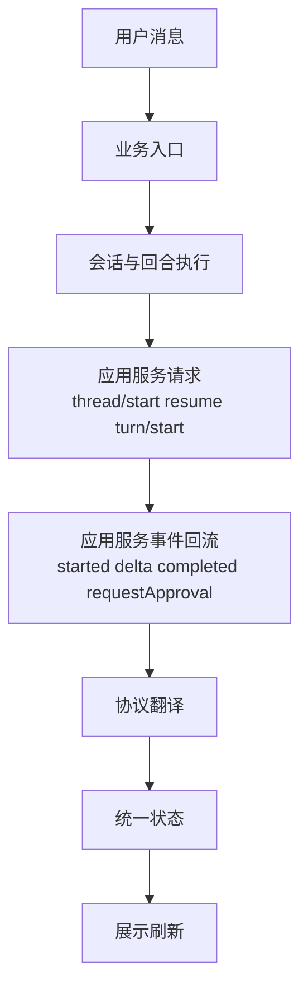
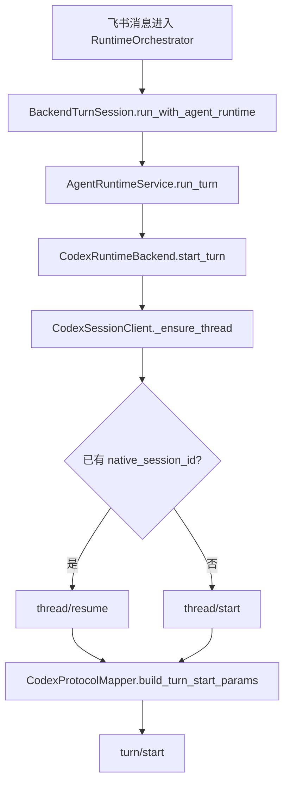
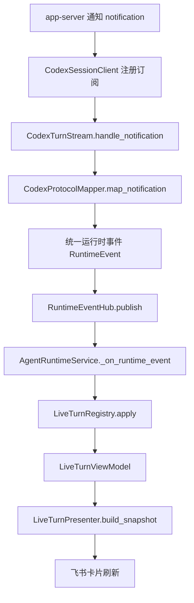
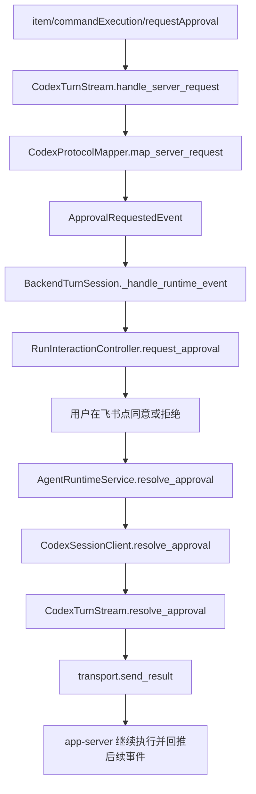
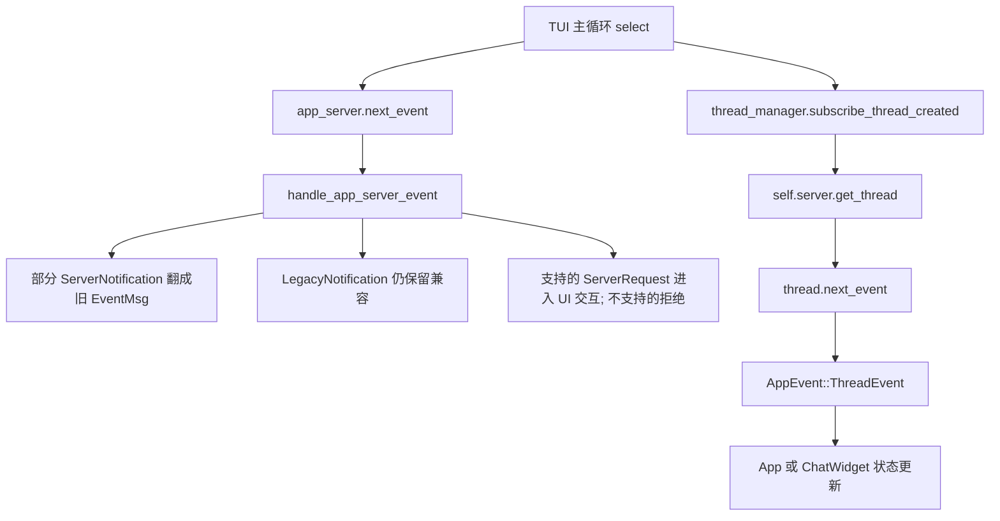

# Codex 应用服务消费链路对比

更新时间：2026-03-17

## 这份文档要解决什么问题

上一版文档更像“架构结论”，但如果你真正想追实际细节，只知道“谁调用了谁”是不够的。

看一条调用链，真正有价值的通常不是：

- 图上画了多少个框
- 有没有提到应用服务（app-server）

而是下面这些更具体的问题：

1. 第一个真正发请求的地方在哪里？
2. 请求发的是什么方法（method）和参数（params）？
3. 回来的不是最终答案时，中间事件是怎么流动的？
4. 哪一层把原始协议翻译成内部状态？
5. 哪一层保存“这次会话是谁、这次回合是谁、现在是否在等待审批”？
6. 哪一层决定展示什么，而不是只转发原始数据？
7. 如果要改行为，应该改哪一层，才不会把结构弄乱？

这份文档按这个思路来整理。

## 先给你一个“看链路时该盯什么”的阅读提纲

如果你还不确定自己到底想看什么，可以先从下面 6 个关注点里挑。

### 1. 请求入口

你想知道“用户一句话最终是怎么进入 `codex app-server` 的”，就看：

- 谁第一次从业务对象组装出远程过程调用（RPC，Remote Procedure Call）参数
- 是先 `thread/start`，还是先 `thread/resume`
- `turn/start` 是谁发的

这类问题的关键词是：

- “谁发请求”
- “请求体长什么样”
- “什么时候决定 `threadId`”

### 2. 事件回流

你想知道“为什么还没结束时界面就已经在更新”，就看：

- 谁订阅了通知（notification）
- 谁接收了服务端请求（server request）
- 流式增量（delta）怎样一步步变成界面上的部分文本

这类问题的关键词是：

- “谁收事件”
- “谁处理流式输出”
- “审批请求是怎么插进来的”

### 3. 状态归约

你想知道“为什么上层代码不用关心 `item/agentMessage/delta` 这种协议细节”，就看：

- 原始协议在哪一层被翻译
- 翻译后的内部事件长什么样
- 内部状态模型是谁维护的

这类问题的关键词是：

- “协议翻译”
- “统一事件”
- “状态模型”

### 4. 展示输入

你想知道“展示层到底消费什么”，就看：

- 展示层拿到的是原始协议，还是已经整理过的视图模型（view model）
- 文本、命令、推理、审批是不是被统一表示了

这类问题的关键词是：

- “展示层输入”
- “卡片怎么刷新”
- “最终回复从哪里来”

### 5. 交互闭环

你想知道“审批、停止、补充输入这些交互能不能走通”，就看：

- 服务端请求（server request）有没有真正被接住
- 接住以后有没有等待用户决策
- 用户决策有没有再写回应用服务（app-server）

这类问题的关键词是：

- “审批闭环”
- “停止怎么生效”
- “用户输入如何回写”

### 6. 修改边界

你想知道“以后要改某个行为应该改哪”，就看：

- 是协议适配层问题
- 还是运行时服务层问题
- 还是展示层问题

这类问题的关键词是：

- “哪一层负责什么”
- “改这里会不会影响别层”

## 一张最实用的总图

如果你只想先抓住主路径，不想一上来就看太多细节，可以先看这张图。

真正要读细节时，不要只问“有没有这 8 层”，而要问：

- `D` 这一层到底发了什么
- `E` 这一层到底收到了什么
- `F` 这一层到底丢掉了什么协议细节，保留了什么内部语义
- `G` 这一层到底存了哪些状态

下面分两条链路展开。

## Openrelay 现在的实际消费链路

### 一句话结论

`openrelay` 现在已经把 `codex app-server` 当成正式后端来消费，但它的上层并不直接依赖原始协议，而是依赖翻译后的统一运行时事件（RuntimeEvent）和实时视图模型（LiveTurnViewModel）。

这句话拆开以后，真正要看的细节是 4 件事：

1. 请求在哪里发
2. 事件在哪里收
3. 协议在哪里翻译
4. 展示状态在哪里生成

## Openrelay：从入口到请求发出

先看主请求链的纵向图，再读下面的代码说明会更快。

### 第一个业务入口

用户消息先进入：

- `src/openrelay/runtime/orchestrator.py`

这里的职责不是直接跟 `app-server` 说话，而是先做业务层控制：

- 过滤无效消息
- 解析会话（session）
- 决定是不是停止命令
- 控制串行执行

换句话说，这一层解决的是“这条消息该不该跑、属于哪个会话”，还没有进入“怎么调应用服务”。

### 真正进入执行主路径的地方

随后进入：

- `src/openrelay/runtime/turn.py`

这里的 `BackendTurnSession.run_with_agent_runtime()` 才真正把这次用户输入包装成回合输入（TurnInput），交给统一运行时服务（AgentRuntimeService）。

你如果想追“这次用户输入是从哪里变成后端输入对象的”，这里就是第一个关键点。

### 真正发应用服务请求的地方

再往下是：

- `src/openrelay/agent_runtime/service.py`
- `src/openrelay/backends/codex_adapter/backend.py`
- `src/openrelay/backends/codex_adapter/client.py`

真正开始发 `thread/start`、`thread/resume`、`turn/start` 的，不是 `RuntimeOrchestrator`，也不是展示层，而是 `CodexSessionClient`。

这里可以把职责拆清楚：

- `CodexRuntimeBackend`：统一后端接口到 Codex 适配器的桥
- `CodexSessionClient`：真正决定发哪些应用服务方法
- `CodexRpcTransport`：真正把请求送到底层客户端

### 这里最值得看的实际细节

#### 细节 1：什么时候 `thread/start`

在 `CodexSessionClient._ensure_thread()` 里：

- 如果已有原生会话标识（native session id），就发 `thread/resume`
- 如果没有，就发 `thread/start`

这决定了它是“续接旧对话”还是“创建新对话”。

#### 细节 2：`turn/start` 的参数是谁组的

在 `CodexProtocolMapper.build_turn_start_params()` 里，会把这些信息装进请求：

- `threadId`
- `cwd`（当前工作目录，current working directory）
- `approvalPolicy`（审批策略）
- `model`（模型）
- `input`（输入）

也就是说，协议参数的装配不是散落在各处，而是集中在协议映射器（ProtocolMapper）里。

#### 细节 3：会话标识什么时候落库

如果这是新线程，`_ensure_thread()` 拿到 `thread/start` 的结果后，会立刻发一个会话已启动事件（SessionStartedEvent）。  
上层再把这个原生会话标识持久化。

这一步很重要，因为后续 stop、resume、read transcript 都依赖这个标识。

## Openrelay：事件是怎么回来的

这一段最容易口头化，建议直接对着下面这张图看。

### 事件订阅在哪里挂上去

在 `CodexSessionClient.start_turn()` 里，会注册两类订阅：

- 通知订阅（notification subscriber）
- 服务端请求订阅（server request subscriber）

然后把它们都交给：

- `CodexTurnStream`

这说明 `CodexTurnStream` 是这条链上的“事件汇流点”。

### `CodexTurnStream` 真正在做什么

文件：

- `src/openrelay/backends/codex_adapter/turn_stream.py`

这里有 3 个实际很重要的动作。

#### 动作 1：处理通知

`handle_notification()` 会做两件事：

1. 调用 `mapper.map_notification()`，把原始协议通知翻译成内部事件
2. 把翻译后的事件逐个发布给运行时事件汇流器（event hub）

这里顺手还会处理回合结束条件：

- 如果收到了回合完成（turn.completed），就结束 future
- 如果收到了回合中断（turn.interrupted），就抛出中断
- 如果收到了回合失败（turn.failed），就抛出错误

也就是说，这一层不只是“转发事件”，还负责“判断这次回合什么时候算结束”。

#### 动作 2：处理服务端请求

`handle_server_request()` 的流程是：

1. 调用 `mapper.map_server_request()`
2. 把服务端请求翻译成审批请求事件（ApprovalRequestedEvent）
3. 先发布给上层
4. 等上层把用户决策写回来
5. 再调用 `transport.send_result()` 回给应用服务

这一步就是完整的交互闭环。

#### 动作 3：处理中断

`interrupt()` 会在知道 `turn_id` 以后发：

- `turn/interrupt`

这意味着 stop 不是单纯把本地任务杀掉，而是明确通知应用服务中断当前回合。

## Openrelay：原始协议是怎么被翻译掉的

### 真正的协议翻译层

文件：

- `src/openrelay/backends/codex_adapter/mapper.py`

如果你想知道“哪些应用服务方法会影响界面”，这里是最该细读的文件。

它把原始方法映射成统一运行时事件（RuntimeEvent）。下面是最关键的一组对照：

| 原始应用服务方法 | 中文含义 | 内部事件 |
| --- | --- | --- |
| `thread/started` | 线程已启动 | `session.started` |
| `turn/started` | 回合已启动 | `turn.started` |
| `item/agentMessage/delta` | 助手消息增量 | `assistant.delta` |
| `item/reasoning/textDelta` | 推理文本增量 | `reasoning.delta` |
| `item/commandExecution/outputDelta` | 命令输出增量 | `tool.progress` |
| `item/started` | 某个条目开始 | `tool.started` 或其他内部事件 |
| `item/completed` | 某个条目完成 | `assistant.completed` / `tool.completed` |
| `turn/completed` | 回合结束 | `turn.completed` / `turn.interrupted` / `turn.failed` |
| `item/commandExecution/requestApproval` | 命令审批请求 | `approval.requested` |

### 为什么这一层重要

因为它决定了两件事：

1. 上层“看得见什么”
2. 上层“看不见什么”

例如展示层并不需要知道：

- 某条协议方法原始字段名是 `contentIndex` 还是 `summaryIndex`
- 某条输出来自 `item/agentMessage/delta` 还是兼容别名

这些都在协议映射器（mapper）里被消化掉了。

## Openrelay：状态在哪里成形

### 统一状态归约在什么地方

文件：

- `src/openrelay/agent_runtime/service.py`

运行时服务（AgentRuntimeService）收到统一运行时事件（RuntimeEvent）后，会把它们交给实时回合注册表（LiveTurnRegistry）去归约。

这里可以把“归约”理解成：

- 之前状态是什么
- 新来一个事件以后
- 现在状态变成什么

### 展示层真正消费的不是协议，而是状态

文件：

- `src/openrelay/presentation/live_turn.py`

展示层最后消费的是实时视图模型（LiveTurnViewModel），不是原始应用服务事件。

它关心的字段是：

- 当前助手文本
- 当前推理文本
- 当前工具列表
- 当前审批请求
- 当前状态是运行中、完成、失败还是中断

所以如果你问“为什么 Feishu 卡片不用知道 `item/agentMessage/delta` 这些名字”，答案就是：这些细节在更下面已经被翻译过了。

## Openrelay：一条最具体的例子

这里用“用户发一句话，助手开始流式输出，然后申请命令审批”举例。

### 这条链路实际发生了什么

1. `RuntimeOrchestrator` 收到 Feishu 消息
2. `BackendTurnSession` 组装回合输入（TurnInput）
3. `CodexSessionClient` 先确保线程存在：已有就 `thread/resume`，没有就 `thread/start`
4. `CodexSessionClient` 发 `turn/start`
5. 应用服务开始回推通知：
   - `turn/started`
   - `item/agentMessage/delta`
   - `item/commandExecution/requestApproval`
6. `CodexTurnStream` 收到这些事件
7. `CodexProtocolMapper` 把它们翻译成：
   - `turn.started`
   - `assistant.delta`
   - `approval.requested`
8. `AgentRuntimeService` 归约出新的实时视图模型（LiveTurnViewModel）
9. `LiveTurnPresenter` 把它变成卡片快照
10. 用户在 Feishu 上点同意或拒绝
11. 上层把审批决定回写给 `CodexTurnStream.resolve_approval()`
12. `CodexTurnStream` 再把结果发回应用服务

如果你要查“审批为什么没弹出来”或者“审批点了以后为什么没继续”，这 12 步已经足够你定位问题。

## Codex CLI 的终端界面现在怎么消费应用服务

### 一句话结论

截至 2026-03-17，官方 `codex cli` 的终端界面（TUI，Text User Interface，文本用户界面）已经把应用服务客户端（InProcessAppServerClient）接进主循环，但当前主界面仍主要由直接核心事件流（direct-core event stream）驱动。

所以它不是：

- 完全没接应用服务

也不是：

- 已经完全靠应用服务驱动

而是：

- 正在迁移中的混合态

## Codex CLI：现在实际有哪两条事件路

### 路 1：应用服务事件路

在官方 `app.rs` 里，主循环已经监听：

- `app_server.next_event()`

这说明应用服务事件流已经被接进来了。

### 路 2：直接核心事件路

同一个主循环里，还在监听：

- `thread_manager.subscribe_thread_created()`

并且在线程创建后，会继续：

- `self.server.get_thread(thread_id)`
- `thread.next_event().await`

然后把事件送进：

- `AppEvent::ThreadEvent`

这说明当前主界面依然深度依赖直接核心事件流。

## Codex CLI：为什么说它还没真正“消费”应用服务

### 关键不是“有没有监听”，而是“监听后做了什么”

官方当前文件：

- `codex-rs/tui_app_server/src/app/app_server_adapter.rs`

这里写得非常直白：这是混合迁移阶段（hybrid migration period）的临时适配层。

但截至 2026-03-17，官方现状已经不是更早那种“完全忽略应用服务通知”的状态了，而是更具体的双轨：

- 老 `codex_tui` 仍然存在，继续保留直接核心事件消费路径
- 新 `codex_tui_app_server` 在 `Feature::TuiAppServer` 打开时才启用
- 新路径已经会消费一部分 typed `ServerNotification`
- 但旧 `LegacyNotification` 也还在保留，作为迁移期兼容通道
- `ServerRequest` 也不是一律拒绝，而是“支持的接住，不支持的拒绝”

当前 `tui_app_server` 的适配层里，已经显式处理了下面这些 typed 通知并把它们翻成现有 UI 还能消费的 `EventMsg`：

- `thread/tokenUsage/updated`
- `error`
- `thread/name/updated`
- `turn/started`
- `turn/completed`
- `item/started`
- `item/completed`
- `item/agentMessage/delta`
- `item/plan/delta`
- `item/reasoning/summaryTextDelta`
- `item/reasoning/textDelta`
- 一组 realtime 会话通知

同时它也单独处理了账户信息类通知：

- `account/updated`
- `account/rateLimits/updated`

服务端请求这边，`tui_app_server` 目前已经能挂住并等待解析这些请求：

- `item/commandExecution/requestApproval`
- `item/fileChange/requestApproval`
- `item/permissions/requestApproval`
- `item/tool/requestUserInput`
- `mcpServer/elicitation/request`

但仍有一批 request 会被明确拒绝，比如：

- `dynamicToolCall`
- `chatgptAuthTokensRefresh`
- 一些 legacy approval request

所以更准确的描述应该是：

- 应用服务事件流已经接进来，而且已经开始驱动部分 UI 状态
- 但它还没有覆盖全部 typed v2 通知，也还没有删掉 legacy 兼容路
- 当前版本依旧不是“纯 app-server-first 单轨”

## Codex CLI：一条最实际的追踪方式

如果你要追官方 TUI 现在到底谁在改界面，不要先看抽象架构图，先看这 4 个问题：

1. 主循环在 `select!` 里监听了哪些输入源？
2. 应用服务来的事件最后有没有改 `App` 或 `ChatWidget` 状态？
3. `thread.next_event()` 来的事件最后有没有改 `App` 或 `ChatWidget` 状态？
4. 审批请求（request approval）到底是被处理了，还是被拒绝了？

按这个标准去看，当前答案是：

- 应用服务事件：接进来了，但大部分还没转成界面状态
- 直接核心事件：仍然是主界面事实来源
- 审批服务端请求：当前适配层里直接拒绝

## 两条链路的核心差异

| 关注点 | openrelay | codex cli 终端界面（截至 2026-03-17） |
| --- | --- | --- |
| 应用服务角色 | 正式主后端 | 已接入，但仍在迁移 |
| 第一个真正发 RPC 的位置 | `CodexSessionClient` | 正在从旧路径迁到应用服务路径 |
| 谁收通知和服务端请求 | `CodexTurnStream` | 主循环能收到；`tui_app_server` 已消费一部分 typed 通知与支持的 request |
| 谁翻译协议 | `CodexProtocolMapper` | `app_server_adapter.rs` 把部分 typed `ServerNotification` 翻成旧 `EventMsg` |
| 展示层最终消费什么 | 实时视图模型（LiveTurnViewModel） | `AppEvent`、`EventMsg`、`ChatWidget` 状态 |
| 审批是否闭环 | 是 | 已接住部分 request，但仍有 unsupported request 会拒绝 |
| 主界面事实来源 | 应用服务协议翻译后的统一状态 | 仍是双轨：一部分来自 typed app-server，一部分来自旧核心事件 |

## 把前面 10 个问题全部调查清楚

下面不再只给“该问什么”，而是直接给“现在代码里的答案是什么”。

为了方便你继续追代码，每个问题都按同一结构写：

- `openrelay` 现在怎么做
- 官方 `codex cli` 终端界面（TUI，Text User Interface，文本用户界面）现在是什么状态
- 这件事真正说明了什么

### 1. 新会话和旧会话分别在哪一行代码决定走 `thread/start` 还是 `thread/resume`

#### openrelay

决定点在 `CodexSessionClient._ensure_thread()`：

- 有 `native_session_id` 就发 `thread/resume`
- 没有就发 `thread/start`

也就是说，会不会新建线程，不是在展示层决定，也不是在运行时主循环里临时判断，而是在 Codex 会话客户端（`CodexSessionClient`）里集中收口。

你追代码时，最关键的是看这两个位置：

- `src/openrelay/backends/codex_adapter/client.py` 中 `_ensure_thread()`
- `src/openrelay/backends/codex_adapter/client.py` 中 `start_turn()` 先调 `_ensure_thread()`，再调 `turn/start`

#### codex cli TUI

截至 2026-03-17，官方 TUI 主启动路径仍主要直接走核心线程管理器（`ThreadManager`）：

- `StartFresh` 用 `ChatWidget::new(..., thread_manager.clone())`
- `Resume` 用 `thread_manager.resume_thread_from_rollout(...)`
- `Fork` 用 `thread_manager.fork_thread(...)`

也就是说，当前主启动路径里，并没有一个对称的“先看有没有 thread id，再决定 `thread/start` / `thread/resume`”的 TUI 应用服务调用点。  
这也是为什么相关迁移 PR 还在开着。

#### 说明

`openrelay` 已经把“线程生命周期入口”收敛到了应用服务消费层；官方 TUI 这件事还没有完全收敛，仍有直接核心路径。

### 2. `turn/start` 的 `input` 是怎么从用户消息拼出来的

#### openrelay

这条链分三段：

1. `BackendTurnSession.run_with_agent_runtime()` 把当前消息装成回合输入（`TurnInput`）
2. `CodexSessionClient.start_turn()` 调 `mapper.build_turn_start_params(...)`
3. `CodexProtocolMapper._build_turn_input()` 把 `TurnInput` 转成应用服务的 `input`

最终拼出来的是一个列表：

- 有文本就放 `{ "type": "text", "text": ... }`
- 每张本地图片就放 `{ "type": "localImage", "path": ... }`

所以 `turn/start` 参数并不是在业务层零散拼出来的，而是先归一成 `TurnInput`，再在协议映射器（`CodexProtocolMapper`）里统一出线上的协议结构。

#### codex cli TUI

当前 TUI 主路径里，终端界面确实会持有初始文本和初始图片：

- `initial_prompt`
- `initial_images`
- `create_initial_user_message(...)`

但这些数据当前主要还是进入直接核心线程路径，而不是一个明确可追的 TUI 应用服务 `turn/start` 组包点。  
所以如果你的问题是“官方 TUI 里到底谁在拼 app-server 的 `turn/start.input`”，当前主路径答案仍然是不够完整，迁移还没收口。

#### 说明

`openrelay` 这件事已经可定位到单一组包函数；官方 TUI 当前还没有一个同样清晰的应用服务输入装配边界。

### 3. 图片输入在进入应用服务前有没有被重写

#### openrelay

有，而且分成两次重写：

1. 飞书图片先在事件分发器（`FeishuEventDispatcher`）里从远端图片键（`remote_image_keys`）下载为本地文件路径（`local_image_paths`）
2. 如果消息几乎只有图片，没有明确文字，运行时编排器（`RuntimeOrchestrator`）会把后端提示词改成默认图片提示词
3. 最后协议映射器把这些本地文件路径输出成 `localImage`

所以对 `app-server` 来说，它并没有直接收到“飞书图片 key”，而是收到“本地图片路径 + 可能被补过的默认文本提示”。

#### codex cli TUI

终端界面当前只有“本地图片文件列表”这个输入事实，主路径并没有暴露一个等价于 `openrelay` 的“远端图片转本地路径，再转 `localImage`”过程，因为它本来就不是飞书入口。

但从应用服务协议定义看，`userMessage.content` 支持 `text`、`image`、`localImage` 三类输入，说明长期目标依然是统一落到应用服务输入结构。

#### 说明

`openrelay` 的图片链路不是简单透传，而是“平台素材归一化”后再进应用服务。

### 4. 哪一种原始协议方法会变成“界面上的部分回复”

#### openrelay

最直接的是：

- `item/agentMessage/delta`

它在 `CodexProtocolMapper._map_agent_delta()` 里被翻译成 `assistant.delta`，再由 `LiveTurnReducer` 追加到 `LiveTurnViewModel.assistant_text`。

如果最后还有完整 `agentMessage`，`item/completed` 会在 `_map_item_completed()` 里再补一个 `assistant.completed`，把最终文本收敛成最终态。

#### codex cli TUI

如果只看应用服务协议，官方 README 也明确说 `item/agentMessage/delta` 就是“把增量 `delta` 依次拼起来，还原完整回复”。

截至 2026-03-17，官方 `tui_app_server` 也已经开始消费这条 typed 通知了：`app_server_adapter.rs` 会把 `ServerNotification::AgentMessageDelta` 翻成旧的 `EventMsg::AgentMessageDelta`，再继续走现有 `ChatWidget` 更新链。

但这还不是“全面转向 v2”：

- 只是一部分 typed 通知已经开始进入 UI 状态
- 主 UI 仍保留旧事件模型和 legacy 兼容路径

#### 说明

协议层和 UI 主路径要区分开看：

- 协议上：增量回复就是 `item/agentMessage/delta`
- 当前官方 TUI 实现上：这条 typed 通知已经接入，但整体仍是双轨迁移态，不是纯 v2 单轨

### 5. 哪一种原始协议方法会变成“工具执行中”

#### openrelay

“工具执行中”不是靠一条事件完成，而是至少两类事件配合：

- `item/started`：进入 `_map_item_started()`，如果条目类型是 `commandExecution`、`fileChange`、`webSearch`、`mcpToolCall` 等，会产出 `tool.started`
- `item/commandExecution/outputDelta` / `item/fileChange/outputDelta` / `item/mcpToolCall/progress`：分别产出 `tool.progress`
- `item/completed`：再产出 `tool.completed`

所以界面上的“工具开始了 / 正在跑 / 跑完了”其实是一个三段式状态，而不是单条通知。

#### codex cli TUI

应用服务协议已经把这三段定义得很清楚：

- `item/started`
- 若干 `item/*/delta`
- `item/completed`

截至 2026-03-17，官方 `tui_app_server` 已经开始消费这里面的主干子集：

- `item/started`
- `item/completed`
- `item/agentMessage/delta`
- `item/plan/delta`
- `item/reasoning/*delta`

但像 `thread/status/changed`、`turn/diff/updated`、`skills/changed` 这类新 v2 通知仍未进入它的 `server_notification_thread_events()` 映射，所以“typed v2 已全面接管 UI”这个判断仍然不成立。

#### 说明

如果以后要查“为什么工具卡片一直显示运行中”，你要同时看：

- 有没有收到 `item/started`
- 有没有持续 `outputDelta`
- 有没有最终 `item/completed`
- 当前 UI 适配层有没有为这类 typed 通知补上映射

### 6. 命令审批请求从应用服务来到 Feishu，中间经过了哪些对象

先看闭环图，下面再看每一层各做什么。

#### openrelay

这条链已经闭环，而且对象边界很清楚：

1. `CodexTurnStream.handle_server_request()` 收到服务端请求（`ServerRequest`，服务端主动请求）
2. `CodexProtocolMapper.map_server_request()` 把 `item/commandExecution/requestApproval` 翻成 `ApprovalRequestedEvent`
3. `AgentRuntimeService._on_runtime_event()` 把这个审批请求写进运行时状态，并交给交互跟踪器（如果有）
4. `BackendTurnSession._handle_runtime_event()` 收到 `ApprovalRequestedEvent`
5. `RunInteractionController.request_approval()` 真正向 Feishu 发审批交互

也就是说：

- 协议层只负责“把请求翻译成统一审批对象”
- Feishu 壳层只负责“把统一审批对象展示给用户”

#### codex cli TUI

截至 2026-03-17，这里也已经不是“收到 `ServerRequest` 就直接全拒绝”。

`tui_app_server` 现在会先把 request 记到 `PendingAppServerRequests` 里，至少支持下面这些应用服务请求进入现有 UI 交互流：

- `item/commandExecution/requestApproval`
- `item/fileChange/requestApproval`
- `item/permissions/requestApproval`
- `item/tool/requestUserInput`
- `mcpServer/elicitation/request`

只有 unsupported request 才会在适配层里被显式拒绝，比如 `dynamicToolCall`。

#### 说明

这意味着两边的真实差别已经从“有没有接住 request”收缩成了“接住以后有多完整”：

- `openrelay`：审批与交互请求已经是正式主路径，且 backend-neutral
- 官方 TUI：已经能接住一部分 app-server request，但仍然依赖旧 UI 状态机和兼容层

### 7. 用户点同意以后，结果是在哪一层写回应用服务的

#### openrelay

写回点也已经集中收敛：

1. `RunInteractionController` 取得用户决策
2. `BackendTurnSession._handle_runtime_event()` 调 `runtime_service.resolve_approval(...)`
3. `AgentRuntimeService.resolve_approval()` 下发到 backend
4. `CodexSessionClient.resolve_approval()` 找到对应中的 `CodexTurnStream`
5. `CodexTurnStream.resolve_approval()` 调 `mapper.build_approval_response(...)`
6. `CodexTurnStream.handle_server_request()` 等到这个结果后，再用 `transport.send_result(...)` 写回应用服务

这意味着“用户决策”不会直接从 Feishu 壳层打到协议层，而是始终通过统一运行时服务转发。

#### codex cli TUI

截至 2026-03-17，官方 `tui_app_server` 已经存在“用户决策再写回 app-server”的路径：

- `PendingAppServerRequests.note_server_request()` 先把支持的 request 挂起
- 用户在现有 UI 里做决策后，`take_resolution()` 会把决策编码成对应的 app-server response
- 然后再通过 `resolve_server_request(...)` 写回应用服务

所以这里也不能再写成“完全没有回写主路径”。

#### 说明

现在更准确的说法是：

- `openrelay`：这条路径已经被统一 runtime 收口
- 官方 TUI：这条路径已开始存在，但仍然是 app-server 适配层把 typed request 翻回旧 UI 命令模型

### 8. stop 命令是只停本地任务，还是会发 `turn/interrupt`

#### openrelay

会，而且有两种时机：

- 如果当前已经知道 `turn_id`，`CodexTurnStream.interrupt()` 立即发 `turn/interrupt`
- 如果用户 stop 得很早，回合 id 还没绑定，`CodexTurnStream.bind_started_turn()` 会在拿到 `turn_id` 后补发 `turn/interrupt`

`CodexSessionClient.interrupt_turn()` 也明确优先走活跃流对象；只有找不到活跃流时，才直接请求 `turn/interrupt`。

这说明 stop 不是“本地协程取消一下就算了”，而是尽量向应用服务发真实中断。

#### codex cli TUI

从应用服务协议定义看，`turn/interrupt` 的契约很明确：

- 请求成功后，最终应等 `turn/completed`
- 且 `turn.status` 为 `interrupted`

但当前官方 TUI 主路径还没有把“停止行为”统一收敛到应用服务中断路径上，因为主路径本身还主要走直接核心事件。

#### 说明

`openrelay` 这条闭环已经成立，而且还补了“先 stop、后拿到 turn id”这种竞态场景。

### 9. 终端界面当前到底有没有真正把 `ServerNotification` 转成 UI 状态

可以直接把官方 TUI 当前状态理解成下面这张“双轨图”。

#### 结论

有，但不是完整消费。

#### 证据

当前官方 `app_server_adapter.rs` 的逻辑已经进入下一阶段：

- `ServerNotification`：开始按子集翻译成旧 `EventMsg`
- `LegacyNotification`：仍保留并继续兼容
- `ServerRequest`：支持的挂起并进入交互流，不支持的拒绝

与此同时，主循环虽然确实监听 `app_server.next_event()`，但真正更新界面的主要还是另一条路：

- `thread_manager.subscribe_thread_created()`
- `self.server.get_thread(thread_id)`
- `thread.next_event().await`
- `AppEvent::ThreadEvent`

#### 说明

所以不能只因为“主循环里出现了 `app_server.next_event()`”就判断 TUI 已经完全消费了应用服务。  
真正判断标准应该是：

- 这些 typed 通知有没有进入状态归约
- 状态归约覆盖面有多大
- legacy 兼容路和直接核心事件路有没有被删掉

按这个标准，当前答案是：

- 已经开始消费 v2
- 但只覆盖一部分 typed 通知
- 仍然明显处在双轨迁移态

### 10. 哪些地方现在看起来像“兼容过渡层”，以后应该删掉

#### 官方 TUI 里最明显的 4 处

1. `tui_app_server/src/app/app_server_adapter.rs`
   这个文件头注释已经明说它是“混合迁移期临时适配层”，未来应该缩小直至消失。

2. `App::run()` 里同时监听两条事实来源
   一边监听 `app_server.next_event()`，一边监听直接核心线程事件；这说明现在是双轨，不是单轨。

3. `SessionSelection::Resume` / `Fork` 直接调用 `ThreadManager`
   这说明线程生命周期还没有统一回收进应用服务入口。

4. `handle_thread_created()` 再次附着到直接核心线程对象，并开 `thread.next_event()` 监听任务
   只要这条路径还是主 UI 事实来源，TUI 就还没有真正变成 app-server-first。

#### openrelay 里有没有类似过渡层

相对少很多。  
`openrelay` 现在更像是已经完成“协议层 -> 统一运行时事件 -> 统一视图模型”收敛，主要剩下的是能力扩展，不是双轨迁移清理。

#### 说明

如果你后面要继续盯官方迁移进度，最有价值的观察点不是“又加没加 app-server 相关代码”，而是下面这三个问题：

- 直接核心线程监听有没有删掉
- `ServerNotification` 有没有开始进入 UI 状态归约
- `ServerRequest` 有没有不再被直接拒绝

## 现在可以得出的更硬结论

把上面 10 个问题全部查完以后，结论可以收敛成 4 句：

1. `openrelay` 现在已经不是“表面上接了 app-server”，而是请求入口、事件回流、审批闭环、停止闭环都已经建立。
2. `openrelay` 的展示层消费的不是原始协议，而是统一运行时事件（`RuntimeEvent`）归约后的实时视图模型（`LiveTurnViewModel`）。
3. 官方 `codex cli` TUI 截至 2026-03-17 仍处在混合迁移态：应用服务客户端已经进主循环，typed v2 通知与部分服务端请求已经开始进入主 UI 状态路径，但覆盖面还不完整。
4. 判断“是否真正消费 app-server”的标准，不是有没有 `app_server.next_event()`，而是“请求是否由 app-server 发起、typed 通知是否进入状态归约、legacy 兼容路是否还在、服务端请求是否形成交互闭环”。

## openrelay 侧已观测到但当前未正式建模的 backend 事件

下面这批事件来自实际运行日志 `/home/Shaokun.Tang/.openrelay/data/codex-sqlite/logs_1.sqlite`，是把 `app-server event: <method>` 与当前 `src/openrelay/backends/codex_adapter/mapper.py` 显式分支做差集后得到的。

### 更像真实 app-server 公共事件，值得优先评估是否正式建模

- `account/rateLimits/updated`
- `thread/status/changed`
- `skills/changed`
- `turn/diff/updated`

这几类是 `codex_app_server::outgoing_message` 发出来的，更接近外部 transport 真正能收到的 typed v2 通知。  
当前 openrelay 已能 fallback 渲染其完整 payload，但还没有把它们收口成统一 runtime 语义。

### 更像 provider 内部兼容事件或中间态事件，继续走 fallback 更合理

- `codex/event/agent_message_delta`
- `codex/event/raw_response_item`
- `codex/event/agent_reasoning_delta`
- `codex/event/agent_message`
- `codex/event/exec_command_begin`
- `codex/event/exec_command_end`
- `codex/event/task_started`
- `codex/event/user_message`
- `codex/event/web_search_begin`
- `codex/event/web_search_end`
- `codex/event/mcp_startup_complete`
- `codex/event/turn_aborted`
- `codex/event/skills_update_available`
- `codex/event/turn_diff`
- `codex/event/plan_update`
- `codex/event/exec_command_output_delta`
- `codex/event/terminal_interaction`
- `codex/event/agent_reasoning_section_break`
- `codex/event/agent_reasoning`

这批大多来自 `codex_app_server::codex_message_processor`，更像 Codex 内部兼容别名或中间事件，而不是外部客户端必须直接围绕其建模的稳定公共协议面。

## 证据

### openrelay 仓库内代码

- `src/openrelay/runtime/orchestrator.py`
- `src/openrelay/runtime/turn.py`
- `src/openrelay/agent_runtime/service.py`
- `src/openrelay/backends/codex_adapter/backend.py`
- `src/openrelay/backends/codex_adapter/client.py`
- `src/openrelay/backends/codex_adapter/transport.py`
- `src/openrelay/backends/codex_adapter/turn_stream.py`
- `src/openrelay/backends/codex_adapter/mapper.py`
- `src/openrelay/presentation/live_turn.py`

### 官方外部资料

- `codex app-server` README  
  <https://github.com/openai/codex/blob/main/codex-rs/app-server/README.md>
- 终端界面应用服务适配层  
  <https://github.com/openai/codex/blob/main/codex-rs/tui_app_server/src/app/app_server_adapter.rs>
- 终端界面应用服务会话封装  
  <https://github.com/openai/codex/blob/main/codex-rs/tui_app_server/src/app_server_session.rs>
- 终端界面主循环分发  
  <https://github.com/openai/codex/blob/main/codex-rs/cli/src/main.rs>
- 应用服务客户端事件门面  
  <https://github.com/openai/codex/blob/main/codex-rs/app-server-client/src/lib.rs>
- 应用服务 typed 通知定义  
  <https://github.com/openai/codex/blob/main/codex-rs/app-server-protocol/src/protocol/common.rs>
- 开放拉取请求（PR，Pull Request）：`feat(tui): migrate TUI to in-process app-server`  
  <https://github.com/openai/codex/pull/14018>
- 开放拉取请求（PR，Pull Request）：`feat(tui): route fresh-session thread lifecycle through app-server`  
  <https://github.com/openai/codex/pull/14699>
- 开放拉取请求（PR，Pull Request）：`feat(tui): route resume and fork thread lifecycle through app-server, eliminating DirectCore transport`  
  <https://github.com/openai/codex/pull/14711>
- 开放拉取请求（PR，Pull Request）：`Move TUI on top of app server (parallel code)`  
  <https://github.com/openai/codex/pull/14717>

## 时效性说明

- `codex cli` 终端界面的结论，基于 2026-03-17 查询到的官方 `main` 分支源码与当日可见的开放拉取请求（PR）。
- 由于官方这一段正在快速迁移，后续如果这些 PR 合并，本文对终端界面现状的描述可能会失效。
- `openrelay` 部分结论基于当前仓库代码与本地运行日志，时效点同样是 2026-03-17。
