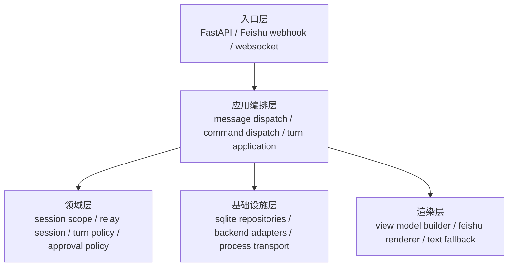
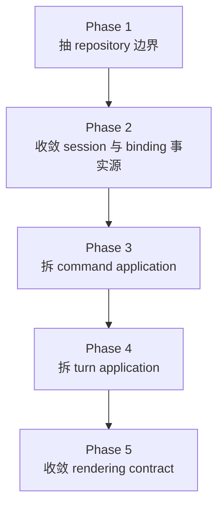

# OR-TASK-009 架构重构总体设计

更新时间：2026-03-18

## 1. 这份文档回答什么

这份文档从模块职责划分和系统长期演化的角度，回答 `openrelay` 下一轮架构重构的总体设计问题：

1. 现在真正的问题是什么。
2. 下一阶段的目标架构应该长什么样。
3. 每一层应该承担什么职责，不应该承担什么职责。
4. 这轮重构应该按什么顺序推进。
5. 哪些事情明确不在本轮范围内。

它不是代码级详细设计，也不是一次性大重写方案。

它的作用是：先把主路径的边界、事实来源、依赖方向和实施阶段固定下来，避免后续继续在几个中心文件上叠功能。

## 2. 背景与问题定义

`openrelay` 当前的主链路方向是正确的：

- `feishu/` 负责平台接入。
- `runtime/` 负责消息分流与会话执行编排。
- `agent_runtime/` 负责 backend-neutral 的 turn/event/approval 语义。
- `backends/` 负责 provider adapter。
- `session/` 与 `storage/` 负责本地状态。

这个分层意图已经在代码和文档里形成主干，但当前实现已经出现明显的“**边界有名义、职责仍回流**”问题。

核心症状有五个：

### 2.1 中心对象过载

以下模块正在演变成系统中心节点：

- `src/openrelay/runtime/orchestrator.py`
- `src/openrelay/runtime/commands.py`
- `src/openrelay/runtime/turn.py`
- `src/openrelay/storage/state.py`

它们不再只是单一职责模块，而是在承担：装配、流程控制、规则判断、状态同步、数据访问、回复输出等多层职责。

### 2.2 状态事实来源不唯一

当前至少存在两份部分重叠的“会话真实状态”：

- `SessionRecord`
- `RelaySessionBinding`

其中 `backend`、`cwd`、`model`、`safety_mode`、`native_session_id` 等字段分散在两处，再通过同步补丁维持一致。这种结构短期可跑，长期会让读取路径越来越依赖启发式修正。

### 2.3 presentation 与平台耦合回流

文档声称 `presentation/` 负责状态投影，但当前部分 presenter 已直接依赖 Feishu card 构造细节。这意味着展示层实际上已经是“Feishu 专用渲染层”，却仍以平台无关层自居。

### 2.4 session 与 storage 只做了目录分离，没有做真正职责分离

`session/` 与 `storage/` 在目录上分开了，但上层仍通过一个宽接口 `StateStore` 获取大量高层行为，导致 repository、schema、查询语义、迁移逻辑、领域辅助逻辑耦在一起。

### 2.5 新需求正在继续放大上述问题

只要继续增加：

- 新命令
- 新交互类型
- 新 backend event
- 新面板视图
- 新观测点

这些功能就会自然堆到现有中心模块里，形成越来越高的变更耦合。

## 3. 设计目标

### 3.1 本轮目标

这轮架构重构的目标不是追求目录更漂亮，而是把系统重新压回以下状态：

1. **依赖方向稳定**：入口层 -> 应用编排层 -> 领域策略层 / 基础设施层 -> 平台渲染层。
2. **事实来源唯一**：同一类状态只在一处拥有写权限。
3. **主路径可追踪**：消息进入、session 解析、turn 运行、approval、reply 输出有清晰边界。
4. **模块职责单一**：大文件退化为装配器、调度器或渲染器，而不是混合体。
5. **后续可渐进实施**：重构必须能拆成多个独立提交，而不是一次性重写。

### 3.2 非目标

本轮明确不做以下事情：

- 不重写 Codex / Claude adapter 主体协议实现。
- 不把所有目录立即整体迁移到全新包结构。
- 不顺手引入新的用户功能或新的产品面。
- 不为了兼容旧边界长期保留双轨实现。
- 不追求一轮内把所有 presenter 彻底平台无关化。

## 4. 一页看懂的新边界

上图的关键不是目录名，而是依赖约束：

- 入口层不直接携带业务规则。
- 应用层不直接拼平台卡片。
- 领域层不依赖 Feishu 或 SQLite。
- 基础设施层不把 provider 协议细节上浮到应用主层。
- 渲染层只消费整理后的结果，不反向决定 session / storage 行为。

## 5. 目标架构

## 5.1 入口层

建议保留现有 `server.py` 和 `feishu/dispatcher.py` 作为入口层，但职责进一步收敛为：

- 接收平台事件。
- 做协议级校验与基本资源解析。
- 规范化为 `IncomingMessage` 或后续同类输入模型。
- 把输入交给应用层。

入口层不再承担：

- session 作用域规则
- 命令语义
- reply 路由策略
- turn 生命周期控制

## 5.2 应用编排层

应用层是本轮重构的重点，建议拆成三条主服务：

### A. `MessageDispatchService`

负责：

- 接收规范化后的入站输入。
- 做 dedup、权限判断、session key 解析入口。
- 判定消息进入 command 还是 turn 主链路。
- 协调 active run / pending follow-up 的接入策略。

不负责：

- 具体命令实现。
- 具体 turn 运行逻辑。
- 具体 Feishu reply 拼装。

### B. `CommandApplicationService`

负责：

- slash command 解析与 handler 分发。
- 调用 session / workspace / backend / release 等应用动作。
- 返回统一的 command result。

不负责：

- 直接访问平台 message API。
- 直接修改 card 结构。
- 和 turn 执行主路径混写在同一个 router 类里。

### C. `TurnApplicationService`

负责：

- 准备本次 turn 的输入与上下文。
- 获取或创建 relay-to-backend binding。
- 订阅 runtime event。
- 驱动 live state、approval、interrupt、finalize。

不负责：

- 平台卡片 JSON 组装。
- SQLite schema 细节。
- provider-specific 事件翻译。

## 5.3 领域层

领域层不追求抽象很多对象，而是只保留稳定规则。

建议形成四个核心领域对象或策略集：

### A. `ConversationScopePolicy`

负责：

- thread / root / parent / reply_to 的 session 归属规则。
- top-level control command 与 thread follow-up 的作用域差异。
- alias 规则与显式 session key 规则。

### B. `RelaySession`

负责表达 relay 侧稳定会话配置：

- `session_id`
- `base_key`
- `release_channel`
- 用户可见 label
- 默认 backend / cwd / model / safety policy 的选择结果

这里的重点是：它表示“relay 侧会话”，不表示 provider attachment。

### C. `SessionBinding`

负责表达 relay session 与 backend native session 的绑定关系：

- `relay_session_id`
- `backend`
- `native_session_id`
- `cwd`
- `model`
- `safety_mode`
- 平台关联 scope

它表示“当前实际附着在哪个 provider session 上”。

### D. `TurnPolicy`

负责：

- follow-up 在 active run 期间的接入策略。
- stop / interrupt 的语义。
- approval 请求的生命周期规则。
- final reply 与 interrupted / failed 文案决策输入。

## 5.4 基础设施层

基础设施层建议收敛成两组边界：

### A. Repository 边界

不要再把所有状态能力挂在 `StateStore` 一个对象上。

建议拆成：

- `SessionRepository`
- `MessageRepository`
- `SessionAliasRepository`
- `DedupRepository`
- `ShortcutRepository`
- `SessionBindingRepository`
- 后续如有观测需求，再独立 `TraceRepository`

SQLite schema、迁移和连接生命周期仍可由一个薄的 `SqliteStore` 或同类对象承载，但不再暴露高层复合语义。

### B. Backend Adapter 边界

`agent_runtime` 仍然是上层只应依赖的 backend-neutral contract。

`backends/` 保持如下约束：

- provider transport / protocol mapping 全部留在 adapter 内部。
- runtime 主层只消费标准化 event、session、approval、usage、diff 等语义。
- 如果 Codex event family 增长，应在 adapter 内继续分层，而不是把 provider item type 引到 `runtime/`。

## 5.5 渲染层

渲染层建议显式承认“平台专用渲染器”的存在，而不要把它继续混在平台无关 `presentation` 名义下。

推荐收敛方式：

- `presentation/` 保留平台无关 view model builder。
- `feishu/` 或 `presentation/feishu/` 负责 card / post / text fallback renderer。
- 应用层只处理统一的 `RenderedReply` 或 `ReplyEnvelope`。

渲染层负责：

- 把 live state / status / panel / help / transcript 转成平台输出。
- 保持 card 与 text fallback 语义一致。

渲染层不负责：

- session 读取策略。
- backend 状态同步。
- command 业务决策。

## 6. 核心设计决策

## 6.1 `SessionRecord` 与 `SessionBinding` 分离所有权

这是本轮最重要的设计决策。

### 决策

- `SessionRecord` 只保留 relay 视角稳定信息。
- `SessionBinding` 成为 backend attachment 的唯一事实来源。
- 删除通过 binding 反向覆盖 session record 的同步式补丁。

### 理由

如果两者都可写同一批“当前真实后端状态”，后续读路径一定会越来越依赖修补逻辑。把所有权一次性划清，比继续加同步更稳定。

## 6.2 `RuntimeOrchestrator` 退化为装配根

### 决策

`RuntimeOrchestrator` 不再继续承接业务规则，目标是收敛成：

- 依赖装配
- 应用服务持有
- 单一入口转发
- shutdown 生命周期管理

### 理由

如果入口对象持续同时拥有流程判断、策略、状态和回复逻辑，它最终会变成无法拆分的总枢纽。

## 6.3 命令系统改为 handler registry，而不是继续扩写总路由器

### 决策

将命令系统从“大 switch / 大 if router”改为：

- command parser
- command handler registry
- 每类命令独立 handler

### 理由

命令本质上是稳定扩展点。继续把所有命令堆到单个 router 中，会让 session、workspace、backend、ops 等完全不同语义相互耦合。

## 6.4 turn 执行链要从“大类”改成“状态机 + 组件协作”

### 决策

`BackendTurnSession` 后续应拆成：

- turn preparation
- runtime event bridge
- streaming driver
- approval coordinator
- turn finalizer

### 理由

turn 主链路本身就是一个显式生命周期。把多个阶段写在一个类里，短期顺手，长期会让每次新增交互都变成插桩式扩写。

## 6.5 presentation 要么平台无关，要么明确平台相关，不保留模糊地带

### 决策

`presentation` 层要么只产出平台无关 view model，要么明确拆出 `Feishu` renderer；不再维持“名字中立、实现平台专用”的中间态。

### 理由

模糊边界最容易让依赖方向失真，后续也无法判断什么逻辑该放在哪一层。

## 7. 实施阶段

这轮重构不适合一次性完成，建议拆成五个阶段。

### Phase 1：抽 repository 边界

目标：把 `StateStore` 从万能服务降级为底层存储承载。

完成标志：

- 上层不再直接依赖 `StateStore` 暴露的大量方法。
- session / runtime / release 只依赖明确 repository 接口。
- schema 与连接管理仍可保留在 sqlite 基础设施层。

### Phase 2：收敛 session 与 binding 事实源

目标：让 relay session 与 backend attachment 各自归位。

完成标志：

- `SessionRecord` 与 `SessionBinding` 字段所有权被固定。
- 删除反向同步补丁。
- control session / placeholder session 的可见规则显式化。

### Phase 3：拆 command application

目标：把 `commands.py` 从总路由器拆成命令系统。

完成标志：

- parser、registry、handler 三者分开。
- session 命令、workspace 命令、backend 命令、ops 命令分文件。
- 命令结果以统一 reply contract 返回。

### Phase 4：拆 turn application

目标：把 `turn.py` 的 lifecycle 拆成可测组件。

完成标志：

- prepare / run / approval / streaming / finalize 的边界明确。
- active run / follow-up / interrupt 规则落在 turn policy 或专门 coordinator。
- turn 主路径可做更细粒度单测。

### Phase 5：收敛 rendering contract

目标：让 runtime 不再直接关心 Feishu card 细节。

完成标志：

- live turn / help / panel / status 的输出都通过统一 renderer contract。
- 平台无关 view model 与 Feishu renderer 分层明确。
- fallback text 不再散落在多个业务点各自拼接。

## 8. 模块重构建议

### 8.1 `runtime/`

目标状态：

- 只保留 application orchestration。
- `orchestrator.py` 只做装配和入口转发。
- `commands.py` 不再承载所有命令逻辑。
- `turn.py` 不再是 turn 生命周期大杂烩。

### 8.2 `session/`

目标状态：

- 表达 scope policy、session mutation、workspace policy、shortcut policy。
- 不再承担底层 SQL 细节。
- 不再依赖 presentation 层来完成核心业务决策。

### 8.3 `storage/`

目标状态：

- 只保留 sqlite 基础设施与 repository 实现。
- 不再继续增加新的高层业务方法。
- 任何新增状态能力都优先以 repository 新接口进入，而不是继续扩 `StateStore`。

### 8.4 `presentation/`

目标状态：

- 收敛成 view model builder 或明确的平台 renderer 包。
- 不直接拥有 session browser / store 查询职责。
- live turn、panel、session list、status 输出共享一致的 reply contract。

### 8.5 `feishu/`

目标状态：

- 平台入口、message API、media 下载、card renderer、streaming sender 都留在这里。
- 业务层不再直接拼 Feishu 结构。

### 8.6 `backends/`

目标状态：

- 保持 adapter / transport / mapper 边界。
- 对 Codex 侧继续控制 `semantic_mapper` 膨胀风险，按 raw normalize / semantic extract / runtime map 继续细分。

## 9. 风险与控制

### 风险 1：重构过程中行为回归

控制方式：

- 每阶段只做单一收敛目标。
- 保留现有 e2e 与主路径测试。
- 在 behavior-preserving 的阶段优先不改外部输出。

### 风险 2：接口拆分过度，抽象反而更重

控制方式：

- 只拆已经稳定存在的职责，不为“未来灵活”额外造层。
- 新接口必须对应明确所有权和调用点。

### 风险 3：目录调整过早，掩盖真实问题

控制方式：

- 优先先拆职责，再决定是否移动目录。
- 不把 rename 误当成重构完成。

### 风险 4：为了兼容旧路径保留长期双轨

控制方式：

- 每个阶段完成后尽快删除旧调用路径。
- 没有明确外部兼容需求时，不保留长期适配层。

## 10. 验收口径

当这轮总体设计真正落地完成时，至少应满足：

- `RuntimeOrchestrator` 明显退化为装配根与入口转发器。
- 命令系统不再依赖单个巨型 router 承载所有命令语义。
- turn 主链路不再集中在一个大类里处理全部生命周期。
- `SessionRecord` 与 `SessionBinding` 不再双写同一类真实状态。
- 上层代码不再直接依赖万能 `StateStore`。
- `presentation` 与 `feishu` 的边界被明确，不再处于名义中立、实现专用的中间态。
- backend-specific 细节仍被限制在 `agent_runtime` 以下。

## 11. 建议的后续文档拆分

这份文档是总体设计。进入实施前，建议继续拆出以下配套设计稿：

1. repository 边界详细设计
2. session / binding source-of-truth 详细设计
3. command application 详细设计
4. turn lifecycle 拆分详细设计
5. rendering contract 详细设计

拆分原则是：每份详细设计只回答一个收敛问题，不把 storage、runtime、presentation 三条线混写在同一份细节稿里。
