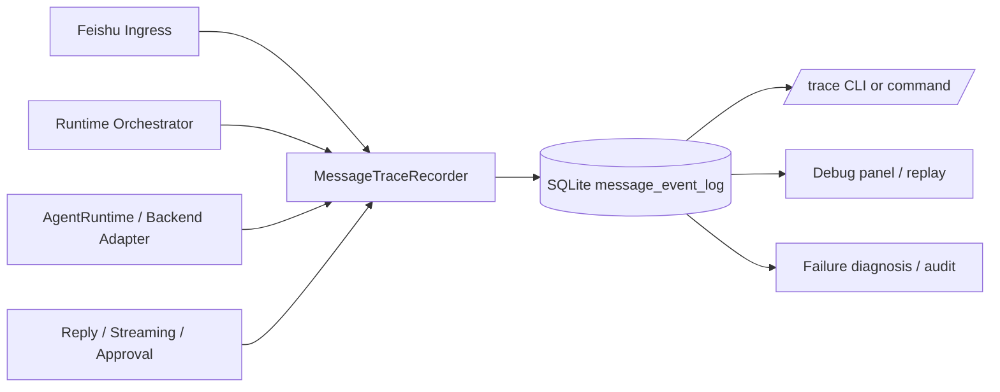

# OR-TASK-007 消息行为日志与可观测性总体设计

更新时间：2026-03-18

## 1. 背景

当前 `openrelay` 对“回复过程中的消息行为”只有两类能力：

- 少量散落在各层的文本日志，例如 session scope 解析、turn 保存、异常栈。
- 一条用于驱动 live turn 展示的内存态 `RuntimeEvent` 流。

这两者都不等价于一个正式的日志机制。

现状的主要问题是：

- **链路不完整**：Feishu 入站消息、session 解析、排队、turn 启动、provider 事件、approval、streaming 更新、最终 reply 没有统一串起来。
- **关联键不稳定**：有些日志按 `event_id`，有些按 `message_id`，有些按 `session_id` 或 `turn_id`，但没有统一 correlation model。
- **不可回放**：`RuntimeEvent` 进入 reducer 后主要变成当前快照，不是 append-only 的审计记录。
- **不可查询**：排查“这条回复为什么走到这个 session”“这次 approval 是谁触发的”“为什么 streaming 中断”时，要在多处 grep 文本日志，成本很高。
- **调试粒度不统一**：有些是业务语义事件，有些是底层异常，没有统一 event taxonomy。

因此需要新增一套**结构化、可持久化、可查询、可回放**的消息行为日志机制。

## 2. 设计目标

### 2.1 目标

这套机制要解决四件事：

1. **观测一条消息如何进入系统并最终形成回复。**
2. **观测某个 relay session / turn 在运行时经历了哪些关键状态变化。**
3. **在不依赖 provider 原生日志的前提下，尽量复原 openrelay 自己的产品行为。**
4. **为后续 `/trace`、调试面板、故障回放、行为分析提供稳定底座。**

### 2.2 非目标

本设计默认不做以下事情：

- 不把所有 provider 原始流量完整镜像进本地数据库。
- 不替代现有 Python `logging` 文本日志；文本日志仍保留给进程级异常和运维输出。
- 不在第一阶段引入外部日志系统，例如 ELK、OpenTelemetry collector、ClickHouse。
- 不把消息内容做长期无限保留；内容采集需有裁剪和脱敏边界。

## 3. 技术选型

### 3.1 首选：SQLite

这里建议**直接使用 SQLite**，并沿用当前仓库已经存在的本地状态库模式。

原因：

- **符合当前部署形态**：`openrelay` 是单进程、本地状态、轻量服务，SQLite 与现有 `StateStore` 一致。
- **事务简单**：消息行为日志本质是 append-heavy、read-mostly，SQLite WAL 模式很合适。
- **查询足够强**：需要按 `session_id` / `message_id` / `turn_id` / 时间范围追踪，SQL 已足够。
- **运维成本低**：不需要额外服务，不引入网络依赖，不增加部署面。
- **方便调试**：可以直接 `sqlite3` 打开，也能给将来的 `/trace` 命令做后端。

### 3.2 为什么不是纯文本日志

纯文本日志的问题不是“不能记”，而是：

- 不适合跨实体关联；
- 不适合做多条件过滤；
- 不适合回放一条消息的完整生命周期；
- 不适合作为产品内调试能力的事实来源。

因此文本日志保留，但**结构化事件库才是主事实来源**。

### 3.3 为什么暂不引入 OpenTelemetry

OpenTelemetry 更适合：

- 多服务调用链；
- 远端 exporter；
- 指标、trace、log 三位一体的平台化接入。

而 `openrelay` 当前主要问题不是“缺标准协议”，而是**本地根本还没有收敛出稳定的消息行为事件模型**。在事件模型和边界没有定型前先上 OTel，容易把复杂度提前引进来。

结论：

- **第一阶段：SQLite + 本地结构化事件模型。**
- **后续可选：基于同一事件模型导出到 OTel / JSONL / 远端 sink。**

## 4. 总体方案

整体上拆成四层：

1. **事件模型层**：定义什么叫“消息行为事件”。
2. **采集层**：在 ingress / runtime / provider adapter / egress 关键节点发事件。
3. **存储层**：写入 SQLite append-only 事件表。
4. **读取层**：提供 trace 查询、时间线回放、统计聚合。



## 5. 事件模型

### 5.1 基本原则

事件模型要满足：

- **append-only**：事件一旦写入，不做原地覆盖。
- **业务语义优先**：优先记录“发生了什么产品行为”，而不是只记底层函数调用。
- **可关联**：每条事件都带稳定关联键。
- **分层清楚**：区分 ingress、runtime、provider、egress、error。

### 5.2 核心关联键

每条事件都尽量带上以下字段：

- `event_id`：日志表自增主键。
- `occurred_at`：事件时间。
- `trace_id`：一次“用户输入触发的处理链”标识。
- `relay_session_id`
- `session_key`
- `execution_key`
- `turn_id`
- `native_session_id`
- `incoming_event_id`
- `incoming_message_id`
- `reply_message_id`
- `chat_id`
- `thread_id`
- `root_id`
- `backend`
- `event_type`
- `stage`
- `level`

其中建议的主关联规则：

- **trace_id**：以“单次入站输入”为单位。一次 Feishu message / card action 进来，就生成一个 `trace_id`。
- **relay_session_id**：跨多次 trace 追踪同一个 relay 会话。
- **turn_id**：追踪某次 backend turn。
- **incoming_message_id / reply_message_id**：追踪 Feishu 消息实体。

### 5.3 事件分层

建议把 `stage` 固定为以下枚举：

- `ingress`
- `session`
- `dispatch`
- `queue`
- `turn`
- `provider`
- `interaction`
- `streaming`
- `egress`
- `storage`
- `error`

### 5.4 事件类型

第一阶段建议只覆盖关键语义事件，不求一口气全量。

建议最小闭环事件集：

- `ingress.message.received`
- `ingress.message.ignored`
- `session.key.resolved`
- `session.alias.saved`
- `session.loaded`
- `dispatch.command.detected`
- `dispatch.turn.accepted`
- `dispatch.turn.rejected`
- `queue.follow_up.enqueued`
- `queue.follow_up.dequeued`
- `turn.started`
- `turn.completed`
- `turn.failed`
- `turn.interrupted`
- `provider.event.observed`
- `provider.approval.requested`
- `provider.approval.resolved`
- `streaming.started`
- `streaming.updated`
- `streaming.rolled_over`
- `streaming.closed`
- `reply.sent`
- `reply.failed`
- `storage.session.saved`

注意：

- `provider.event.observed` 不是要把所有底层 payload 大量展开，而是作为“有某类 provider 事件进入 openrelay 主链路”的抽样记录。
- 对高频事件如 `assistant.delta`、`reasoning.delta`，默认只记聚合摘要，不直接逐 token 入库。

## 6. 数据存储设计

### 6.1 表设计

建议新增一张主表：`message_event_log`。

```sql
CREATE TABLE IF NOT EXISTS message_event_log (
  id INTEGER PRIMARY KEY AUTOINCREMENT,
  trace_id TEXT NOT NULL,
  occurred_at TEXT NOT NULL,
  level TEXT NOT NULL,
  stage TEXT NOT NULL,
  event_type TEXT NOT NULL,
  backend TEXT NOT NULL DEFAULT '',
  relay_session_id TEXT NOT NULL DEFAULT '',
  session_key TEXT NOT NULL DEFAULT '',
  execution_key TEXT NOT NULL DEFAULT '',
  turn_id TEXT NOT NULL DEFAULT '',
  native_session_id TEXT NOT NULL DEFAULT '',
  incoming_event_id TEXT NOT NULL DEFAULT '',
  incoming_message_id TEXT NOT NULL DEFAULT '',
  reply_message_id TEXT NOT NULL DEFAULT '',
  chat_id TEXT NOT NULL DEFAULT '',
  root_id TEXT NOT NULL DEFAULT '',
  thread_id TEXT NOT NULL DEFAULT '',
  parent_id TEXT NOT NULL DEFAULT '',
  source_kind TEXT NOT NULL DEFAULT '',
  summary TEXT NOT NULL DEFAULT '',
  payload_json TEXT NOT NULL DEFAULT '{}'
);

CREATE INDEX IF NOT EXISTS idx_message_event_log_trace
  ON message_event_log(trace_id, id ASC);

CREATE INDEX IF NOT EXISTS idx_message_event_log_session
  ON message_event_log(relay_session_id, id ASC);

CREATE INDEX IF NOT EXISTS idx_message_event_log_turn
  ON message_event_log(turn_id, id ASC);

CREATE INDEX IF NOT EXISTS idx_message_event_log_incoming_message
  ON message_event_log(incoming_message_id, id ASC);

CREATE INDEX IF NOT EXISTS idx_message_event_log_event_type_time
  ON message_event_log(event_type, occurred_at DESC);
```

### 6.2 为什么单表优先

第一阶段建议用**单事实表 + JSON payload**，而不是一开始就做强规范化多表。

原因：

- 当前重点是收敛统一事件模型，不是做分析型数仓。
- 事件类型还会演化，JSON payload 更抗变。
- 单表查询“某条消息发生了什么”最直接。

等事件模型稳定后，再考虑拆：

- `message_trace`
- `message_event_log`
- `provider_event_log`
- `reply_delivery_log`

### 6.3 保留与裁剪策略

建议默认保留策略：

- 只保留最近 N 天，例如 14 或 30 天。
- 启动时或每日定时做一次轻量清理。
- 对 `payload_json` 做大小上限，例如 8KB。
- 超限 payload 只保留摘要字段，例如 `truncated=true`、`original_size=...`。

### 6.4 内容采集边界

为了平衡可调试性和隐私，建议：

- `summary` 只存短摘要，不存完整长文本。
- `payload_json` 中的消息正文、assistant 文本、reasoning 文本都做长度裁剪。
- 图片本地路径、provider 原始 payload 等敏感字段默认只存必要片段。

## 7. 组件设计

### 7.1 `MessageTraceRecorder`

新增一个专门组件，例如：

- `src/openrelay/observability/models.py`
- `src/openrelay/observability/store.py`
- `src/openrelay/observability/recorder.py`

核心职责：

- 生成和传播 `trace_id`
- 把业务上下文收敛成统一事件对象
- 写入 SQLite
- 对 payload 做裁剪与脱敏

建议接口：

```python
class MessageTraceRecorder:
    def new_trace_id(self) -> str: ...
    def record(self, event: MessageEventRecord) -> None: ...
    def record_ingress(self, message: IncomingMessage, *, trace_id: str) -> None: ...
    def record_runtime_event(... ) -> None: ...
    def list_trace(self, trace_id: str) -> list[MessageEventRecord]: ...
```

### 7.2 为什么不要直接把这件事塞进 `logging.Handler`

因为这里记录的不是普通文本日志，而是有明确业务字段和关联键的结构化事件。

如果直接挂到 `logging.Handler`：

- 上下文容易缺失；
- 文本日志语义太松；
- 很多关键实体只能从 message / session / turn 对象里拿，logger 调用点并不总持有这些对象。

更合理的结构是：

- **业务事件记录器**负责结构化事实；
- **Python logging**继续负责进程日志和异常栈；
- 必要时 recorder 也可以反向把关键事件同步打一条简短文本日志。

## 8. 埋点位置

### 8.1 ingress

在 `FeishuEventDispatcher` / `RuntimeOrchestrator.dispatch_message()` 附近记录：

- 收到原始可处理消息
- 因 dedup / 权限 / actionable=false / bot self-message 而忽略

### 8.2 session 解析

在 `SessionScopeResolver` 和 `SessionLifecycleResolver` 附近记录：

- session key 解析来源
- alias 保存
- 命中已有 session 还是创建新 session

### 8.3 dispatch / queue

在 `RuntimeOrchestrator` 记录：

- 命令还是普通 turn
- active run 是否存在
- follow-up 是否排队
- stop 是否命中当前运行

### 8.4 turn 生命周期

在 `BackendTurnSession` 记录：

- turn 准备开始
- binding 是否复用 / 新建
- native session id 何时持久化
- final reply 保存
- 失败 / 中断 / finalize

### 8.5 provider 运行时

在 `AgentRuntimeService`、`CodexTurnStream`、`CodexProtocolMapper` 边界记录：

- provider runtime event 被观察到
- approval 请求与决议
- terminal 事件

这里不建议每个 delta 都逐条落库，建议：

- 对 `assistant.delta` / `reasoning.delta` 做计数与最终聚合；
- 对首次出现、终态事件、异常事件做精确记录。

### 8.6 egress

在 `FeishuMessenger`、streaming session、final reply 发送链路记录：

- 发文本
- 发卡片
- 更新卡片
- roll over
- close
- 发送失败

## 9. 高频事件处理策略

最需要避免的是：把 provider streaming 的每个细粒度 delta 都写一行 SQLite。

否则会出现：

- 数据膨胀很快；
- 调试信息反而被噪音淹没；
- SQLite 写放大明显增加。

因此建议分三档：

### 9.1 精确记录

必须逐条记：

- ingress message
- session resolve
- queue enqueue/dequeue
- approval request / resolve
- turn terminal
- reply sent / failed

### 9.2 聚合记录

按阶段聚合：

- `assistant.delta`
- `reasoning.delta`
- `tool.progress`
- `streaming.updated`

例如只记录：

- 第一次出现时间
- 最后一次出现时间
- 次数
- 累计字符数
- 最终摘要

### 9.3 抽样或关闭

只在 debug mode 开启：

- provider 原始 method 级 observe
- streaming 每次 update 的 payload diff

## 10. 查询与使用方式

第一阶段建议提供三个读取入口。

### 10.1 仓库内 Python API

给上层服务用：

- `list_trace(trace_id)`
- `list_session_events(session_id, limit=...)`
- `list_turn_events(turn_id)`

### 10.2 本地 CLI / 脚本

新增类似：

```bash
uv run python -m openrelay.tools.trace --message om_xxx
uv run python -m openrelay.tools.trace --session s_xxx
uv run python -m openrelay.tools.trace --trace trace_xxx
```

输出一条按时间排序的事件时间线。

### 10.3 产品内调试命令

后续可新增：

- `/trace`
- `/trace last`
- `/trace session`

但这属于第二阶段，不要求在日志底座第一轮同时实现。

## 11. 与现有结构的关系

### 11.1 与 `StateStore`

建议**先复用当前 SQLite 文件**，但把 observability 表和存取逻辑封装成独立组件。

也就是说：

- 短期：仍写到 `openrelay.sqlite3`
- 结构上：不要继续把所有表和逻辑都堆进 `StateStore`

更合适的方向是：

- `StateStore` 继续负责产品状态
- `MessageEventStore` 负责消息行为事件

这也符合仓库当前对 storage / runtime 边界继续拆分的方向。

### 11.2 与 `RuntimeEvent`

`RuntimeEvent` 仍然保留，它的职责是：

- backend-neutral runtime 语义
- 驱动 reducer / presenter

新的消息行为日志机制不是替代它，而是：

- 在必要位置把 `RuntimeEvent` 投影成一部分可持久化观测事件；
- 同时补上 ingress / session / egress 这些 `RuntimeEvent` 覆盖不到的链路。

### 11.3 与文本日志

保留现有 `logging`，但角色收敛为：

- 异常栈
- 进程级运行提示
- 极少量面向运维的摘要日志

不要再把“排查消息行为”的主能力继续建立在 grep 文本日志上。

## 12. 分阶段落地

### Phase 1：先立底座

目标：先形成最小闭环，不求完整。

包含：

- 新增 `observability/` 包
- 新增 `message_event_log` 表
- 收敛 `MessageEventRecord` 数据模型
- 在 ingress / session resolve / turn start / turn terminal / reply sent 埋点
- 提供本地 trace 查询脚本

关闭标准：

- 能按一条 Feishu message 查到从 ingress 到 final reply 的主路径时间线。

### Phase 2：补充 runtime 交互

包含：

- follow-up queue
- approval request / resolve
- streaming lifecycle
- provider observe 摘要

关闭标准：

- 能排查“为什么卡在 approval”“为什么 stop 后仍继续”“为什么 streaming 失败”。

### Phase 3：调试产品化

包含：

- `/trace` 命令
- panel / debug 卡片
- retention 配置
- 脱敏和导出策略

关闭标准：

- 常见一线排障不再需要直接进代码 grep。

## 13. 风险与取舍

### 13.1 风险：事件过多

解决：

- 只让关键语义事件默认入库；
- 对高频流式事件聚合；
- 控制 payload 大小与保留天数。

### 13.2 风险：再次把职责堆回 `StateStore`

解决：

- schema 可以共库；
- 代码上必须独立 `MessageEventStore`；
- 不把 observability 查询 API 混进 session/message repository 主接口。

### 13.3 风险：日志里出现敏感内容

解决：

- 统一裁剪和脱敏入口；
- 默认只存摘要；
- 明确 debug mode 与默认模式的差异。

## 14. 推荐结论

建议采用下面这条路线：

1. **以 SQLite 作为第一阶段正式存储。**
2. **新增独立的消息事件模型与 `MessageTraceRecorder`，不要继续依赖散落文本日志。**
3. **默认记录关键业务语义事件，不逐条落高频 delta。**
4. **优先打通 ingress -> session -> turn -> approval/streaming -> egress 的完整闭环。**
5. **读取方式先做本地 trace 脚本，产品内 `/trace` 放到下一阶段。**

这条路线最符合当前仓库的真实形态：单进程、本地 SQLite、runtime 事件已初步统一，但缺少可持久化的消息行为观测层。
