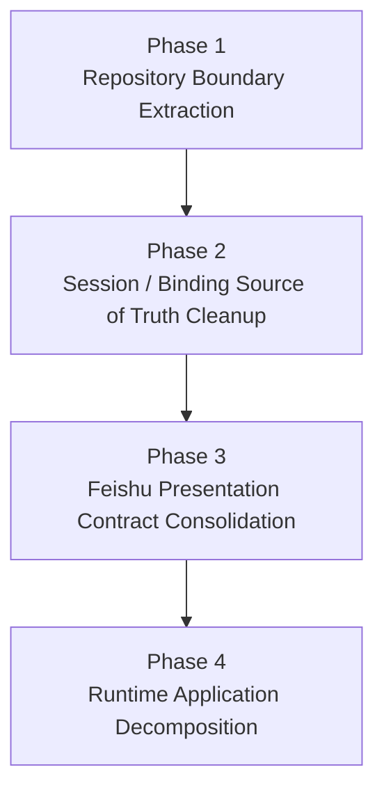
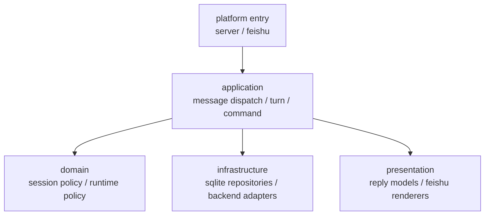
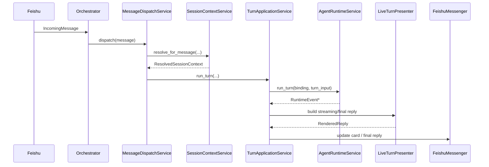
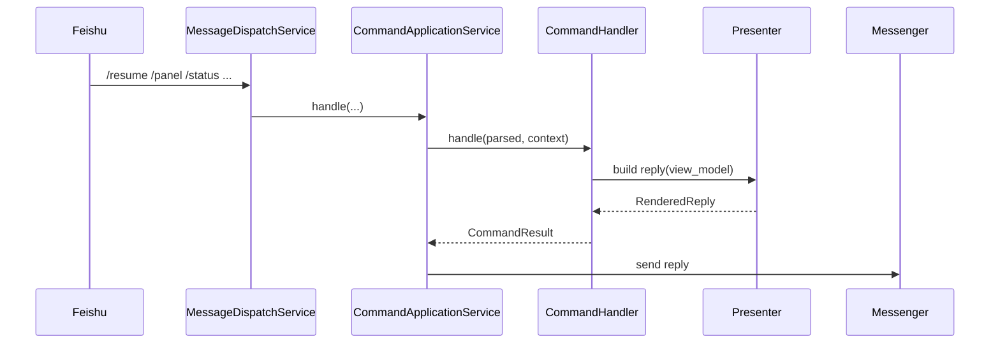
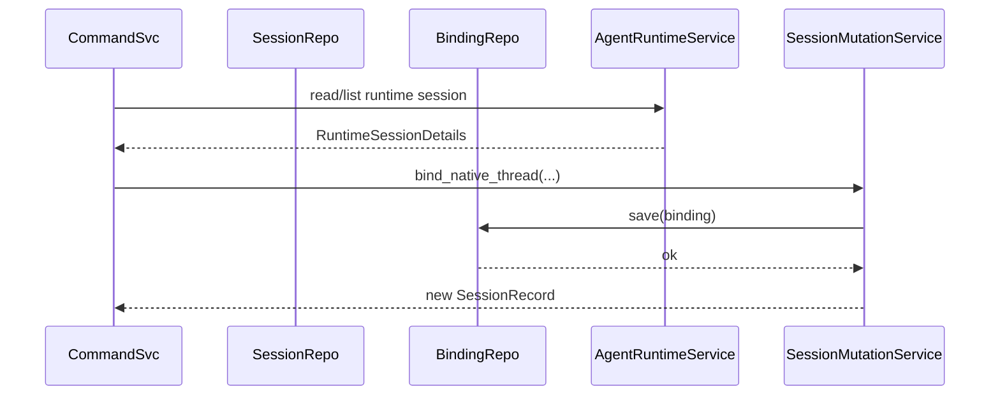

# OR-TASK-005 Runtime Boundary Refactor Detailed Design

> 归档说明：本文档描述的后续实施路径已被 `OR-TASK-009` 吸收；保留在归档目录中，作为历史实现蓝图参考。

更新时间：2026-03-18

## 文档目标

这份文档是 `OR-TASK-005` 的实现蓝图，回答下面六个问题：

1. 新增哪些类、方法、数据结构。
2. 旧代码哪些文件怎么迁移。
3. 每个关键事件怎么流转。
4. 每一阶段怎么保证行为不变。
5. 测试怎么补。
6. 回滚点和风险点是什么。

它和另外两份文档的关系如下：

- `docs/archived/or-task-005-runtime-boundary-refactor-design.md`
  - 负责问题勘察与重构方向。
- `docs/archived/or-task-005-runtime-boundary-overall-plan.md`
  - 负责范围、阶段和非目标。
- `docs/archived/or-task-005-runtime-boundary-detailed-design.md`
  - 负责具体实现设计。

## 一页总览



每一阶段都遵循两个约束：

- 先收敛调用边界，再删旧实现。
- 每一阶段结束时，用户可见行为默认保持不变。

## 目标结构

### 目标分层



### 目标依赖约束

- `runtime` 只能依赖 application input/output、repository interface、presentation contract。
- `session` 不能再依赖 `presentation`。
- `release` 不能再依赖 `presentation`。
- `presentation` 不能直接依赖 `StateStore`、`SessionBrowser`、`SessionWorkspaceService` 之外的查询副作用。
- sqlite 细节只留在 infrastructure repository 内部。

## 新增类 / 方法 / 数据结构

下面的“新增”是目标结构；不要求一开始全部落目录，可以先在现有包下引入，再逐步收敛。

## 1. Repository 边界

### 1.1 新增协议接口

建议新增文件：

- `src/openrelay/session/repositories.py`
- `src/openrelay/runtime/repositories.py`

建议新增协议：

```python
class SessionRepository(Protocol):
    def load(self, session_id: str) -> SessionRecord: ...
    def find_by_scope(self, base_key: str) -> SessionRecord | None: ...
    def load_for_scope(self, base_key: str, template: SessionRecord | None = None) -> SessionRecord: ...
    def save(self, session: SessionRecord) -> SessionRecord: ...
    def bind_scope(self, scope_key: str, session_id: str) -> None: ...
    def create_next(self, base_key: str, current: SessionRecord | None, **overrides: str) -> SessionRecord: ...
    def list_by_scope(self, base_key: str, limit: int = 20) -> list[SessionSummary]: ...
    def clear_scope(self, base_key: str) -> None: ...
```

```python
class SessionBindingRepository(Protocol):
    def save(self, binding: RelaySessionBinding) -> None: ...
    def get(self, relay_session_id: str) -> RelaySessionBinding | None: ...
    def find_by_feishu_scope(self, chat_id: str, thread_id: str) -> RelaySessionBinding | None: ...
    def list_recent(self, backend: str | None = None, limit: int = 20) -> list[RelaySessionBinding]: ...
    def update_native_session_id(self, relay_session_id: str, native_session_id: str) -> None: ...
```

```python
class MessageRepository(Protocol):
    def append(self, session_id: str, role: str, content: str) -> None: ...
    def list(self, session_id: str) -> list[dict[str, str]]: ...
    def clear(self, session_id: str) -> None: ...
    def count(self, session_id: str) -> int: ...
    def first_message(self, session_id: str, role: str) -> str: ...
    def last_message(self, session_id: str, role: str) -> str: ...
```

```python
class DedupRepository(Protocol):
    def remember_message(self, message_id: str) -> bool: ...
```

```python
class SessionAliasRepository(Protocol):
    def find_alias(self, alias_key: str) -> str | None: ...
    def save_alias(self, alias_key: str, base_key: str) -> None: ...
```

```python
class ShortcutRepository(Protocol):
    def list_shortcuts(self) -> tuple[DirectoryShortcut, ...]: ...
    def save_shortcut(self, shortcut: DirectoryShortcut) -> DirectoryShortcut: ...
    def get_shortcut(self, name: str) -> DirectoryShortcut | None: ...
    def remove_shortcut(self, name: str) -> bool: ...
```

### 1.2 新增 sqlite 实现

建议新增文件：

- `src/openrelay/storage/repositories.py`

建议新增实现类：

- `SqliteSessionRepository`
- `SqliteMessageRepository`
- `SqliteDedupRepository`
- `SqliteSessionAliasRepository`
- `SqliteShortcutRepository`

共同依赖一个轻量数据库上下文：

```python
@dataclass(slots=True)
class SqliteStateContext:
    connection: sqlite3.Connection
    config: AppConfig
```

### 1.3 `StateStore` 的新角色

`StateStore` 不再是万能服务，目标是退化成：

```python
class StateStore:
    connection: sqlite3.Connection
    config: AppConfig

    def close(self) -> None: ...
    def init_schema(self) -> None: ...
```

说明：

- 旧方法先保留一阶段，只作为 repository 的委托实现。
- 第一阶段完成后，上层不再直接 import `StateStore` 的业务方法。

## 2. Session / Binding 事实源

### 2.1 新增数据结构

建议新增文件：

- `src/openrelay/session/state_models.py`

建议新增：

```python
@dataclass(slots=True, frozen=True)
class SessionStateSnapshot:
    session: SessionRecord
    binding: RelaySessionBinding | None
```

```python
@dataclass(slots=True, frozen=True)
class ResolvedSessionContext:
    session_key: str
    session: SessionRecord
    binding: RelaySessionBinding | None
    is_control_scope: bool
```

目的：

- 让上层显式区分“relay session 记录”和“当前 backend attachment”。
- 避免到处直接把 `SessionRecord.native_session_id` 当唯一事实源。

### 2.2 新增协调服务

建议新增文件：

- `src/openrelay/session/context_service.py`

建议新增类：

```python
class SessionContextService:
    def __init__(
        self,
        sessions: SessionRepository,
        bindings: SessionBindingRepository,
        lifecycle: SessionLifecycleResolver,
    ) -> None: ...

    def resolve_for_message(
        self,
        session_key: str,
        *,
        is_top_level_control_command: bool,
        is_top_level_message: bool,
        control_key: str,
        feishu_chat_id: str,
        feishu_thread_id: str,
    ) -> ResolvedSessionContext: ...

    def load_snapshot(self, relay_session_id: str) -> SessionStateSnapshot: ...
```

### 2.3 `RelaySessionBinding` 字段所有权

明确字段归属：

- `SessionRecord`
  - `session_id`
  - `base_key`
  - `label`
  - `release_channel`
  - 统计与历史归属字段
- `RelaySessionBinding`
  - `backend`
  - `native_session_id`
  - `cwd`
  - `model`
  - `safety_mode`
  - `feishu_chat_id`
  - `feishu_thread_id`

设计约束：

- `SessionRecord.native_session_id` 标记为兼容字段。
- 上层新代码一律优先从 binding 读 backend attachment。
- 第 2 阶段结束后，不再从 binding 反向同步 `SessionRecord`。

## 3. Presentation Contract

### 3.1 新增回复数据结构

建议新增文件：

- `src/openrelay/presentation/replies.py`

建议新增：

```python
@dataclass(slots=True, frozen=True)
class RenderedTextReply:
    text: str
    command_name: str | None = None
```

```python
@dataclass(slots=True, frozen=True)
class RenderedCardReply:
    card: dict[str, object]
    fallback_text: str
    command_name: str | None = None
```

```python
@dataclass(slots=True, frozen=True)
class RenderedReply:
    text: RenderedTextReply | None = None
    card: RenderedCardReply | None = None
```

### 3.2 新增 presenter 输入模型

建议新增文件：

- `src/openrelay/presentation/view_models.py`

建议新增：

```python
@dataclass(slots=True, frozen=True)
class SessionListViewModel:
    entries: tuple[SessionListEntry, ...]
    page: int
    total_pages: int
    sort_mode: str
```

```python
@dataclass(slots=True, frozen=True)
class RuntimeStatusViewModel:
    command_name: str
    session_title: str
    cwd_text: str
    backend_text: str
    model_text: str
    safety_mode: str
```

```python
@dataclass(slots=True, frozen=True)
class LiveTurnReplyModel:
    transcript_markdown: str
    summary_text: str
    final_text: str
```

原则：

- presenter 不再自己查 `store`。
- presenter 只把 view model 渲染成 `RenderedReply`。

### 3.3 新增渲染器

建议新增文件：

- `src/openrelay/feishu/reply_renderer.py`

建议新增类：

```python
class FeishuReplyRenderer:
    def render_text(self, reply: RenderedTextReply) -> str: ...
    def render_card(self, reply: RenderedCardReply) -> dict[str, object]: ...
```

说明：

- 当前 `build_complete_card()`、`render_transcript_markdown()` 可以继续复用。
- 但 runtime 以后只依赖 `RenderedReply`，不直接拼装 card payload。

## 4. Runtime Application 层

### 4.1 新增应用输入输出模型

建议新增文件：

- `src/openrelay/runtime/application_models.py`

建议新增：

```python
@dataclass(slots=True, frozen=True)
class DispatchContext:
    message: IncomingMessage
    session_key: str
    session: SessionRecord
    binding: RelaySessionBinding | None
    execution_key: str
```

```python
@dataclass(slots=True, frozen=True)
class CommandResult:
    handled: bool
    reply: RenderedReply | None = None
    follow_up_action: str | None = None
```

```python
@dataclass(slots=True, frozen=True)
class TurnExecutionResult:
    final_state: LiveTurnViewModel
    rendered_reply: RenderedReply
```

### 4.2 新增应用服务

建议新增文件：

- `src/openrelay/runtime/message_dispatch_service.py`
- `src/openrelay/runtime/command_application_service.py`
- `src/openrelay/runtime/turn_application_service.py`

建议新增方法：

```python
class MessageDispatchService:
    async def dispatch(self, message: IncomingMessage) -> None: ...
    async def dispatch_serialized(self, context: DispatchContext) -> None: ...
```

```python
class CommandApplicationService:
    async def handle(
        self,
        message: IncomingMessage,
        session_key: str,
        session: SessionRecord,
        binding: RelaySessionBinding | None,
    ) -> CommandResult: ...
```

```python
class TurnApplicationService:
    async def run_turn(
        self,
        message: IncomingMessage,
        session_key: str,
        session: SessionRecord,
        binding: RelaySessionBinding | None,
    ) -> TurnExecutionResult: ...

    async def stop_turn(self, message: IncomingMessage, execution_key: str) -> None: ...
```

### 4.3 `RuntimeOrchestrator` 最终角色

最终只保留：

- 构造依赖
- 接收入口消息
- 调用 `MessageDispatchService`
- 生命周期关闭

即：

```python
class RuntimeOrchestrator:
    async def dispatch_message(self, message: IncomingMessage) -> None:
        await self.message_dispatch.dispatch(message)
```

## 旧代码迁移方案

## Phase 1 迁移：Repository Boundary Extraction

### 迁移目标

- 上层服务不再直接调 `StateStore` 业务方法。
- 旧行为保持不变。

### 文件迁移

- `src/openrelay/storage/state.py`
  - 保留 schema、连接、底层 SQL。
  - 逐步把业务方法移动到 `storage/repositories.py`。
- `src/openrelay/session/browser.py`
  - 从依赖 `StateStore` 改为依赖 `SessionRepository`、`SessionBindingRepository`。
- `src/openrelay/session/lifecycle.py`
  - 从依赖 `StateStore` 改为依赖 `SessionRepository`。
- `src/openrelay/session/shortcuts.py`
  - 改为依赖 `ShortcutRepository`。
- `src/openrelay/runtime/orchestrator.py`
  - 构造 repository 并把它们注入现有服务。

### 迁移方法

先用“委托适配”过渡：

```python
class SqliteSessionRepository(SessionRepository):
    def __init__(self, store: StateStore) -> None:
        self.store = store

    def load(self, session_id: str) -> SessionRecord:
        return self.store.get_session(session_id)
```

这样第一阶段不改 SQL，不改 schema，只改调用边界。

## Phase 2 迁移：Session / Binding Source of Truth Cleanup

### 迁移目标

- 移除 `_sync_session_record()`。
- 业务逻辑改从 binding 读 attachment。

### 文件迁移

- `src/openrelay/session/store.py`
  - 移除 `_sync_session_record()`。
  - `update_native_session_id()` 只更新 binding。
- `src/openrelay/runtime/orchestrator.py`
  - turn 启动、恢复、stop、status 相关逻辑改为读取 `ResolvedSessionContext`。
- `src/openrelay/runtime/commands.py`
  - `/resume`、`/compact`、`/backend` 等命令改为显式消费 binding。
- `src/openrelay/presentation/runtime_status.py`
  - 状态文案改从 `SessionStateSnapshot` 或独立 view model 构造。

### 兼容策略

- `SessionRecord.native_session_id` 先保留字段。
- 读路径先改，写路径后删。
- 当所有读路径都已切到 binding 后，再删除同步补丁。

## Phase 3 迁移：Feishu Presentation Contract Consolidation

### 迁移目标

- presenter 不再自己查 store / browser。
- runtime 不再直接组 card JSON。

### 文件迁移

- `src/openrelay/presentation/live_turn.py`
  - 保留 transcript 组装逻辑。
  - 输出从 `dict[str, Any]` 逐步收敛到 `LiveTurnReplyModel` + `RenderedReply`。
- `src/openrelay/presentation/panel.py`
  - `build_panel_payload()` 改为先构造 view model，再返回 `RenderedReply`。
- `src/openrelay/presentation/runtime_status.py`
  - `build_text()` 改为 `build_reply(view_model) -> RenderedReply`。
- `src/openrelay/runtime/help.py`
  - help 卡片构造迁到 presentation 侧。
- `src/openrelay/runtime/card_sender.py`
  - 改为只发送 `RenderedReply`。

### 兼容策略

- presenter 内部仍可暂时复用现有 `build_*_card()`。
- 新 contract 先在 live turn 接入，再逐步推广到 panel / help / status。

## Phase 4 迁移：Runtime Application Decomposition

### 迁移目标

- orchestrator 只剩装配和入口。
- `commands.py` 不再承载大部分业务。

### 文件迁移

- `src/openrelay/runtime/orchestrator.py`
  - dispatch、序列化、active run 协调迁到 `MessageDispatchService`。
- `src/openrelay/runtime/commands.py`
  - 保留参数解析和 handler dispatch。
  - 业务逻辑拆到 `command_application_service.py` 与 `runtime/handlers/*.py`。
- `src/openrelay/runtime/turn.py`
  - turn stream 与 finalization 的协调迁到 `TurnApplicationService`。

### handler 切分建议

建议新增：

- `src/openrelay/runtime/handlers/panel_handler.py`
- `src/openrelay/runtime/handlers/release_handler.py`
- `src/openrelay/runtime/handlers/session_handler.py`
- `src/openrelay/runtime/handlers/backend_handler.py`

每个 handler 统一接口：

```python
class CommandHandler(Protocol):
    async def handle(self, command: ParsedCommand, context: DispatchContext) -> CommandResult: ...
```

## 关键事件流转

## 1. 普通消息 turn 流



关键要求：

- `RuntimeEvent` 的产生和 reducer 逻辑不改。
- 只改变 runtime 如何消费这些事件并生成 reply。

## 2. 命令消息流



关键要求：

- 参数解析和业务执行分离。
- `reply()` / `send_panel()` / `send_help()` 之类 hook 最终会收敛成统一 reply 发送。

## 3. `/resume` 事件流



关键变化：

- 更新后端 attachment 只写 binding。
- session record 只更新 relay 侧稳定字段。

## 4. approval / stop / interrupt 流

这三类事件保持现有 `AgentRuntimeService` 和 `RuntimeExecutionCoordinator` 语义不变。

本轮只调整消费层：

- approval resolved 后，由 `TurnApplicationService` 触发 presenter 更新。
- stop 命令仍走 execution key，但执行入口移到 `MessageDispatchService` / `TurnApplicationService`。
- interrupt 相关事件仍由 reducer 写入 `LiveTurnViewModel`。

## 每一阶段如何保证行为不变

## Phase 1

- 不改 schema。
- 不改 SQL。
- 不改 service 对外 API。
- 只把 `StateStore` 方法包装到 repository。

验证口径：

- 现有测试全部保持通过。
- 运行时对同一输入生成的 session / shortcut / dedup 行为完全一致。

## Phase 2

- 先改读路径，后改写路径。
- `SessionRecord.native_session_id` 先保留，不立即删。
- 对外文本和卡片文案不改。

验证口径：

- `/resume`、`/compact`、新 thread 创建、stop 后续恢复行为与原来一致。
- 只允许数据库内部事实源变化，不允许用户可见输出变化。

## Phase 3

- 先引入 `RenderedReply`，但 presenter 内部继续复用老 card builder。
- 发送路径双测：老调用点和新 contract 对同一 view model 生成相同 card / fallback text。

验证口径：

- 流式 turn 卡片结构不变。
- panel/help/status 的文本和卡片内容不变。

## Phase 4

- 先搬方法，再裁剪 orchestrator / commands。
- handler 新旧路径短期并存，但只允许一个入口被实际调用。
- 当新 service 稳定后再删旧私有方法。

验证口径：

- dispatch 序列化、active run、queued follow-up、stop、approval 语义不变。
- 只允许代码组织变化，不允许执行顺序变化。

## 测试设计

## 1. Repository 层测试

建议新增：

- `tests/test_storage_repositories.py`

覆盖：

- `SqliteSessionRepository`
- `SqliteMessageRepository`
- `SqliteDedupRepository`
- `SqliteShortcutRepository`
- `SqliteSessionAliasRepository`

重点断言：

- repository 输出与当前 `StateStore` 方法保持一致。
- 不引入额外 schema 变化。

## 2. Session / Binding 事实源测试

建议新增：

- `tests/test_session_context_service.py`
- `tests/test_session_binding_repository.py`

覆盖：

- `resolve_for_message()`
- `find_by_feishu_scope()`
- binding 更新后 session 不再被反向同步
- placeholder control session 替代逻辑

重点断言：

- binding 是 attachment 的唯一事实源。
- session record 仍能正确表达 relay scope。

## 3. Presentation Contract 测试

建议新增：

- `tests/test_rendered_reply.py`

覆盖：

- `RenderedReply` -> Feishu card/text 渲染
- live turn / panel / help / status 对同一输入的输出保持不变

建议保留并扩充：

- `tests/test_feishu_streaming.py`
- `tests/test_live_turn_presenter.py`

## 4. Runtime Application 测试

建议新增：

- `tests/test_message_dispatch_service.py`
- `tests/test_command_application_service.py`
- `tests/test_turn_application_service.py`

覆盖：

- 串行化执行
- active run + follow-up 队列
- stop / interrupt
- 命令分发
- 普通消息 turn 执行

## 5. 回归测试矩阵

至少保留下面这些高价值回归：

- 私聊顶层普通消息
- 私聊 thread 内普通消息
- `/panel`
- `/resume`
- `/compact`
- `/status`
- `/cwd` / `/shortcut`
- 流式输出 + approval
- stop 后继续 follow-up

## 回滚点

每一阶段都必须有独立回滚点，避免做到一半只能整体回滚。

## Phase 1 回滚点

- repository interface 已引入，但上层尚未删除 `StateStore` 旧方法。
- 如有问题，可只回退依赖注入变更，保留 repository 文件。

## Phase 2 回滚点

- 删除 `_sync_session_record()` 之前必须单独提交。
- 如果行为异常，可回滚“读 binding 替代 session.native_session_id”的那一批提交。

## Phase 3 回滚点

- `RenderedReply` 接入 live turn、panel、help、status 应分别提交。
- 如 card 行为异常，只回退某个 presenter 的 contract 切换，不影响其他模块。

## Phase 4 回滚点

- `MessageDispatchService`、`CommandApplicationService`、`TurnApplicationService` 分开提交。
- orchestrator 精简必须放在 service 接入稳定之后，作为单独提交。

## 风险点

## 1. 事实源切换风险

最容易出问题的是 `SessionRecord.native_session_id` 和 binding 的切换期。

风险：

- 某些旧逻辑仍偷偷读 `session.native_session_id`。
- `/resume`、`/compact`、status 文案可能出现来源不一致。

缓解：

- 第 2 阶段先做全仓搜索与测试覆盖。
- 明确加一个临时断言：新代码路径禁止直接依赖 `session.native_session_id` 决策。

## 2. presenter 迁移风险

风险：

- card JSON 细节多，容易在“看起来结构一样”时引入飞书渲染差异。

缓解：

- presenter 切换时做 snapshot 测试。
- 对已有关键 card 保留 JSON 级别比较，而不是只比较 fallback text。

## 3. dispatch 重组风险

风险：

- active run、queued follow-up、stop 的时序很容易在搬代码时破坏。

缓解：

- 先提取 service，再搬逻辑，不先改执行顺序。
- 给 `MessageDispatchService` 补行为级测试，覆盖锁、排队、绕过命令。

## 4. 过度重构风险

风险：

- 把“边界收敛”演变成“全面重写”，导致提交过大、难以回滚。

缓解：

- 每个阶段只解决一个结构问题。
- 没有测试和回滚点的重组不应合并。

## 实施建议

建议接下来按这个顺序落地：

1. 先开 `005-A`，只做 repository 边界和对应测试。
2. 再开 `005-B`，解决 session / binding 事实源。
3. 再开 `005-C`，统一 reply contract。
4. 最后开 `005-D`，拆 orchestrator 与 commands。

如果某一阶段开始需要同时碰 storage、presentation、runtime 三条主线，说明拆分粒度已经失控，应该重新切任务，而不是继续往前推。
