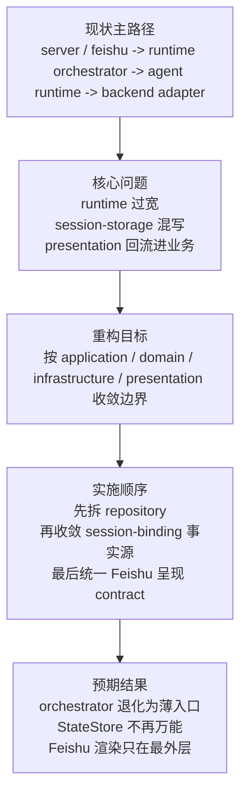
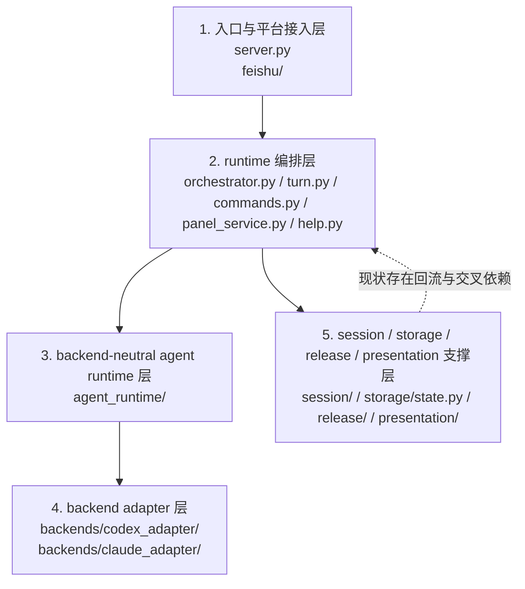
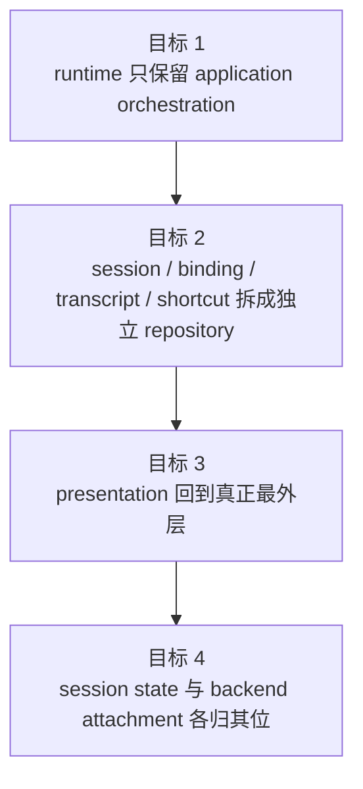
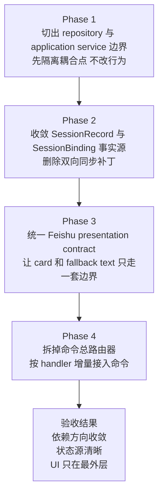
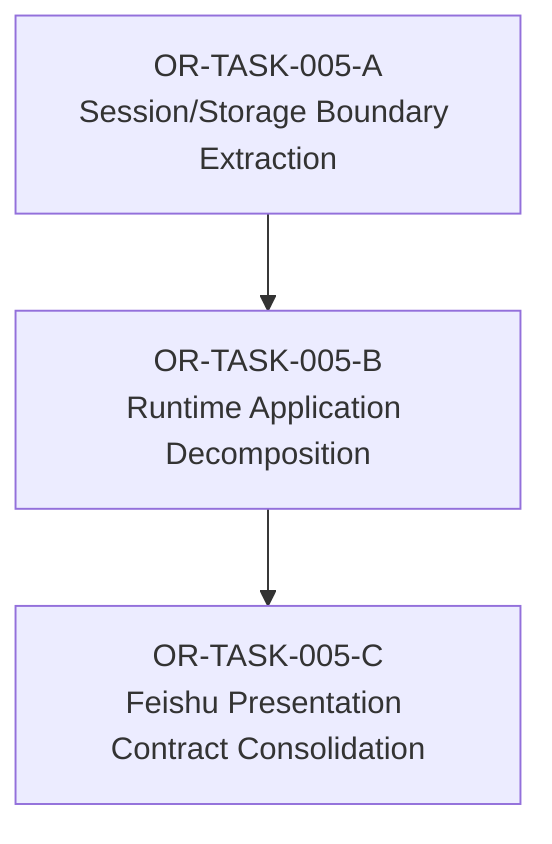

# OR-TASK-005 Runtime Boundary Refactor Design

> 归档说明：本任务的设计结论已被 `OR-TASK-009` 吸收并进入实现主路径；本文档仅保留为历史设计证据，不再作为当前设计入口。

更新时间：2026-03-18

## 背景

这份设计稿只基于当前代码结构，不把现有文档当作事实来源。

本轮目标不是立刻改代码，而是先回答三个问题：

1. 当前项目真实的运行架构是什么。
2. 哪些模块已经超出职责边界，或者靠补丁式逻辑维持主路径。
3. 后续重构应该沿什么边界收敛，才能减少继续叠补丁。

## 快速阅读

如果只想先抓住这个任务的核心，可以直接看下面这张图。

## 当前代码里的实际架构

按当前实现，`openrelay` 的主路径可以概括为五层。

先看纵向结构图，再读下面五层细节会更快。

### 1. 入口与平台接入层

- `src/openrelay/server.py`
  - 负责 FastAPI 启动、Feishu webhook / websocket 接入、运行时对象装配。
- `src/openrelay/feishu/`
  - 负责 Feishu 入站解析、消息发送、打字态、streaming card 与 websocket client。

这层已经明显是平台适配层，但目前它并不只是 I/O 壳层；部分 Feishu 交互语义已经上浮到 runtime 和 presentation。

### 2. runtime 编排层

- `src/openrelay/runtime/orchestrator.py`
- `src/openrelay/runtime/turn.py`
- `src/openrelay/runtime/commands.py`
- `src/openrelay/runtime/panel_service.py`
- `src/openrelay/runtime/help.py`

这层承担了当前系统的大部分主流程：

- 入站消息去重、鉴权、scope 解析、active run 串行化
- 命令路由
- turn 执行与 stop / follow-up / approval 协调
- reply route 与 Feishu card/text 回包
- runtime backend 装配

也就是说，runtime 现在既是 application service，又夹带了 UI 选择、平台策略、对象装配和一部分 domain policy。

### 3. backend-neutral agent runtime 层

- `src/openrelay/agent_runtime/`

这层相对清晰：

- `backend.py` 定义统一 backend protocol
- `events.py` / `models.py` 定义 runtime 事件与 view model
- `reducer.py` 维护 live turn state
- `service.py` 负责 backend 选择、turn 启动、approval 回传、binding 更新

这是当前仓库里最接近稳定内核的一层。

### 4. backend adapter 层

- `src/openrelay/backends/codex_adapter/`
- `src/openrelay/backends/claude_adapter/`

这层负责把具体 backend 协议映射到 agent runtime 统一事件模型。

其中 Codex 适配已经形成较完整链路：

- transport / app-server client
- protocol mapper / semantic mapper
- turn stream
- runtime backend facade

Claude 目前是能力较弱但接口同构的适配层。

### 5. session / storage / release / presentation 支撑层

- `src/openrelay/session/`
- `src/openrelay/storage/state.py`
- `src/openrelay/release/service.py`
- `src/openrelay/presentation/`

这部分本应分别承担：

- session 作用域与绑定
- 数据持久化
- release channel 切换
- 视图投影

但在当前代码里，这几层已经出现明显回流和交叉依赖。

## 从代码看见的主要偏离

### A. `RuntimeOrchestrator` 已经变成总装配 + 总调度 + 总策略中心

直接证据：`src/openrelay/runtime/orchestrator.py`

它当前同时负责：

- runtime backend 构建
- message dispatch 主流程
- session lifecycle 调用
- command router / help / panel service / release service 装配
- reply route 与 Feishu 回包
- active run 协调
- stop / restart / streaming finalization

这说明 orchestration 已超出“编排”职责，实际成为系统的 god object。后续任何需求只要碰主路径，都容易继续堆到这里。

### B. `presentation` 不再只是视图层，已经反向参与 session / release 语义

直接证据：

- `src/openrelay/session/mutations.py` 依赖 `openrelay.presentation.session.SessionPresentation`
- `src/openrelay/release/service.py` 依赖 `openrelay.presentation.session.SessionPresentation`
- `src/openrelay/presentation/panel.py` 直接依赖 `session.browser`、`session.shortcuts`、`session.workspace`
- `src/openrelay/presentation/live_turn.py` 直接依赖 `openrelay.feishu`

问题不在于 import 本身，而在于职责方向反了：

- session mutation 本应只改 session state，不该依赖 UI 语义对象
- release service 本应只做 channel switch 规则，不该依赖展示层决定 model 文案
- presentation 本应消费投影后的数据，不该自己回头拼 session 查询能力

结果就是：展示层不再是最外层，而变成了业务结构的一部分。

### C. `StateStore` 承担了过多彼此无关的职责

直接证据：`src/openrelay/storage/state.py`

单文件里当前同时包含：

- sqlite schema 初始化与迁移
- legacy DB 文件迁移
- session 持久化
- session scope pointer 规则
- message transcript 存储与裁剪
- message dedup
- session alias 存储
- directory shortcut 存储
- session list / resume / clear 等高层查询语义

这已经不是 repository，而是一个混合了 storage、query service、scope policy、migration logic 的大管家。

这种结构的直接代价是：

- session 规则很难单独替换或测试
- 新功能容易继续直接塞进 store
- storage 细节持续上浮到上层 service

### D. session binding 与 session record 之间存在双向同步补丁

直接证据：`src/openrelay/session/store.py`

`SessionBindingStore.save()` / `update_native_session_id()` 会在保存 binding 后调用 `_sync_session_record()`，把 binding 信息再回写到 `sessions` 表对应的 `SessionRecord`。

这意味着现在存在两份都想表达“当前会话真实后端状态”的数据：

- `relay_session_bindings`
- `sessions`

为了不让两边漂移，当前实现增加了回写同步补丁。

这类结构通常说明边界没有划清：

- 要么 `SessionRecord` 只保留 relay 视角的稳定配置
- 要么 binding 成为唯一的 backend attachment 事实源

但现在两者都保留了一部分“当前真实后端状态”，所以只能靠同步逻辑勉强维持一致。

### E. command 路由器承担了解析、授权、状态变更和结果组织四种职责

直接证据：`src/openrelay/runtime/commands.py`

`RuntimeCommandRouter` 当前既负责：

- 文本命令解析
- 权限判断
- 调用 session / release / status / help / panel 等服务
- 组织用户回复文案
- `/resume`、`/compact` 等带状态分支的控制逻辑

文件长度和依赖宽度都说明，它已经不是单纯 router，而是命令应用层和部分交互层的混合体。

继续在这里扩命令，边界只会越来越差。

### F. Feishu card 相关视图逻辑分散在多个包中

直接证据：

- `src/openrelay/presentation/session.py`
- `src/openrelay/presentation/panel.py`
- `src/openrelay/presentation/live_turn.py`
- `src/openrelay/runtime/help.py`
- `src/openrelay/runtime/interactions/controller.py`
- `src/openrelay/feishu/reply_card.py`

当前的 card / text / transcript 视图逻辑不是单点收敛，而是按功能散落：

- help 卡片在 runtime
- panel 卡片在 presentation
- live turn final card 在 presentation，但底层 markdown/card helper 在 feishu
- approval 交互卡片又在 runtime interaction controller

这会造成一个实际问题：每次改 Feishu 呈现 contract，都要同时修改 runtime、presentation、feishu 三层。

### G. 包级依赖方向已经开始回流

按当前 import 关系，至少存在以下包级回流：

- `runtime -> presentation`
- `presentation -> session`
- `session -> presentation`
- `release -> presentation`
- `presentation -> feishu`
- `runtime.__init__ -> presentation`

文件级虽然还没形成直接循环 import，但包级职责已经出现环状依赖趋势。这通常是正式循环之前的预警阶段。

## 当前实现里最明显的“补丁味”位置

这些点不一定是 bug，但都体现出结构上在用补丁维持主路径。

### 1. placeholder control session 识别

- `src/openrelay/session/lifecycle.py`

`_load_control_session()` 和 `_is_placeholder_control_session()` 在用一组启发式条件判断“当前 session 是否只是占位 control session”。

这说明当前 session 创建时机和 session 可见语义没有完全统一，只能在读取阶段再补一次判定。

### 2. binding 反向同步 session record

- `src/openrelay/session/store.py`

这是典型的“两个事实源并存后靠回写保持一致”的补丁结构。

### 3. card fallback text 在多个 presenter / service 间重复维护

- `src/openrelay/presentation/live_turn.py`
- `src/openrelay/presentation/panel.py`
- `src/openrelay/runtime/panel_service.py`
- `src/openrelay/runtime/card_sender.py`

当前很多 card payload 都同时维护：

- card JSON
- fallback text
- fallback 发送策略

这本身不是问题，但因为 contract 没有收敛成统一 view result，导致每个 presenter/service 都要自己处理一次 fallback 语义。

### 4. `runtime_backends: dict[str, object]`

- `src/openrelay/runtime/orchestrator.py`

运行时后端已实际遵循 `AgentBackend` 协议，但 orchestrator 仍用 `dict[str, object]` 保存，再在别处做能力判断。这会让边界更松，类型和职责都不够明确。

## 重构目标

这次重构建议不追求“大改名”或“一次性重写”，而是围绕职责边界收敛到下面四个目标。

### 目标 1：把 runtime 收敛成 application orchestration，而不是大杂烩

runtime 层只保留：

- 入站消息编排
- command / turn / interaction 三类用例调度
- reply route 选择
- 生命周期协调

不再让它直接承担：

- 视图拼装细节
- session 持久化细节
- release 文案拼装
- 平台卡片细节

### 目标 2：把 session / binding / transcript / shortcut 的持久化拆成独立 repository

建议至少拆成：

- `SessionRepository`
- `SessionBindingRepository`
- `MessageRepository`
- `DedupRepository`
- `ShortcutRepository`
- `SessionAliasRepository`

sqlite 仍可保留一套连接与 schema 管理，但上层不再直接面对一个万能 `StateStore`。

### 目标 3：让 presentation 回到真正的最外层

presentation 只接受已整理好的 view model，不直接调用 session/browser/store，也不反向参与 session mutation。

Feishu-specific card renderer 应明确成为 adapter / presenter 的末端实现，而不是散落在 runtime 与 presentation 之间。

### 目标 4：让 session state 与 backend attachment 各归其位

建议明确区分：

- `SessionRecord`：用户可见的 relay session 配置与历史归属
- `SessionBinding`：当前 relay session 绑定到哪个 backend session / thread

两者不要重复存储“当前真实后端状态”。

## 建议的目标结构

不要求立即改目录，但建议按以下逻辑收敛。

### A. domain 层

建议收敛出稳定的领域对象与规则：

- `session_domain`
  - scope key 规则
  - session lifecycle policy
  - release channel / cwd / model / sandbox 变更规则
- `turn_domain`
  - active run / queued follow-up / interruption 语义
- `runtime_domain`
  - backend-neutral live turn state

这层不依赖 Feishu，不依赖 sqlite，不依赖 card helper。

### B. application 层

建议按用例拆成三个主服务：

- `MessageDispatchService`
  - 负责入口消息主路径、鉴权、去重、scope 选择
- `CommandApplicationService`
  - 负责命令解析后的业务执行，不负责卡片渲染细节
- `TurnApplicationService`
  - 负责 turn 执行、approval、streaming state、finalization

`RuntimeOrchestrator` 最终应退化为装配器和薄入口。

### C. infrastructure 层

- sqlite repositories
- Codex / Claude backend adapters
- Feishu messenger / websocket / webhook gateway

基础设施层只负责外部协议和持久化，不承载跨模块业务规则。

### D. presentation / adapter 层

建议显式区分：

- backend-neutral view model builder
- Feishu card renderer
- Feishu text fallback renderer

统一把“card + fallback text”的组合收敛为单一返回结构，例如 `RenderedReply`，避免 presenter/service 各自重复管理 fallback 语义。

## 推荐的分阶段重构路线

先看路线图，再读每个 phase 的关闭条件。

### Phase 1：先切出边界，不先改行为

目标：把最容易继续膨胀的耦合点先隔离。

建议动作：

1. 为 `StateStore` 抽 repository 接口，先保留 sqlite 实现不变。
2. 为 command、turn、panel、help 定义独立 application service 输入输出。
3. 把 `SessionPresentation` 中与 session policy 无关的纯展示逻辑留在 presentation，把会话命名/标题/预览策略抽成独立 policy。
4. 去掉 `runtime.__init__` 对 presentation 常量的再导出。

关闭条件：

- runtime 不再直接依赖万能 `StateStore`
- session / release 不再 import presentation
- `RuntimeOrchestrator` 只做装配与转发

### Phase 2：收敛 session 与 binding 的事实源

目标：消除双向同步补丁。

建议动作：

1. 明确 `SessionRecord` 与 `SessionBinding` 各自字段所有权。
2. 删除 `_sync_session_record()` 这类反向同步逻辑。
3. 让 session list / resume / current scope 查询显式决定使用哪类事实源，而不是混写。
4. 重写 placeholder control session 判定，让“占位会话”不再靠读路径启发式识别。

关闭条件：

- binding 更新不再回写 session record
- control session 不再依赖 placeholder heuristic

### Phase 3：收敛 Feishu 呈现层

目标：把 UI 契约收回到最外层。

建议动作：

1. 把 `runtime/help.py`、`runtime/interactions/controller.py` 中的 Feishu card 构造迁到统一 presenter/renderer 包。
2. `presentation` 不再直接拿 session/browser/store 做查询。
3. 统一定义 `RenderedCardReply` / `RenderedTextReply` 之类的回复对象。
4. `CommandCardSender` 只负责发送，不再承担视图补全。

关闭条件：

- card JSON 生成只在一个清晰边界内发生
- fallback text 语义只有一套 contract

### Phase 4：拆掉命令总路由器

目标：把命令系统从“一个大文件”收敛为清晰用例集合。

建议动作：

1. `RuntimeCommandRouter` 只保留命令解析和 handler 分发。
2. `/cwd`、`/resume`、`/compact`、`/main`、`/develop` 等分别有独立 handler。
3. 授权、参数解析、业务执行、回复模型分别拆层。

关闭条件：

- `commands.py` 不再集中承载大部分命令业务逻辑
- 新命令可以按 handler 增量接入，而不继续改主路由大文件

## 明确不建议的重构方式

### 1. 不建议直接大规模改目录名

当前最大问题不是目录名，而是职责边界。先抽边界，再考虑是否换目录结构。

### 2. 不建议一边重构一边继续叠新命令和新卡片语义

如果业务新增仍继续直接落在 `RuntimeOrchestrator`、`commands.py`、`StateStore`，重构会被实时抵消。

### 3. 不建议先重写 Codex / Claude adapter

当前最主要的问题不在 backend adapter，而在 runtime、session、presentation 的边界回流。先动 adapter 会偏题。

## 这份设计稿对应的首批实施任务

建议先拆成下面三个任务，而不是一次性开“大重构”。

### OR-TASK-005-A Session/Storage Boundary Extraction

- 抽出 repository 边界
- 缩小 `StateStore`
- 明确 session / binding 事实源

### OR-TASK-005-B Runtime Application Decomposition

- 拆分 orchestrator / commands / turn application service
- 去掉 runtime 对展示细节的直接拥有

### OR-TASK-005-C Feishu Presentation Contract Consolidation

- 统一 card / fallback text contract
- 收敛 help / panel / live turn / approval 的 Feishu 渲染边界

## 验收标准

当后续重构完成时，至少应满足以下结构性结果：

1. `session` 和 `release` 不再依赖 `presentation`。
2. `presentation` 不再直接查询 `store` 或 `session browser`。
3. `StateStore` 不再同时承担 session policy、repository 和 migration orchestration 三种职责。
4. `RuntimeOrchestrator` 文件体量和依赖宽度明显下降，退化为薄协调层。
5. `SessionBindingStore` 不再通过回写 `SessionRecord` 保持一致性。
6. Feishu card 生成 contract 收敛到单一边界。

## 本轮代码实勘证据

本设计稿主要依据以下实现文件：

- `src/openrelay/server.py`
- `src/openrelay/runtime/orchestrator.py`
- `src/openrelay/runtime/turn.py`
- `src/openrelay/runtime/commands.py`
- `src/openrelay/runtime/panel_service.py`
- `src/openrelay/runtime/help.py`
- `src/openrelay/agent_runtime/service.py`
- `src/openrelay/session/lifecycle.py`
- `src/openrelay/session/mutations.py`
- `src/openrelay/session/store.py`
- `src/openrelay/session/browser.py`
- `src/openrelay/storage/state.py`
- `src/openrelay/presentation/session.py`
- `src/openrelay/presentation/panel.py`
- `src/openrelay/presentation/live_turn.py`
- `src/openrelay/release/service.py`
