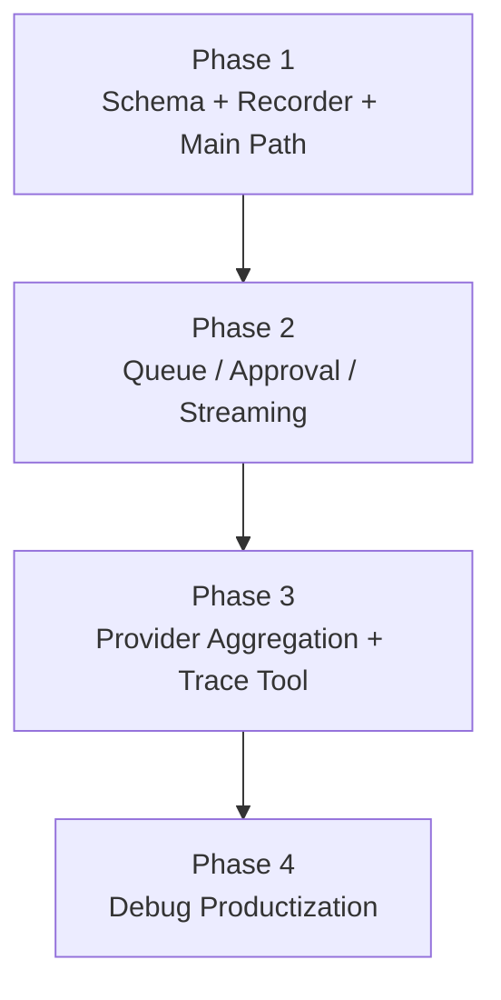
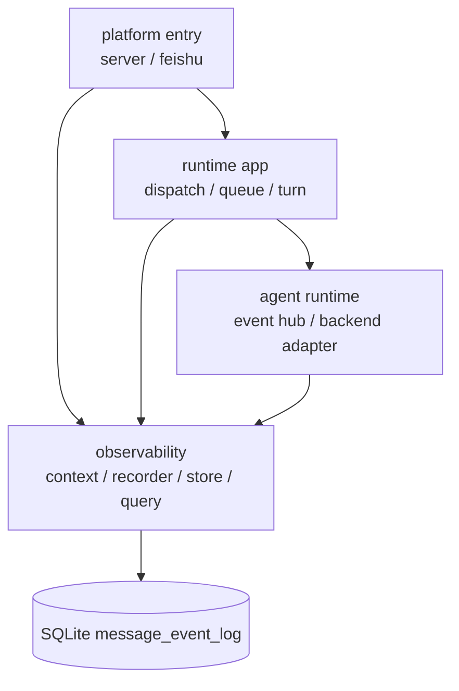
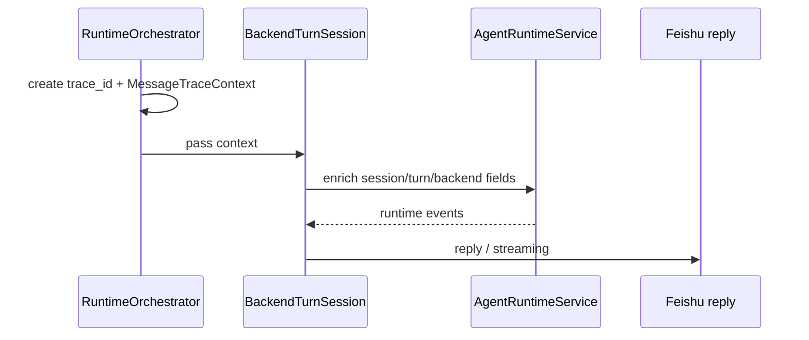

# OR-TASK-007 消息行为日志详细设计

更新时间：2026-03-18

## 文档目标

这份文档是 `OR-TASK-007` 的实现蓝图，回答下面七个问题：

1. 新增哪些模块、类、方法、数据结构。
2. SQLite schema 如何落地，索引和裁剪策略是什么。
3. `trace_id`、`session_id`、`turn_id` 等关联键如何生成和传播。
4. ingress、runtime、provider、egress 各层具体在哪里埋点。
5. 高频事件如何聚合，避免数据库被 streaming 噪音淹没。
6. 查询接口和本地 trace 工具如何设计。
7. 如何分阶段迁移，并保证现有行为不被打乱。

它和另外一份文档的关系如下：

- `docs/design/or-task-007-message-observability-design.md`
  - 负责总体目标、技术选型、范围和阶段。
- `docs/design/or-task-007-message-observability-detailed-design.md`
  - 负责具体实现设计。

## 一页总览



设计约束只有两条：

- 先建立独立 observability 边界，再逐步扩埋点范围。
- 默认只记录关键业务语义事件，不做全量底层流量镜像。

## 目标结构

### 目标分层



### 依赖约束

- `observability` 允许依赖 `core` 基础模型，但不允许反向依赖 `runtime` 具体实现细节。
- `runtime`、`feishu`、`agent_runtime` 只依赖 recorder 接口，不直接写 SQL。
- SQLite 细节收敛在 `observability/store.py`。
- `StateStore` 只共享数据库连接与 schema 初始化入口，不承担 observability 查询逻辑。

## 新增模块 / 类 / 数据结构

建议新增包：

- `src/openrelay/observability/__init__.py`
- `src/openrelay/observability/models.py`
- `src/openrelay/observability/context.py`
- `src/openrelay/observability/store.py`
- `src/openrelay/observability/recorder.py`
- `src/openrelay/observability/query.py`
- `src/openrelay/tools/trace.py`

## 1. 数据模型

### 1.1 事件级模型

建议新增：

```python
@dataclass(slots=True, frozen=True)
class MessageEventRecord:
    trace_id: str
    occurred_at: str
    level: str
    stage: str
    event_type: str
    backend: str = ""
    relay_session_id: str = ""
    session_key: str = ""
    execution_key: str = ""
    turn_id: str = ""
    native_session_id: str = ""
    incoming_event_id: str = ""
    incoming_message_id: str = ""
    reply_message_id: str = ""
    chat_id: str = ""
    root_id: str = ""
    thread_id: str = ""
    parent_id: str = ""
    source_kind: str = ""
    summary: str = ""
    payload: dict[str, Any] = field(default_factory=dict)
```

约束：

- `summary` 用于快速阅读。
- `payload` 用于补充细节，但必须经过统一裁剪。
- 第一阶段禁止把长文本正文或完整 provider payload 原样堆入 `payload`。

### 1.2 上下文模型

建议新增：

```python
@dataclass(slots=True, frozen=True)
class MessageTraceContext:
    trace_id: str
    relay_session_id: str = ""
    session_key: str = ""
    execution_key: str = ""
    turn_id: str = ""
    native_session_id: str = ""
    backend: str = ""
    incoming_event_id: str = ""
    incoming_message_id: str = ""
    chat_id: str = ""
    root_id: str = ""
    thread_id: str = ""
    parent_id: str = ""
    source_kind: str = ""
```

作用：

- 避免每个埋点点位手工拼装公共字段。
- 在一条链路中逐步 enrich 上下文，而不是每层重复计算。

### 1.3 聚合状态模型

建议新增：

```python
@dataclass(slots=True)
class RuntimeEventAggregate:
    assistant_delta_count: int = 0
    assistant_char_count: int = 0
    reasoning_delta_count: int = 0
    reasoning_char_count: int = 0
    streaming_update_count: int = 0
    first_observed_at: str = ""
    last_observed_at: str = ""
```

作用：

- 只在内存里累计高频事件摘要。
- 在 turn terminal 或 streaming close 时一次性落库。

## 2. Store 与 Schema

### 2.1 `MessageEventStore`

建议接口：

```python
class MessageEventStore:
    def __init__(self, connection: sqlite3.Connection) -> None: ...
    def init_schema(self) -> None: ...
    def append(self, record: MessageEventRecord) -> int: ...
    def append_many(self, records: Sequence[MessageEventRecord]) -> None: ...
    def list_by_trace(self, trace_id: str, limit: int = 500) -> list[MessageEventRecord]: ...
    def list_by_session(self, relay_session_id: str, limit: int = 500) -> list[MessageEventRecord]: ...
    def list_by_turn(self, turn_id: str, limit: int = 500) -> list[MessageEventRecord]: ...
    def list_by_message(self, incoming_message_id: str, limit: int = 500) -> list[MessageEventRecord]: ...
    def prune_before(self, cutoff: str) -> int: ...
```

### 2.2 SQLite 表结构

沿用总体设计中的主表：

```sql
CREATE TABLE IF NOT EXISTS message_event_log (
  id INTEGER PRIMARY KEY AUTOINCREMENT,
  trace_id TEXT NOT NULL,
  occurred_at TEXT NOT NULL,
  level TEXT NOT NULL,
  stage TEXT NOT NULL,
  event_type TEXT NOT NULL,
  backend TEXT NOT NULL DEFAULT '',
  relay_session_id TEXT NOT NULL DEFAULT '',
  session_key TEXT NOT NULL DEFAULT '',
  execution_key TEXT NOT NULL DEFAULT '',
  turn_id TEXT NOT NULL DEFAULT '',
  native_session_id TEXT NOT NULL DEFAULT '',
  incoming_event_id TEXT NOT NULL DEFAULT '',
  incoming_message_id TEXT NOT NULL DEFAULT '',
  reply_message_id TEXT NOT NULL DEFAULT '',
  chat_id TEXT NOT NULL DEFAULT '',
  root_id TEXT NOT NULL DEFAULT '',
  thread_id TEXT NOT NULL DEFAULT '',
  parent_id TEXT NOT NULL DEFAULT '',
  source_kind TEXT NOT NULL DEFAULT '',
  summary TEXT NOT NULL DEFAULT '',
  payload_json TEXT NOT NULL DEFAULT '{}'
);
```

建议补充两个维护表：

```sql
CREATE TABLE IF NOT EXISTS message_trace_meta (
  trace_id TEXT PRIMARY KEY,
  created_at TEXT NOT NULL,
  last_event_at TEXT NOT NULL,
  relay_session_id TEXT NOT NULL DEFAULT '',
  incoming_message_id TEXT NOT NULL DEFAULT '',
  turn_id TEXT NOT NULL DEFAULT '',
  status TEXT NOT NULL DEFAULT 'running'
);
```

```sql
CREATE TABLE IF NOT EXISTS message_event_housekeeping (
  key TEXT PRIMARY KEY,
  value TEXT NOT NULL
);
```

说明：

- `message_trace_meta` 不是必须，但能显著提升 trace 列表和状态概览效率。
- `message_event_housekeeping` 用于记录上次 prune 时间，避免每次启动都做重清理。

### 2.3 索引

建议索引：

- `idx_message_event_log_trace(trace_id, id ASC)`
- `idx_message_event_log_session(relay_session_id, id ASC)`
- `idx_message_event_log_turn(turn_id, id ASC)`
- `idx_message_event_log_incoming_message(incoming_message_id, id ASC)`
- `idx_message_event_log_event_type_time(event_type, occurred_at DESC)`
- `idx_message_trace_meta_last_event(last_event_at DESC)`

### 2.4 裁剪与序列化策略

统一规则：

- `summary` 最长 240 字符。
- `payload_json` 默认上限 8192 bytes。
- 超限后保留：
  - `truncated: true`
  - `original_size`
  - 若是文本，保留前 1024 字符摘要
- 所有 JSON 序列化使用 `ensure_ascii=False`，但写入前统一裁剪。

## 3. Recorder 设计

### 3.1 `MessageTraceRecorder`

建议接口：

```python
class MessageTraceRecorder:
    def __init__(
        self,
        store: MessageEventStore,
        *,
        logger: logging.Logger | None = None,
        retention_days: int = 14,
        max_payload_bytes: int = 8192,
    ) -> None: ...

    def new_trace_id(self) -> str: ...
    def build_context_for_message(self, message: IncomingMessage) -> MessageTraceContext: ...
    def enrich_context(self, context: MessageTraceContext, **changes: str) -> MessageTraceContext: ...
    def record(
        self,
        context: MessageTraceContext,
        *,
        stage: str,
        event_type: str,
        level: str = "info",
        summary: str = "",
        payload: dict[str, Any] | None = None,
        reply_message_id: str = "",
    ) -> None: ...
    def record_exception(...) -> None: ...
    def flush_runtime_aggregate(...) -> None: ...
    def maybe_prune() -> None: ...
```

### 3.2 职责边界

`MessageTraceRecorder` 负责：

- 创建 `trace_id`
- 维护公共字段
- payload 裁剪与脱敏
- 写入 store
- 高频事件聚合 flush

它不负责：

- 决定 session scope 业务语义
- 直接读取 provider transport
- 做 UI 呈现

## 4. `trace_id` 与上下文传播

### 4.1 生成原则

每个入站 `IncomingMessage` 生成一个新的 `trace_id`：

```python
trace_id = f"trace_{uuid.uuid4().hex[:16]}"
```

不要复用 `event_id` / `message_id` 直接作为 trace id，原因：

- card action 可能没有稳定 message lineage；
- follow-up、approval、streaming update 和原 message id 并非一一对应；
- 独立 trace id 更适合表达“一次处理链”。

### 4.2 传播路径

建议在 `RuntimeOrchestrator.dispatch_message()` 开始处创建 context，并沿主路径向下传：



### 4.3 传播方式

建议优先显式传参，而不是 `contextvars`。

原因：

- 当前调用链大多是显式对象协作；
- 显式传递更可读；
- 避免异步并发下 trace context 隐式泄漏。

后续如果出现跨层回调难以传参的点，再局部引入 `contextvars`。

## 5. 各层埋点设计

## 5.1 ingress

文件：

- `src/openrelay/runtime/orchestrator.py`
- 可选补点：`src/openrelay/feishu/dispatcher.py`

最小埋点：

1. `ingress.message.received`
2. `ingress.message.ignored`

记录内容：

- `event_id`
- `message_id`
- `chat_id`
- `chat_type`
- `source_kind`
- 是否 actionable
- 忽略原因，例如 `dedup` / `self_message` / `unauthorized`

### 5.2 session / dispatch

文件：

- `src/openrelay/session/scope/resolver.py`
- `src/openrelay/runtime/orchestrator.py`

事件：

- `session.key.resolved`
- `session.alias.saved`
- `session.loaded`
- `dispatch.command.detected`
- `dispatch.turn.accepted`
- `dispatch.turn.rejected`
- `queue.follow_up.enqueued`
- `queue.follow_up.dequeued`

要求：

- `session.key.resolved` 必须带 `resolution_source`，例如 `explicit_key`、`root_id`、`alias_hit`、`existing_scope`、`first_thread_candidate`、`top_level_command`、`message_id_scope`。
- `session.loaded` 必须带 `relay_session_id` 和是否新建。

### 5.3 turn lifecycle

文件：

- `src/openrelay/runtime/turn.py`

事件：

- `turn.started`
- `storage.session.saved`
- `turn.completed`
- `turn.failed`
- `turn.interrupted`

要求：

- `turn.started` 在实际调用 backend 之前发出。
- provider 返回 `native_session_id` 后，记录一次 `storage.session.saved` 或专门的 `turn.binding.updated`。
- terminal 事件必须包含：
  - `backend`
  - `turn_id`
  - `native_session_id`
  - 最终状态
  - usage 摘要

### 5.4 approval / interaction

文件：

- `src/openrelay/runtime/turn.py`
- `src/openrelay/backends/codex_adapter/turn_stream.py`
- `src/openrelay/agent_runtime/service.py`

事件：

- `provider.approval.requested`
- `provider.approval.resolved`

要求：

- 请求与决议都带 `approval_id`
- 记录 `kind`、`options`、`decision`
- 用户自定义回答只存摘要，不存超长原文

### 5.5 streaming / egress

文件：

- `src/openrelay/runtime/turn.py`
- `src/openrelay/feishu/streaming.py`
- `src/openrelay/feishu/messenger.py`

事件：

- `streaming.started`
- `streaming.updated`
- `streaming.rolled_over`
- `streaming.closed`
- `reply.sent`
- `reply.failed`

要求：

- `streaming.updated` 默认不逐次写库，只在 recorder 聚合器中累计次数
- `reply.sent` 必须带 reply message id alias 或真实 message id

### 5.6 provider observe

文件：

- `src/openrelay/backends/codex_adapter/mapper.py`
- `src/openrelay/backends/codex_adapter/turn_stream.py`

事件：

- `provider.event.observed`

策略：

- 只记录有限集合：未知事件、terminal 事件、approval 请求类、显著状态变化类
- `assistant.delta` / `reasoning.delta` 只更新聚合器

## 6. 高频事件聚合

### 6.1 聚合点

聚合器放在 `BackendTurnSession` 的一次运行实例中最合适。

原因：

- 它天然对应一条 turn 主链路；
- 同时看得到 runtime event、streaming update 和 terminal 收口；
- turn 结束时 flush 成一次摘要最自然。

### 6.2 聚合内容

建议聚合：

- assistant delta 次数 / 总字符数
- reasoning delta 次数 / 总字符数
- streaming update 次数
- tool progress 次数

terminal 时生成一条：

- `provider.stream.summary`

payload 例如：

```json
{
  "assistant_delta_count": 42,
  "assistant_char_count": 1834,
  "reasoning_delta_count": 8,
  "reasoning_char_count": 412,
  "streaming_update_count": 17
}
```

### 6.3 flush 规则

- `turn.completed` 前 flush
- `turn.failed` 前 flush
- `turn.interrupted` 前 flush
- `finalize()` 再兜底 flush 一次，保证异常路径不漏

## 7. 查询层设计

### 7.1 `MessageTraceQueryService`

建议新增：

```python
class MessageTraceQueryService:
    def __init__(self, store: MessageEventStore) -> None: ...
    def read_trace(self, trace_id: str) -> list[MessageEventRecord]: ...
    def read_message_timeline(self, incoming_message_id: str) -> list[MessageEventRecord]: ...
    def read_session_timeline(self, relay_session_id: str, limit: int = 200) -> list[MessageEventRecord]: ...
    def read_turn_timeline(self, turn_id: str) -> list[MessageEventRecord]: ...
```

### 7.2 CLI 工具

建议新增：

`src/openrelay/tools/trace.py`

支持：

```bash
uv run python -m openrelay.tools.trace --trace trace_xxx
uv run python -m openrelay.tools.trace --message om_xxx
uv run python -m openrelay.tools.trace --session s_xxx
uv run python -m openrelay.tools.trace --turn turn_xxx
```

输出格式：

- 默认文本时间线
- 可选 `--json`

文本样例：

```text
2026-03-18T10:00:00Z ingress.message.received   message=om_1 summary="hello"
2026-03-18T10:00:00Z session.key.resolved      session_key=p2p:oc_x:thread:om_1
2026-03-18T10:00:01Z turn.started              backend=codex turn=turn_1
2026-03-18T10:00:05Z provider.approval.requested approval=42 kind=command
2026-03-18T10:00:08Z provider.approval.resolved  approval=42 decision=accept
2026-03-18T10:00:20Z turn.completed            usage.total_tokens=1234
2026-03-18T10:00:20Z reply.sent                reply=om_bot_1
```

## 8. 装配方式

### 8.1 `StateStore` 侧

建议在 `StateStore` 初始化后增加：

```python
self.message_event_store = MessageEventStore(self.connection)
self.message_event_store.init_schema()
```

但不要继续把业务查询方法挂回 `StateStore`，而是在 orchestrator 装配时显式创建：

```python
self.message_trace_recorder = MessageTraceRecorder(self.store.message_event_store, logger=LOGGER)
self.message_trace_query = MessageTraceQueryService(self.store.message_event_store)
```

### 8.2 `RuntimeOrchestrator` 侧

把 recorder 注入到：

- `SessionScopeResolver`
- `BackendTurnSession`
- 发送 reply 的路径

建议通过 `TurnRuntimeContext` 增加一个字段：

```python
message_trace_recorder: MessageTraceRecorder | None = None
```

并给 `BackendTurnSession` 增加：

```python
trace_context: MessageTraceContext
```

## 9. 迁移策略

## Phase 1：最小闭环

新增：

- `observability/models.py`
- `observability/store.py`
- `observability/recorder.py`
- `message_event_log` schema

埋点：

- `ingress.message.received`
- `session.key.resolved`
- `session.loaded`
- `turn.started`
- `turn.completed` / `turn.failed` / `turn.interrupted`
- `reply.sent` / `reply.failed`

验证：

- 一条普通消息从 ingress 到 final reply 可完整 trace。

## Phase 2：交互与排队

埋点：

- `queue.follow_up.enqueued`
- `queue.follow_up.dequeued`
- `provider.approval.requested`
- `provider.approval.resolved`
- `streaming.started`
- `streaming.closed`

验证：

- stop / approval / queued follow-up 能排查。

## Phase 3：高频事件摘要 + CLI

新增：

- 运行时聚合器
- `provider.stream.summary`
- `src/openrelay/tools/trace.py`

验证：

- trace 输出既能看到关键过程，又不会被 delta 噪音淹没。

## Phase 4：产品化读取入口

新增：

- `/trace` 命令
- panel / debug 使用 trace query

验证：

- 一线排障不再需要直接 `sqlite3` 或 grep 文本日志。

## 10. 测试设计

### 10.1 store 测试

建议新增：

- `tests/test_message_event_store.py`

覆盖：

- schema 初始化
- append / list
- payload 裁剪
- prune

### 10.2 recorder 测试

建议新增：

- `tests/test_message_trace_recorder.py`

覆盖：

- trace id 生成
- 上下文字段继承
- summary / payload 裁剪
- exception 事件落库

### 10.3 主链路集成测试

建议新增：

- `tests/test_runtime_message_trace.py`

覆盖：

- 普通消息主路径
- approval 路径
- stop / interrupt 路径
- queued follow-up 路径

## 11. 风险与回滚点

### 11.1 风险：写库过于频繁

缓解：

- 高频事件聚合
- `append_many`
- 后台 prune

### 11.2 风险：调用点改动太散

缓解：

- 每阶段只接最短主路径
- 先在 orchestrator / turn / reply 三处立住骨架

### 11.3 风险：日志内容过敏感

缓解：

- recorder 统一裁剪
- 默认只存摘要
- debug-only 事件单独开关

### 11.4 回滚点

每一阶段都可以独立回滚：

- schema 可保留，代码停用 recorder 即可
- 埋点失败不应影响主业务；recording 失败必须吞掉并打运维日志

## 12. 推荐实现顺序

最推荐的落地顺序是：

1. 先加 `MessageEventStore` 和 `MessageTraceRecorder`
2. 再在 `RuntimeOrchestrator.dispatch_message()` 立 `trace_id`
3. 接 `SessionScopeResolver` 的 `session.key.resolved`
4. 接 `BackendTurnSession` 的 turn terminal
5. 接 final reply send
6. 最后再补 approval、queue、streaming 聚合和 trace CLI

这样做的好处是：

- 主路径最短；
- 早期就能开始真实采样；
- 不会因为追求“全覆盖”而把实现拖成大 patch。
