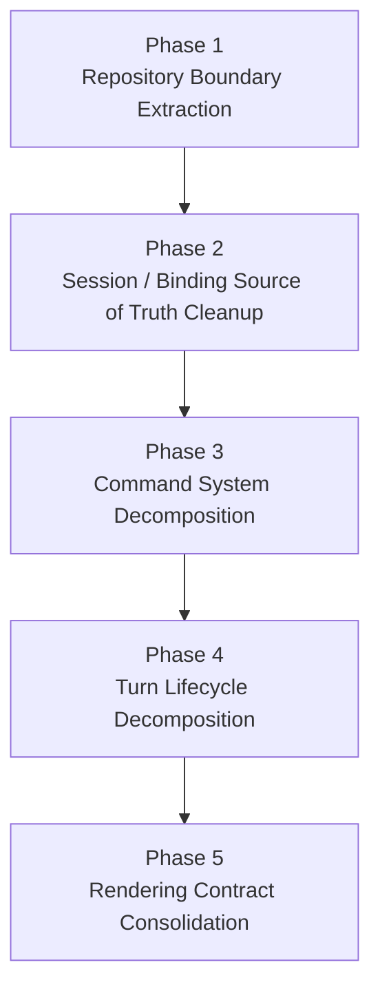
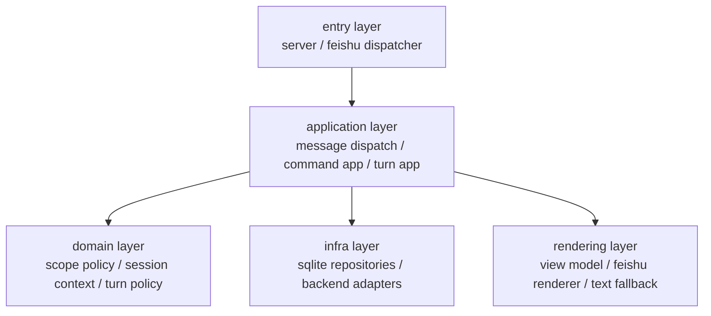

# OR-TASK-009 架构重构详细设计

更新时间：2026-03-18

## 文档目标

这份文档是 `OR-TASK-009` 的实施蓝图，用于把总体设计落成可以逐阶段执行的具体方案。

它重点回答七个问题：

1. 整体重构按什么阶段推进。
2. 每个阶段为什么现在做，而不是之后再做。
3. 每个阶段要改哪些模块、文件、类和方法。
4. 新旧结构在过渡期如何共存，如何删旧实现。
5. 关键数据与调用链如何迁移。
6. 每阶段应补哪些测试与验证。
7. 风险点、回滚点和完成标志是什么。

它与 `docs/design/or-task-009-architecture-refactor-overall-design.md` 的关系如下：

- overall design
  - 负责回答为什么改、目标边界是什么、整体阶段怎么分。
- detailed design
  - 负责回答每一步具体改什么、放到哪里、为什么这样拆。

## 一页总览



每一阶段都遵循三个约束：

- 先收敛边界，再删旧入口。
- 每阶段默认保持用户可见行为不变。
- 每阶段必须能形成单独提交，不把多条线混成一个大 patch。

## 1. 当前代码上的主要结构问题

在进入详细方案前，先把当前代码中最需要拆的节点固定下来。

### 1.1 `RuntimeOrchestrator`

当前文件：`src/openrelay/runtime/orchestrator.py`

当前同时承担：

- 依赖装配
- message ingress 主入口
- session key 解析后的主路径分流
- active run / follow-up / stop 控制
- reply 策略调用
- backend runtime 装配

问题不是它“太大”本身，而是它同时横跨入口层、应用层和部分平台输出层。

### 1.2 `RuntimeCommandRouter`

当前文件：`src/openrelay/runtime/commands.py`

当前同时承担：

- command parser
- command registry
- command handler
- session mutation orchestration
- workspace / backend / shortcut / admin / status 多类命令实现

这会导致任何新增命令都继续向一个中心类堆积。

### 1.3 `BackendTurnSession`

当前文件：`src/openrelay/runtime/turn.py`

当前同时承担：

- turn 准备
- 消息落库
- typing / streaming 开启
- runtime event 订阅
- approval request / resolution
- final reply
- cancel / cleanup

问题在于 turn 生命周期已经完整存在，但还没有被显式建模。

### 1.4 `StateStore`

当前文件：`src/openrelay/storage/state.py`

当前同时承担：

- sqlite 初始化
- schema migration
- session repository
- message repository
- dedup repository
- alias repository
- shortcut repository
- 一部分领域默认值推断

问题在于 repository 与领域辅助逻辑没有隔离，导致上层任何新需求都容易继续加方法。

### 1.5 `SessionRecord` 与 `RelaySessionBinding`

当前文件：

- `src/openrelay/core/models.py`
- `src/openrelay/session/models.py`
- `src/openrelay/session/store.py`

当前问题：

- 两者都表达了一部分“当前真实后端状态”。
- 读路径并不总能确定应以哪一份为准。
- 需要 `_sync_session_record()` 一类补丁维持一致。

### 1.6 `presentation/` 与 `feishu/`

当前文件：

- `src/openrelay/presentation/live_turn.py`
- `src/openrelay/presentation/panel.py`
- `src/openrelay/feishu/reply_card.py`

当前问题：

- presenter 已直接引用 Feishu card builder。
- runtime 上层并没有稳定的 reply contract。
- 文本 fallback、card reply、streaming update 的语义散落。

## 2. 目标目录与职责模型

这轮详细设计先不要求一次性大搬家，但要明确最终职责归位。



建议的目标包方向：

- `src/openrelay/runtime/`
  - 逐步收敛为 application layer
- `src/openrelay/session/`
  - 保留 session domain 与 application-support service
- `src/openrelay/storage/`
  - 收敛为 sqlite infrastructure
- `src/openrelay/presentation/`
  - 保留平台无关 view model
- `src/openrelay/feishu/`
  - 保留平台 renderer 与 sender

## 3. Phase 1：Repository Boundary Extraction

## 3.1 目标

第一阶段先拆 repository 边界，而不是先拆 orchestrator 或 turn。

原因：

- `StateStore` 是几乎所有高层模块的公共耦合点。
- 如果先拆 command 或 turn，而底层仍是万能 `StateStore`，只是把耦合改成换个地方继续调用。
- repository 边界先稳定，后面 session / command / turn 才有干净依赖面。

## 3.2 模块改动范围

### 新增文件

- `src/openrelay/storage/db.py`
- `src/openrelay/storage/repositories.py`
- `src/openrelay/session/repositories.py`

### 保留但收敛的文件

- `src/openrelay/storage/state.py`
- `src/openrelay/session/store.py`

## 3.3 新增类设计

### A. `SqliteStateContext`

文件：`src/openrelay/storage/db.py`

```python
@dataclass(slots=True)
class SqliteStateContext:
    config: AppConfig
    connection: sqlite3.Connection
```

职责：

- 提供 sqlite connection 与 config 给各 repository 实现。
- 不承载业务方法。

新增方法：

- `close(self) -> None`
- `init_schema(self) -> None`

设计原因：

- 现在 schema 初始化和业务 repository 方法都塞在 `StateStore` 里。
- 先抽出上下文对象，后续 repository 可组合，不必继续继承一个大类。

### B. `SessionRepository`

文件：`src/openrelay/session/repositories.py`

```python
class SessionRepository(Protocol):
    def get(self, session_id: str) -> SessionRecord: ...
    def find(self, session_id: str) -> SessionRecord | None: ...
    def find_by_scope(self, base_key: str) -> SessionRecord | None: ...
    def load_for_scope(self, base_key: str, template: SessionRecord | None = None) -> SessionRecord: ...
    def create_next(self, base_key: str, current: SessionRecord | None = None) -> SessionRecord: ...
    def save(self, session: SessionRecord) -> SessionRecord: ...
    def list_by_scope(self, base_key: str, limit: int = 20) -> list[SessionSummary]: ...
    def clear_scope(self, base_key: str) -> None: ...
```

设计原因：

- 把 session record 的增删改查从 `StateStore` 里抽离。
- 让 `session/` 与 `runtime/` 面向接口，而不是面向万能对象。

### C. `MessageRepository`

文件：`src/openrelay/session/repositories.py`

```python
class MessageRepository(Protocol):
    def append(self, session_id: str, role: str, content: str) -> None: ...
    def list(self, session_id: str) -> list[dict[str, str]]: ...
    def clear(self, session_id: str) -> None: ...
    def count(self, session_id: str) -> int: ...
    def first(self, session_id: str, role: str) -> str: ...
    def last(self, session_id: str, role: str) -> str: ...
```

设计原因：

- transcript 历史与 session record 是不同聚合，不应该继续混在同一 store 方法组里。

### D. `DedupRepository`

文件：`src/openrelay/session/repositories.py`

```python
class DedupRepository(Protocol):
    def remember(self, message_id: str) -> bool: ...
```

设计原因：

- dedup 是 ingress 基础设施能力，不应该继续作为 `StateStore` 的一个散落细节。

### E. `SessionAliasRepository`

文件：`src/openrelay/session/repositories.py`

```python
class SessionAliasRepository(Protocol):
    def find(self, alias_key: str) -> str | None: ...
    def save(self, alias_key: str, base_key: str) -> None: ...
```

设计原因：

- alias 是 scope resolution 的基础设施支撑，应单独可替换、可测。

### F. `ShortcutRepository`

文件：`src/openrelay/session/repositories.py`

```python
class ShortcutRepository(Protocol):
    def list(self) -> tuple[DirectoryShortcut, ...]: ...
    def save(self, shortcut: DirectoryShortcut) -> DirectoryShortcut: ...
    def get(self, name: str) -> DirectoryShortcut | None: ...
    def remove(self, name: str) -> bool: ...
```

设计原因：

- shortcut 与 session 主记录无直接聚合关系，拆开后更容易被 workspace 服务独立使用。

### G. `SessionBindingRepository`

文件：`src/openrelay/session/repositories.py`

```python
class SessionBindingRepository(Protocol):
    def get(self, relay_session_id: str) -> RelaySessionBinding | None: ...
    def save(self, binding: RelaySessionBinding) -> None: ...
    def find_by_feishu_scope(self, chat_id: str, thread_id: str) -> RelaySessionBinding | None: ...
    def list_recent(self, backend: str | None = None, limit: int = 20) -> list[RelaySessionBinding]: ...
    def update_native_session_id(self, relay_session_id: str, native_session_id: str) -> None: ...
```

设计原因：

- 先把 binding 也放进 repository contract，第二阶段才能继续收敛 source of truth。

## 3.4 新增 sqlite 实现类

文件：`src/openrelay/storage/repositories.py`

建议新增：

- `SqliteSessionRepository`
- `SqliteMessageRepository`
- `SqliteDedupRepository`
- `SqliteSessionAliasRepository`
- `SqliteShortcutRepository`
- `SqliteSessionBindingRepository`

这些类的方法实现最初可以直接搬运 `StateStore` / `SessionBindingStore` 的既有 SQL。

设计原因：

- 第一阶段只改变边界，不改变存储语义。
- 先完成“接口替代”，再考虑整理 SQL 细节。

## 3.5 `StateStore` 的过渡设计

文件：`src/openrelay/storage/state.py`

第一阶段目标不是立刻删除 `StateStore`，而是把它降级为过渡入口。

建议保留：

- `__init__`
- `_resolve_db_path`
- `_init_schema`
- `close`
- `context()` 或同类方法，返回 `SqliteStateContext`

建议逐步废弃：

- 全部 session/message/dedup/alias/shortcut 业务方法

过渡方法设计：

```python
class StateStore:
    def context(self) -> SqliteStateContext: ...
    def session_repository(self) -> SqliteSessionRepository: ...
    def message_repository(self) -> SqliteMessageRepository: ...
    def dedup_repository(self) -> SqliteDedupRepository: ...
```

设计原因：

- 现有装配代码大量使用 `StateStore`。
- 先让它变成 repository factory，可减小第一阶段改动面。

## 3.6 需要修改的现有类

### `RuntimeOrchestrator`

文件：`src/openrelay/runtime/orchestrator.py`

第一阶段修改：

- 构造函数中不再把 `StateStore` 直接传给所有服务。
- 改为提前构造 repository 实例，再注入给需要的服务。

新增私有方法：

- `_build_repositories(self) -> RuntimeRepositories`

新增数据结构：

文件：`src/openrelay/runtime/repositories.py`

```python
@dataclass(slots=True)
class RuntimeRepositories:
    sessions: SessionRepository
    messages: MessageRepository
    dedup: DedupRepository
    aliases: SessionAliasRepository
    shortcuts: ShortcutRepository
    bindings: SessionBindingRepository
```

设计原因：

- 把依赖面先固定下来，后续 orchestrator 拆薄时就不必再回头处理 `StateStore`。

### `SessionScopeResolver`

文件：`src/openrelay/session/scope/resolver.py`

修改：

- 构造函数从 `StateStore` 改为依赖 `SessionAliasRepository` 和一个最小化的 session scope existence query 接口。

新增协议：

```python
class SessionScopeQuery(Protocol):
    def has_scope(self, base_key: str) -> bool: ...
```

设计原因：

- `SessionScopeResolver` 只应该依赖 alias 与 scope existence，而不是整个 store。

### `SessionLifecycleResolver`

文件：`src/openrelay/session/lifecycle.py`

修改：

- 构造函数从 `StateStore` 改为依赖 `SessionRepository` 和 `MessageRepository`。

新增私有方法：

- `_find_visible_control_session(...)`
- `_is_placeholder_control_session(...)`

这些方法内部不再直接查大 store，而是用 repository 查询。

设计原因：

- lifecycle 是领域服务，不应直接绑定 sqlite 大对象。

## 3.7 Phase 1 测试与完成标志

测试补充：

- repository 单元测试：CRUD 与行为保持一致。
- scope / lifecycle 现有测试改为依赖 fake repository 或 sqlite repository。
- orchestrator 烟测：确认主路径仍能启动。

完成标志：

- 新代码不再新增任何对 `StateStore` 业务方法的直接调用。
- 现有主路径可通过 repository contract 访问状态。
- `StateStore` 开始退化为 connection + schema + repository factory。

## 4. Phase 2：Session / Binding Source of Truth Cleanup

## 4.1 目标

第二阶段解决 source of truth 问题。

为什么这一步放在 repository 之后：

- source of truth 的清理会影响 session、binding、lifecycle、turn 全链路。
- 如果存储边界还没拆好，第二阶段会不可避免变成大面积直接改 SQL + 业务逻辑混杂。

## 4.2 模块改动范围

### 新增文件

- `src/openrelay/session/context_models.py`
- `src/openrelay/session/context_service.py`

### 重点修改文件

- `src/openrelay/core/models.py`
- `src/openrelay/session/models.py`
- `src/openrelay/session/store.py`
- `src/openrelay/session/lifecycle.py`
- `src/openrelay/runtime/turn.py`
- `src/openrelay/agent_runtime/service.py`

## 4.3 新增数据结构

### A. `SessionStateSnapshot`

文件：`src/openrelay/session/context_models.py`

```python
@dataclass(slots=True, frozen=True)
class SessionStateSnapshot:
    session: SessionRecord
    binding: RelaySessionBinding | None
```

用途：

- 显式表达 relay session record 与 backend binding 的组合视图。
- 防止继续在上层偷用 `SessionRecord.native_session_id` 当真实 attachment。

### B. `ResolvedSessionContext`

文件：`src/openrelay/session/context_models.py`

```python
@dataclass(slots=True, frozen=True)
class ResolvedSessionContext:
    session_key: str
    session: SessionRecord
    binding: RelaySessionBinding | None
    is_control_scope: bool
```

用途：

- message dispatch 后的统一上下文对象。
- orchestrator / dispatch service 后续都只拿这个上下文，不再自己拼 session + binding。

## 4.4 新增服务类

### `SessionContextService`

文件：`src/openrelay/session/context_service.py`

```python
class SessionContextService:
    def __init__(
        self,
        sessions: SessionRepository,
        bindings: SessionBindingRepository,
        lifecycle: SessionLifecycleResolver,
    ) -> None: ...

    def resolve_for_message(
        self,
        session_key: str,
        *,
        is_top_level_control_command: bool,
        is_top_level_message: bool,
        control_key: str,
        feishu_chat_id: str,
        feishu_thread_id: str,
    ) -> ResolvedSessionContext: ...

    def snapshot(self, relay_session_id: str) -> SessionStateSnapshot: ...
```

设计原因：

- 当前 orchestrator 自己 resolve session，然后 turn 链路再自己找 binding。
- 这类“组合读取”应该集中在一个上下文服务里。

## 4.5 `SessionRecord` 与 `RelaySessionBinding` 字段所有权

### `SessionRecord`

文件：`src/openrelay/core/models.py`

重构方向：

- 保留 relay session 的稳定配置与归属字段。
- 将 `native_session_id` 标记为兼容字段，逐步淡出读取主路径。

建议保留字段：

- `session_id`
- `base_key`
- `label`
- `release_channel`
- `created_at`
- `updated_at`
- `last_usage`

建议过渡保留、后续考虑下沉到 binding 的字段：

- `backend`
- `cwd`
- `model_override`
- `safety_mode`
- `native_session_id`

设计原因：

- 短期内不做一次性 schema 大迁移。
- 先固定“读取谁为准”，再决定数据模型是否进一步物理收缩。

### `RelaySessionBinding`

文件：`src/openrelay/session/models.py`

明确成为以下字段的唯一事实源：

- `backend`
- `native_session_id`
- `cwd`
- `model`
- `safety_mode`
- `feishu_chat_id`
- `feishu_thread_id`

设计原因：

- 这些字段本质都描述“当前实际附着在哪个 backend/native session 上”。

## 4.6 `SessionBindingStore` 的重构

文件：`src/openrelay/session/store.py`

需要删除的旧职责：

- `_sync_session_record()`

过渡步骤：

1. 第一小步：把 `_sync_session_record()` 标记为兼容路径，新增注释说明 binding 是唯一 attachment source。
2. 第二小步：所有新代码改从 `SessionBindingRepository` 读取 attachment。
3. 第三小步：删除 `_sync_session_record()` 与对 `SessionRecord` 的反向回写。

设计原因：

- 只要保留同步补丁，系统就仍然存在两个 writer。

## 4.7 需要修改的方法

### `BackendTurnSession._ensure_binding(...)`

文件：`src/openrelay/runtime/turn.py`

重构方向：

- 保证所有 backend 运行参数从 binding 或 binding 创建输入中获取。
- 不再把 `session.native_session_id` 作为一等来源。

### `BackendTurnSession.persist_native_thread_id(...)`

文件：`src/openrelay/runtime/turn.py`

重构方向：

- 改为更新 `SessionBindingRepository.update_native_session_id(...)`
- 兼容阶段可继续回写 `session.native_session_id` 作为缓存，但不再作为权威来源。

设计原因：

- native thread id 本质上是 backend attachment 状态，不是 relay session 自身身份。

### `AgentRuntimeService.start_new_session(...)`

文件：`src/openrelay/agent_runtime/service.py`

需要保证：

- 新 session started 后仅更新 binding。
- 上层读取 live/native session 时通过 binding 或 turn registry 获取。

## 4.8 Phase 2 测试与完成标志

测试补充：

- session context service 单元测试
- binding 优先读取测试
- turn 中断 / resume / compact 仍能走通

完成标志：

- 上层新代码不再依赖 `SessionRecord.native_session_id` 作为唯一事实源。
- `_sync_session_record()` 被删除或降为无效兼容壳。
- resolve 后的上下文对象显式包含 `session + binding`。

## 5. Phase 3：Command System Decomposition

## 5.1 目标

第三阶段开始拆命令系统。

为什么不是先拆 turn：

- 命令系统改动范围相对明确，且业务边界天然适合切文件。
- turn 生命周期更复杂，需要建立在 session/binding 事实源已稳定的基础上。

## 5.2 模块改动范围

### 新增文件

- `src/openrelay/runtime/command_models.py`
- `src/openrelay/runtime/command_registry.py`
- `src/openrelay/runtime/command_handlers/base.py`
- `src/openrelay/runtime/command_handlers/session.py`
- `src/openrelay/runtime/command_handlers/workspace.py`
- `src/openrelay/runtime/command_handlers/backend.py`
- `src/openrelay/runtime/command_handlers/ops.py`

### 收敛文件

- `src/openrelay/runtime/commands.py`

## 5.3 新增数据结构

### A. `ParsedCommand`

文件：`src/openrelay/runtime/command_models.py`

```python
@dataclass(slots=True, frozen=True)
class ParsedCommand:
    raw_text: str
    name: str
    arg_text: str
    tokens: tuple[str, ...]
```

设计原因：

- 当前 `handle()` 每次自己切 `parts/tokens`，解析分散。
- parser 与 handler 分离后，命令扩展更稳定。

### B. `CommandContext`

文件：`src/openrelay/runtime/command_models.py`

```python
@dataclass(slots=True)
class CommandContext:
    message: IncomingMessage
    session_key: str
    session: SessionRecord
    binding: RelaySessionBinding | None
```

设计原因：

- handler 不应重复自己拼上下文。

### C. `CommandResult`

文件：`src/openrelay/runtime/command_models.py`

```python
@dataclass(slots=True)
class CommandResult:
    handled: bool
    text: str = ""
    command_name: str = ""
    send_panel: bool = False
    send_help: bool = False
    stop_active_run: bool = False
```

设计原因：

- 让命令系统先统一返回语义结果，再由应用层决定如何发出 reply。
- 避免 handler 直接拿 messenger 做平台输出。

## 5.4 新增接口与类

### A. `CommandHandler`

文件：`src/openrelay/runtime/command_handlers/base.py`

```python
class CommandHandler(Protocol):
    def names(self) -> tuple[str, ...]: ...
    async def handle(self, command: ParsedCommand, context: CommandContext) -> CommandResult: ...
```

### B. `CommandRegistry`

文件：`src/openrelay/runtime/command_registry.py`

```python
class CommandRegistry:
    def __init__(self, handlers: list[CommandHandler]) -> None: ...
    def get(self, name: str) -> CommandHandler | None: ...
```

### C. `CommandParser`

文件：`src/openrelay/runtime/command_registry.py`

```python
class CommandParser:
    def parse(self, text: str) -> ParsedCommand | None: ...
```

设计原因：

- 让 `commands.py` 从“既解析又执行”退化为 facade。

## 5.5 处理器拆分建议

### `SessionCommandHandler`

文件：`src/openrelay/runtime/command_handlers/session.py`

负责：

- `/resume`
- `/compact`
- `/clear`
- `/reset`
- `/status`
- `/usage`
- `/stop`

原因：

- 它们都围绕当前会话与运行态展开。

### `WorkspaceCommandHandler`

文件：`src/openrelay/runtime/command_handlers/workspace.py`

负责：

- `/workspace`
- `/ws`
- `/shortcut`
- `/shortcuts`
- `/main`
- `/stable`
- `/develop`

原因：

- 都和目录、channel、workspace 选择相关。

### `BackendCommandHandler`

文件：`src/openrelay/runtime/command_handlers/backend.py`

负责：

- `/model`
- `/sandbox`
- `/mode`
- `/backend`

原因：

- 都在修改 backend attachment 参数或默认执行参数。

### `OpsCommandHandler`

文件：`src/openrelay/runtime/command_handlers/ops.py`

负责：

- `/ping`
- `/help`
- `/tools`
- `/restart`

原因：

- 这是平台运营/诊断类命令，和业务会话修改应分离。

## 5.6 `RuntimeCommandRouter` 的收缩目标

文件：`src/openrelay/runtime/commands.py`

第一步改成：

- 只保留构造注入
- 只保留 `handle(...)`
- 内部仅做 parse -> lookup -> handler.execute -> translate result

建议新增方法：

- `_build_context(...) -> CommandContext`
- `_apply_result(...) -> bool`

建议删除或迁出的内容：

- 具体 `_handle_resume`
- 具体 `_handle_workspace`
- 具体 `_handle_backend`
- 具体 `_handle_shortcut`
- 几乎全部 `_parse_*` 命令私有方法

设计原因：

- `Router` 应该是入口，不应该继续是所有命令实现的落点。

## 5.7 Phase 3 测试与完成标志

测试补充：

- command parser 单元测试
- 每个 handler 的表格化行为测试
- `/resume`、`/workspace`、`/backend`、`/stop` 的回归测试

完成标志：

- `commands.py` 不再包含大段命令业务逻辑。
- 新命令新增时不再修改中心路由器大分支。
- 命令输出先形成 `CommandResult`，再由上层转成 reply。

## 6. Phase 4：Turn Lifecycle Decomposition

## 6.1 目标

第四阶段拆 turn 生命周期。

为什么放在 command 之后：

- turn 链路是主路径里最复杂的部分，应该在 command 系统先稳定后再动。
- 命令系统拆完后，runtime 剩下的最大中心对象就是 `BackendTurnSession`，更适合集中处理。

## 6.2 模块改动范围

### 新增文件

- `src/openrelay/runtime/turn_models.py`
- `src/openrelay/runtime/turn_services.py`
- `src/openrelay/runtime/turn_streaming.py`
- `src/openrelay/runtime/turn_interactions.py`
- `src/openrelay/runtime/turn_finalizer.py`

### 收敛文件

- `src/openrelay/runtime/turn.py`

## 6.3 新增数据结构

### A. `TurnExecutionContext`

文件：`src/openrelay/runtime/turn_models.py`

```python
@dataclass(slots=True)
class TurnExecutionContext:
    message: IncomingMessage
    session: SessionRecord
    binding: RelaySessionBinding
    execution_key: str
    message_summary: str
    backend_prompt: str
```

用途：

- 显式传递本次 turn 的运行上下文。
- 避免 turn 内部再从多个对象拼状态。

### B. `TurnRunResult`

文件：`src/openrelay/runtime/turn_models.py`

```python
@dataclass(slots=True)
class TurnRunResult:
    final_text: str
    native_session_id: str
    usage: dict[str, object]
    status: str
```

用途：

- 让 finalizer 和 caller 不再直接依赖 `BackendReply` 这一较弱语义对象。

## 6.4 新增服务类

### A. `TurnPreparationService`

文件：`src/openrelay/runtime/turn_services.py`

```python
class TurnPreparationService:
    async def prepare(
        self,
        message: IncomingMessage,
        session: SessionRecord,
        summary: str,
    ) -> SessionRecord: ...
```

负责：

- label session if needed
- save session
- append user message
- start typing
- start streaming if needed

设计原因：

- 这些动作都属于 turn 前置准备，不应继续混在主执行器里。

### B. `TurnEventBridge`

文件：`src/openrelay/runtime/turn_services.py`

```python
class TurnEventBridge:
    async def attach(... ) -> None: ...
    async def handle_event(... ) -> None: ...
    async def detach(... ) -> None: ...
```

负责：

- 订阅 / 取消订阅 runtime event hub
- 把 runtime event 转成 live snapshot 更新
- 驱动 approval coordinator 与 streaming driver

设计原因：

- 现在 event subscription、snapshot update、approval 处理都在 `BackendTurnSession._handle_runtime_event()` 里耦合。

### C. `TurnStreamingDriver`

文件：`src/openrelay/runtime/turn_streaming.py`

```python
class TurnStreamingDriver:
    async def start(self) -> None: ...
    async def push_snapshot(self, snapshot: dict[str, Any]) -> None: ...
    async def close_final(self, snapshot: dict[str, Any], fallback_text: str) -> None: ...
    async def close_cancelled(self) -> None: ...
```

负责：

- 管理 streaming session 生命周期
- 管理 snapshot 队列和 update 节奏
- 管理 final card close 与 fallback text close

设计原因：

- streaming 细节很多，继续留在 `BackendTurnSession` 只会让类继续长大。

### D. `TurnApprovalCoordinator`

文件：`src/openrelay/runtime/turn_interactions.py`

```python
class TurnApprovalCoordinator:
    async def request(self, binding: RelaySessionBinding, request: ApprovalRequest) -> ApprovalDecision: ...
    async def shutdown(self) -> None: ...
```

负责：

- 请求审批
- 等待用户决策
- 向 runtime_service 回传决策

设计原因：

- approval 是清晰的子生命周期，不应混在通用 event handler 中。

### E. `TurnFinalizer`

文件：`src/openrelay/runtime/turn_finalizer.py`

```python
class TurnFinalizer:
    async def finalize_success(self, context: TurnExecutionContext, result: TurnRunResult) -> None: ...
    async def finalize_interrupted(self, context: TurnExecutionContext) -> None: ...
    async def finalize_failure(self, context: TurnExecutionContext, exc: Exception) -> None: ...
```

负责：

- 保存 assistant reply
- 更新 usage
- 关闭 typing / streaming
- 发最终 reply
- 统一失败与中断文案

设计原因：

- 结束路径通常最容易在后续改动时被复制分支，必须先收敛。

## 6.5 `BackendTurnSession` 的最终角色

文件：`src/openrelay/runtime/turn.py`

目标收敛为很薄的 facade：

```python
class BackendTurnSession:
    async def run(self, message_summary: str, backend_prompt: str) -> None:
        context = self.build_execution_context(...)
        await self.preparation.prepare(...)
        try:
            result = await self.turn_runner.run(context)
            await self.finalizer.finalize_success(context, result)
        except InterruptedError:
            await self.finalizer.finalize_interrupted(context)
        except Exception as exc:
            await self.finalizer.finalize_failure(context, exc)
```

建议新增方法：

- `build_execution_context(...) -> TurnExecutionContext`

建议删除或迁出：

- `prepare`
- `_handle_runtime_event`
- `_start_streaming_if_needed`
- `_flush_streaming_updates`
- `reply_final`
- 大部分 cleanup 细节

设计原因：

- `BackendTurnSession` 应变成生命周期入口，而不是生命周期所有细节本体。

## 6.6 Phase 4 测试与完成标志

测试补充：

- turn happy path
- turn interrupted path
- approval path
- streaming broken fallback path
- event bridge snapshot 更新测试

完成标志：

- `turn.py` 不再同时持有 streaming、approval、finalize 的主要实现。
- turn 主路径可通过更小组件单测。
- 中断、失败、成功三条结束路径集中收口。

## 7. Phase 5：Rendering Contract Consolidation

## 7.1 目标

第五阶段才收敛 rendering contract。

为什么放最后：

- 前四阶段先稳定数据源、上下文和应用服务边界。
- 如果太早改 rendering，会因为上游结构未稳而反复返工。

## 7.2 模块改动范围

### 新增文件

- `src/openrelay/presentation/models.py`
- `src/openrelay/presentation/replies.py`
- `src/openrelay/feishu/renderers.py`

### 重点修改文件

- `src/openrelay/presentation/live_turn.py`
- `src/openrelay/presentation/panel.py`
- `src/openrelay/presentation/runtime_status.py`
- `src/openrelay/feishu/reply_card.py`
- `src/openrelay/feishu/messenger.py`
- `src/openrelay/runtime/replying.py`

## 7.3 新增数据结构

### A. `ReplyEnvelope`

文件：`src/openrelay/presentation/replies.py`

```python
@dataclass(slots=True)
class ReplyEnvelope:
    text: str = ""
    card: dict[str, object] | None = None
    update_message_id: str = ""
    force_new_message: bool = False
```

用途：

- 应用层只返回“要发什么”，而不是直接调 Feishu message API。

### B. `LiveTurnViewData`

文件：`src/openrelay/presentation/models.py`

```python
@dataclass(slots=True)
class LiveTurnViewData:
    heading: str
    status: str
    transcript_markdown: str
    final_text: str
    session_label: str
    cwd_display: str
```

用途：

- 把平台无关的展示语义固定下来。
- `LiveTurnPresenter` 负责产出 view data，不直接组 Feishu card。

## 7.4 新增 renderer 类

### A. `FeishuReplyRenderer`

文件：`src/openrelay/feishu/renderers.py`

```python
class FeishuReplyRenderer:
    def render_live_turn(self, view: LiveTurnViewData) -> ReplyEnvelope: ...
    def render_final_turn(self, view: LiveTurnViewData) -> ReplyEnvelope: ...
    def render_status(self, view: StatusViewData) -> ReplyEnvelope: ...
    def render_panel(self, view: PanelViewData) -> ReplyEnvelope: ...
```

设计原因：

- card JSON 构造应该回到 Feishu 边界，而不是继续让 presenter 直接引用 Feishu helper。

### B. `TextFallbackRenderer`

文件：`src/openrelay/feishu/renderers.py`

```python
class TextFallbackRenderer:
    def render_live_turn_text(self, view: LiveTurnViewData) -> str: ...
    def render_status_text(self, view: StatusViewData) -> str: ...
```

设计原因：

- card 与 text fallback 的语义必须在一个 renderer contract 下维护，不能散落。

## 7.5 需要修改的现有类

### `LiveTurnPresenter`

文件：`src/openrelay/presentation/live_turn.py`

修改方向：

- 保留 snapshot build 能力。
- 删除或迁出直接生成 Feishu card 的方法：
  - `build_reply_card`
  - `build_streaming_card`
  - `build_final_card`

新增方法：

- `to_view_data(...) -> LiveTurnViewData`

设计原因：

- presenter 应只做 view model，不做平台 renderer。

### `RuntimePanelPresenter`

文件：`src/openrelay/presentation/panel.py`

修改方向：

- 保留 panel view data 组装。
- card block 细节迁到 `FeishuReplyRenderer`。

新增方法：

- `build_view_data(...) -> PanelViewData`

### `RuntimeStatusPresenter`

文件：`src/openrelay/presentation/runtime_status.py`

修改方向：

- 不再直接返回最终文本。
- 返回 `StatusViewData`，由 renderer 决定文本或 card 形式。

### `RuntimeReplyPolicy`

文件：`src/openrelay/runtime/replying.py`

修改方向：

- 继续只保留 route 选择，不直接承载渲染含义。
- 路由与渲染分离。

设计原因：

- route 决定“发到哪”，renderer 决定“发什么”，这是两层不同职责。

## 7.6 Phase 5 测试与完成标志

测试补充：

- presenter view data 测试
- feishu renderer card snapshot 测试
- text fallback 测试
- live turn card / final card / panel / status 回归测试

完成标志：

- `presentation/` 不再直接 import Feishu card builder。
- runtime 上层统一面向 `ReplyEnvelope` 或同类结果对象。
- card 与 text fallback 的语义在 renderer 中统一收敛。

## 8. 实施顺序与每一步原因

这里把全流程再按“为什么这样排”重新压缩一次。

### Step 1：先抽 repository 边界

原因：

- 这是最底层的公共耦合点。
- 不先拆这里，任何上层重构都只是移动 `StateStore` 调用位置。

### Step 2：再处理 session / binding source of truth

原因：

- source of truth 一旦清晰，后续 command 和 turn 才不会继续读错对象。
- 这是所有运行态与恢复态逻辑的共同基础。

### Step 3：然后拆 command system

原因：

- 命令系统最适合按 handler 拆开，收益高、风险可控。
- 它能先把 runtime 主层的一大块复杂度切出去。

### Step 4：再拆 turn lifecycle

原因：

- turn 是最复杂主路径，必须建立在前面两个基础稳定后再动。
- 这一步做完，runtime 主链路会明显变短。

### Step 5：最后收敛 rendering contract

原因：

- 渲染是最外层边界，应在上游结构稳定后统一收口。
- 否则会因为上游数据结构频繁变化而重复改 card 生成逻辑。

## 9. 回滚与风险控制

### 风险 1：阶段间相互阻塞

控制方式：

- 每阶段先引入新接口，再切主调用，再删旧实现。
- 不在一个 commit 里同时做 repository + source of truth + renderer 三条线改动。

### 风险 2：行为保持失败

控制方式：

- 每阶段默认先保证行为不变。
- 行为变化只允许出现在明确的 bug fix 提交里，不夹带在结构提交内。

### 风险 3：抽象过度

控制方式：

- 每个新增类都必须回答：它是否承载了一个已存在的稳定职责。
- 如果只是把一个函数换成三个空壳类，不应引入。

### 风险 4：文档和实现脱节

控制方式：

- 每完成一个阶段，应在任务板或对应设计稿里回写已完成证据。
- 详细设计中的目标类和方法如果实际实现时收敛为更简单结构，应同步修文档，而不是放任失真。

## 10. 建议的实施提交切分

建议至少拆成下面这些提交：

1. `refactor: extract sqlite repositories from state store`
2. `refactor: separate session binding from relay session state`
3. `refactor: split command router into handlers`
4. `refactor: decompose turn lifecycle services`
5. `refactor: introduce rendering contract for feishu replies`

每个提交都应满足：

- 可独立运行测试。
- 不混入无关 feature。
- 有清晰的删旧逻辑，而不是长期双轨。

## 11. 验收清单

当这份详细设计对应的重构真正完成时，应满足以下清单：

- `StateStore` 不再是上层万能依赖。
- `SessionBinding` 成为 backend attachment 的唯一事实源。
- `RuntimeCommandRouter` 退化为 parse + dispatch facade。
- `BackendTurnSession` 退化为 turn lifecycle facade。
- `presentation` 与 `feishu renderer` 的边界明确。
- runtime 上层只依赖稳定的 repository、context、reply contract。
- 新需求再进入系统时，有明确落点，而不是继续堆到现有中心类上。
