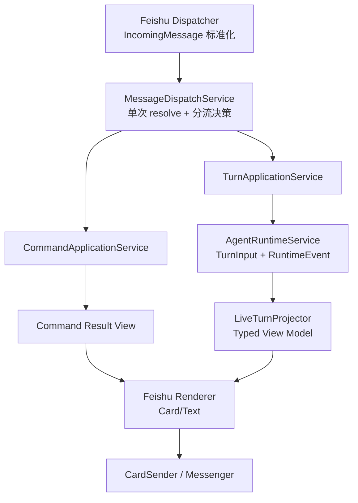

# OR-TASK-009 端到端重构执行蓝图

更新时间：2026-03-18

## 文档定位

这份文档是 `OR-TASK-009` 的端到端执行级详细设计，目标不是补充“更多抽象”，而是固定一条可落地、可并行、可验收的重构路径。

它与已有文档的关系：

- `docs/design/or-task-009-architecture-refactor-overall-design.md`
  - 固定总体边界与方向。
- `docs/design/or-task-009-architecture-refactor-detailed-design.md`
  - 固定阶段拆分与关键对象。
- 本文
  - 把“消息进入 -> 命令/turn 执行 -> 渲染输出”的端到端链路收敛为可执行步骤，并补全模块、文件、类、方法与阶段原因。

## 1. 设计理念

本轮重构遵循五条执行原则：

1. 复用：保留已有稳定能力（scope 规则、runtime event hub、session mutation service），不做无意义重写。
2. 减负：把中心类降级成薄编排器，移除重复包装和重复状态携带。
3. 可读性强：主路径函数只做一层抽象，输入输出对象明确可追踪。
4. 去历史遗留：替代路径稳定后直接删旧入口，不长期双轨共存。
5. 职责分明：同一事实只允许一个写入口；同一语义只在一层做解释。

执行约束：

- 主路径只保留必要语义边界，不保留“为了兼容旧调用习惯”的中间壳。
- 任何新增抽象都必须减少调用点复杂度，否则不引入。
- 每阶段都要有可回滚点和可验收证据。

## 2. 现状问题（端到端视角）

## 2.1 消息主链路重复 session resolve

当前 `IncomingMessage` 在 `dispatch_message()` 已完成一次 session key 解析与 session 加载，进入串行处理后又在 `_handle_single_serialized_input()` 重做一次等价解析。

结果：

- 主路径重复计算，逻辑分叉点增多。
- 同一条消息在不同阶段可能命中不同补丁逻辑，增加不可预测性。

## 2.2 `SessionRecord` 与 `RelaySessionBinding` 重叠承载运行态

当前两类对象都承载：

- `backend`
- `cwd`
- `model` / `model_override`
- `safety_mode`
- `native_session_id`

并通过 `_sync_session_record()` 维持表面一致。

结果：

- 写路径与读路径事实来源不一致。
- turn、command、session lifecycle 都需要做补丁式同步。

## 2.3 `RuntimeCommandRouter` 职责混合

当前单类同时承担：

- parser
- registry
- handler
- application orchestration
- 命令文案拼装

结果：

- 任何新命令都继续堆入单文件。
- 命令规则、参数解析、跨模块编排耦合在同一抽象层。

## 2.4 presentation 与 Feishu 渲染耦合

当前 `presentation/live_turn.py` 与 `presentation/panel.py` 已直接依赖 Feishu card 细节，并存在多次语义改写链路：

`LiveTurnViewModel -> snapshot dict -> transcript markdown -> Feishu card`

结果：

- 同一语义在多层重复包装。
- `presentation` 无法作为平台无关投影层复用。

## 2.5 `StateStore` 过载导致边界回流

`StateStore` 同时承担 db context、schema、repository、部分生命周期策略，导致上层都依赖宽接口。

结果：

- 重构无法局部替换。
- 任何变化都容易回流到中心对象。

## 3. 端到端目标链路



必要语义边界（保留）：

1. 平台事件 -> `IncomingMessage`。
2. `IncomingMessage` -> 单次 session scope resolve。
3. 会话上下文 -> `TurnInput`。
4. runtime event -> typed turn state。
5. typed view model -> 平台 renderer 输出。

重复转换（删除）：

1. 锁前锁后重复 session resolve。
2. `SessionRecord` / `RelaySessionBinding` 双写同一运行态字段。
3. snapshot 中重复维护多套同义历史结构。
4. presenter 直接构造 Feishu card。

## 4. 模块职责与依赖约束

## 4.1 入口层（Entry）

文件：

- `src/openrelay/feishu/dispatcher.py`
- `src/openrelay/server.py`

职责：

- 协议校验与输入标准化。
- 调用应用层入口。

禁止：

- 业务规则决策。
- session lifecycle 决策。
- card 结构拼装。

## 4.2 应用编排层（Application）

文件：

- `src/openrelay/runtime/message_dispatch.py`
- `src/openrelay/runtime/command_router.py`
- `src/openrelay/runtime/turn_application.py`
- `src/openrelay/runtime/orchestrator.py`（收敛为装配根）

职责：

- 接收入站消息并形成一次性决策对象。
- 调用命令子系统或 turn 子系统。
- 协调 active run、queued follow-up、stop、approval。

禁止：

- 直接依赖 sqlite schema 细节。
- 直接构造 Feishu 卡片 JSON。

## 4.3 领域层（Domain）

文件：

- `src/openrelay/session/scope/resolver.py`
- `src/openrelay/session/lifecycle.py`
- `src/openrelay/session/models.py`
- `src/openrelay/runtime/turn_policy.py`（新增）

职责：

- scope 归属规则。
- session/binding 生命周期策略。
- turn 接入与中断策略。

## 4.4 基础设施层（Infrastructure）

文件：

- `src/openrelay/storage/db.py`（新增）
- `src/openrelay/storage/repositories.py`（新增）
- `src/openrelay/session/repositories.py`（新增）
- `src/openrelay/session/store.py`（收敛为 binding repository）

职责：

- db context 和 repository 实现。
- backend adapter 接入。

## 4.5 渲染层（Rendering）

文件：

- `src/openrelay/presentation/models.py`（新增）
- `src/openrelay/presentation/live_turn_view_builder.py`（新增）
- `src/openrelay/presentation/panel_view_builder.py`（新增）
- `src/openrelay/feishu/renderers/live_turn_renderer.py`（新增）
- `src/openrelay/feishu/renderers/panel_renderer.py`（新增）
- `src/openrelay/feishu/renderers/transcript_renderer.py`（新增）

职责：

- 平台无关 view model 生成。
- 平台 renderer 输出卡片或文本。

禁止：

- 反向修改 session 或 runtime 状态。

## 5. 目标文件布局

```text
src/openrelay/
  runtime/
    orchestrator.py                    # 收敛为 assembly root + ingress forwarder
    message_dispatch.py                # 新增：单次 resolve + 分流
    dispatch_models.py                 # 新增：ResolvedMessage / DispatchDecision
    command_router.py                  # 新增：薄 facade
    command_parser.py                  # 新增
    command_registry.py                # 新增
    command_context.py                 # 新增
    command_handlers/
      control.py                       # /ping /help /status /stop /restart
      session_config.py                # /model /sandbox /backend /clear /reset
      workspace.py                     # /workspace
      shortcut.py                      # /shortcut
      runtime_session.py               # /resume /compact
      release.py                       # /main /stable /develop
    command_services/
      session_commands.py
      workspace_commands.py
      runtime_session_commands.py
      release_commands.py
    turn_application.py                # 新增
    turn_run_controller.py             # 新增：run lifecycle
    turn_runtime_event_bridge.py       # 新增：runtime event -> state projector
  session/
    repositories.py                    # 新增：Protocol 边界
    store.py                           # 收敛：仅 binding repository
    defaults.py                        # 新增：默认策略
  storage/
    db.py                              # 新增：SqliteStateContext
    repositories.py                    # 新增：sqlite repository 实现
    state.py                           # 收敛：兼容 facade，后续可删
  presentation/
    models.py                          # 新增：typed view model
    live_turn_view_builder.py          # 新增
    panel_view_builder.py              # 新增
  feishu/
    renderers/
      live_turn_renderer.py            # 新增
      panel_renderer.py                # 新增
      transcript_renderer.py           # 新增
    reply_card.py                      # 收敛：仅 Feishu-specific 片段
```

## 6. 关键类 / 方法设计

## 6.1 消息分发

### A. `MessageDispatchService`

文件：`src/openrelay/runtime/message_dispatch.py`

```python
class MessageDispatchService:
    async def dispatch(self, message: IncomingMessage) -> DispatchDecision: ...
    def resolve_message(self, message: IncomingMessage) -> ResolvedIncomingMessage: ...
```

职责：

- dedup、权限、单次 session resolve、分流决策。

改动原因：

- 消除锁前/锁后重复 resolve，缩短主路径。

### B. `ResolvedIncomingMessage`

文件：`src/openrelay/runtime/dispatch_models.py`

```python
@dataclass(slots=True)
class ResolvedIncomingMessage:
    message: IncomingMessage
    session_key: str
    relay_session: SessionRecord
    binding: RelaySessionBinding | None
    execution_key: str
    route: Literal["command", "turn", "live_input", "queue", "stop", "ignore"]
```

职责：

- 固定后续链路输入，避免下游重复查询与补写。

## 6.2 session / binding 事实来源收敛

### A. `RelaySessionRepository` 与 `SessionBindingRepository`

文件：`src/openrelay/session/repositories.py`

```python
class RelaySessionRepository(Protocol):
    def get(self, session_id: str) -> SessionRecord: ...
    def find_active(self, base_key: str) -> SessionRecord | None: ...
    def save(self, session: SessionRecord) -> SessionRecord: ...
    def bind_scope(self, base_key: str, session_id: str) -> None: ...

class SessionBindingRepository(Protocol):
    def get(self, relay_session_id: str) -> RelaySessionBinding | None: ...
    def save(self, binding: RelaySessionBinding) -> RelaySessionBinding: ...
    def update_native_session_id(self, relay_session_id: str, native_session_id: str) -> None: ...
```

职责：

- `SessionRecord` 只表达 relay 会话稳定元数据。
- `RelaySessionBinding` 作为 backend attachment 唯一写入口。

改动原因：

- 删除 `_sync_session_record()` 这类双写补丁，建立单一事实来源。

### B. `SessionDefaultsPolicy`

文件：`src/openrelay/session/defaults.py`

```python
class SessionDefaultsPolicy:
    def default_backend(self) -> str: ...
    def default_model(self) -> str: ...
    def default_safety_mode(self) -> str: ...
    def default_workspace(self, release_channel: str) -> str: ...
```

改动原因：

- 把默认策略从 `StateStore` 剥离，避免基础设施层承载业务规则。

## 6.3 命令系统拆分

### A. `CommandParser` / `CommandRegistry`

文件：

- `src/openrelay/runtime/command_parser.py`
- `src/openrelay/runtime/command_registry.py`

```python
class CommandParser:
    def parse(self, message: IncomingMessage) -> ParsedCommand | None: ...

class CommandRegistry:
    def register(self, spec: CommandSpec, handler: CommandHandler) -> None: ...
    def resolve(self, name: str) -> CommandHandler | None: ...
```

改动原因：

- 把命令识别与命令业务执行解耦，避免 `if/elif` 巨链。

### B. `RuntimeCommandRouter`（薄 facade）

文件：`src/openrelay/runtime/command_router.py`

```python
class RuntimeCommandRouter:
    async def handle(self, ctx: CommandContext) -> CommandResult: ...
```

职责：

- parse -> resolve -> authorize -> dispatch。

禁止：

- 命令业务逻辑内嵌。

### C. `CommandHandler` 分组

目录：`src/openrelay/runtime/command_handlers/`

分组：

- `control.py`：`/ping` `/help` `/status` `/stop` `/restart`
- `session_config.py`：`/clear` `/reset` `/model` `/sandbox` `/backend`
- `workspace.py`：`/workspace`
- `shortcut.py`：`/shortcut`
- `runtime_session.py`：`/resume` `/compact`
- `release.py`：`/main` `/stable` `/develop`

改动原因：

- 每类命令按状态归属收敛，降低跨模块耦合。

## 6.4 turn 生命周期拆分

### A. `TurnApplicationService`

文件：`src/openrelay/runtime/turn_application.py`

```python
class TurnApplicationService:
    async def run(self, request: TurnDispatchRequest) -> TurnResult: ...
    async def cancel(self, execution_key: str, reason: str) -> None: ...
```

职责：

- 组装 turn 输入、驱动 run lifecycle、处理 terminal 输出。

### B. `TurnRunController`

文件：`src/openrelay/runtime/turn_run_controller.py`

```python
class TurnRunController:
    async def prepare(self, request: TurnDispatchRequest) -> PreparedTurn: ...
    async def execute(self, prepared: PreparedTurn) -> BackendReply: ...
    async def finalize(self, prepared: PreparedTurn, result: BackendReply | Exception) -> TurnResult: ...
```

改动原因：

- 将 `BackendTurnSession` 中 prepare/execute/finalize 显式化，减少单类职责混写。

### C. `TurnRuntimeEventBridge`

文件：`src/openrelay/runtime/turn_runtime_event_bridge.py`

```python
class TurnRuntimeEventBridge:
    async def on_event(self, event: RuntimeEvent) -> None: ...
    def current_view(self) -> LiveTurnView: ...
```

改动原因：

- 把 event 订阅与投影更新独立，避免 turn 执行流和渲染状态混写。

## 6.5 typed view model + renderer 分层

### A. `LiveTurnView` / `PanelView`

文件：`src/openrelay/presentation/models.py`

```python
@dataclass(slots=True)
class LiveTurnView:
    session: SessionHeaderView
    status: TurnStatusView
    answer: AnswerView
    timeline: tuple[TimelineItemView, ...]
    approval: ApprovalView | None

@dataclass(slots=True)
class PanelView:
    header: PanelHeaderView
    navigation: tuple[ActionView, ...]
    sections: tuple[PanelSectionView, ...]
```

改动原因：

- 替换弱类型 snapshot dict，减少跨层重复包装。

### B. `LiveTurnViewBuilder`

文件：`src/openrelay/presentation/live_turn_view_builder.py`

```python
class LiveTurnViewBuilder:
    def build_initial(self, session: SessionRecord, cwd_label: str) -> LiveTurnView: ...
    def build_from_state(self, state: LiveTurnViewModel, previous: LiveTurnView | None) -> LiveTurnView: ...
    def apply_approval_resolution(self, previous: LiveTurnView, request: ApprovalRequest, decision: ApprovalDecision) -> LiveTurnView: ...
```

改动原因：

- 统一状态投影入口，不在 renderer 层重做语义判断。

### C. `FeishuLiveTurnRenderer` / `FeishuPanelRenderer`

文件：

- `src/openrelay/feishu/renderers/live_turn_renderer.py`
- `src/openrelay/feishu/renderers/panel_renderer.py`

```python
class FeishuLiveTurnRenderer:
    def render_streaming(self, view: LiveTurnView) -> dict[str, object]: ...
    def render_final(self, view: LiveTurnView) -> dict[str, object]: ...

class FeishuPanelRenderer:
    def render(self, view: PanelView) -> dict[str, object]: ...
```

改动原因：

- presentation 不再直接依赖 Feishu card 结构。

## 7. 分阶段实施步骤（含每步原因）

## Phase 1：Repository Boundary Extraction

改动：

- 新增 `db.py` 和细分 repository。
- `StateStore` 降级为组合入口，不再新增业务方法。

原因：

- 如果不先拆底层边界，上层拆分会继续依赖宽接口。

完成标志：

- 上层模块可仅依赖 repository protocol。

## Phase 2：Session / Binding Source of Truth Cleanup

改动：

- `RelaySessionBinding` 成为运行态唯一事实来源。
- 删除 `_sync_session_record()` 与相关双写补丁。
- `SessionRecord` 收敛为 relay 元数据对象。

原因：

- 先解决事实来源冲突，再拆 command/turn，避免重复迁移。

完成标志：

- 所有运行态字段读取均来自 binding repository。

## Phase 3：Message Dispatch Normalization

改动：

- 引入 `MessageDispatchService` + `ResolvedIncomingMessage`。
- 删除锁前锁后重复 session resolve。

原因：

- 主路径先变短，再谈局部优化。

完成标志：

- 单条消息在主路径中只 resolve 一次 session。

## Phase 4：Command System Decomposition

改动：

- 落 parser/registry/context/handler/service 分层。
- `RuntimeCommandRouter` 收敛为薄 facade。

原因：

- 命令是高频扩展点，必须先消除中心类堆积。

完成标志：

- `runtime/commands.py` 巨链拆除，新增命令无需修改中心 if/elif。

## Phase 5：Turn Lifecycle Decomposition

改动：

- `TurnApplicationService` + `TurnRunController` + `TurnRuntimeEventBridge` 落地。
- `BackendTurnSession` 退化为兼容壳或被替代。

原因：

- 把 prepare/execute/finalize 显式化，减少运行态与渲染态耦合。

完成标志：

- turn 生命周期由独立组件组合完成，不再单类承载全流程。

## Phase 6：Rendering Contract Consolidation

改动：

- 引入 typed view model。
- 从 presentation 移除 Feishu card 组装逻辑。
- renderer 统一接管平台输出。

原因：

- 消除 `snapshot -> markdown -> card` 重复语义改写链路。

完成标志：

- `presentation/` 不再导入 `openrelay.feishu.*` card 构造函数。

## Phase 7：旧路径删除与收口

改动：

- 删除过渡兼容入口、旧 router 大方法、旧 snapshot 冗余字段。

原因：

- 不保留历史包袱，避免回流。

完成标志：

- 不存在并行双轨主路径。

## 8. 并行实施建议（多子线并发）

并行工作流建议分四条线：

1. A 线（storage/session）：
   - 负责 Phase 1-2。
   - 输出 repository protocol 与 binding 单一事实来源。
2. B 线（message/command）：
   - 在 A 线接口稳定后推进 Phase 3-4。
   - 输出 dispatch 标准化与命令拆分。
3. C 线（turn/rendering）：
   - 与 B 线并行推进 Phase 5-6。
   - 输出 turn 生命周期拆分与 renderer 分层。
4. D 线（验证与收口）：
   - 跨阶段维护回归测试、链路验证与旧路径删除。

并行约束：

- A 线先完成 repository protocol 与 binding 契约冻结，B/C 才开始批量迁移。
- B 线与 C 线共享 `ResolvedIncomingMessage`、`LiveTurnView` 两个稳定契约，禁止各自扩展私有版本。

## 9. 风险与缓解

风险 1：阶段迁移期间出现行为回归。

- 缓解：每阶段仅替换一条主责任链，保留可回滚开关到前一阶段边界。

风险 2：session/binding 拆分导致历史数据读取异常。

- 缓解：Phase 2 提供一次性迁移脚本与只读校验任务，先校验后切读路径。

风险 3：命令拆分后权限与作用域规则散落。

- 缓解：`CommandSpec` 集中声明 `requires_admin` / `scope_policy`，handler 不自行复制规则。

风险 4：renderer 拆分导致展示细节差异。

- 缓解：建立 snapshot 对比测试与卡片结构快照测试，先一致后删旧实现。

风险 5：并行开发造成接口漂移。

- 缓解：冻结 `dispatch_models.py` 与 `presentation/models.py` 契约，接口变更必须先更新设计文档。

## 10. 验收标准

架构验收：

1. 主路径单次 session resolve，无重复解析。
2. 运行态字段只有 `RelaySessionBinding` 写入口。
3. 命令系统完成 parser/registry/handler/service 分层。
4. presentation 层不再直接构造 Feishu card。

代码验收：

1. `RuntimeOrchestrator` 仅保留装配与入口转发职责。
2. `RuntimeCommandRouter` 不再承载具体命令业务。
3. `BackendTurnSession` 不再承载全生命周期逻辑。
4. `StateStore` 不再扩展业务语义方法。

行为验收：

1. 现有命令行为与权限边界保持兼容（除明确删除的历史入口）。
2. turn streaming、approval、stop、final reply 链路行为一致。
3. panel 与 transcript 输出语义一致，渲染逻辑迁移后无可见退化。

交付验收：

1. 每阶段都有独立提交与验证证据。
2. 任务板可追踪每阶段完成状态与后续收口项。

