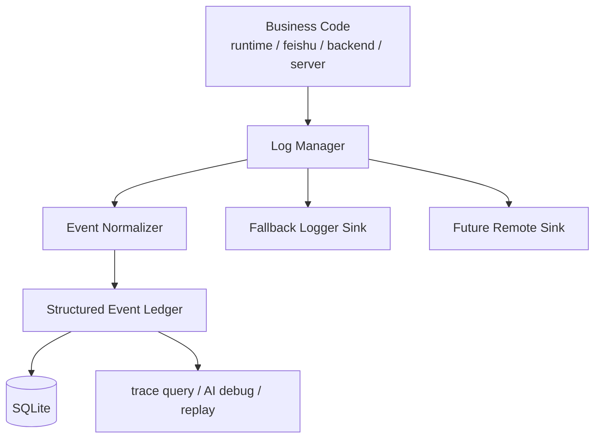

# OR-TASK-014 Log Manager 总体设计

更新时间：2026-03-19

## 1. 背景

`OR-TASK-007` 已经为消息主链路建立了第一版结构化可观测性底座：

- `src/openrelay/observability/` 已能把关键消息事件写入 SQLite。
- 系统已经具备按 `trace_id`、`relay_session_id`、`turn_id`、`incoming_message_id` 查询时间线的能力。
- `/trace` 对应的本地 CLI 已可用于读取消息事件。

但从工程角度看，当前系统仍然同时存在两套并行但边界尚未完全清楚的记录机制：

1. **Python `logging` 文本日志**
   - 分散存在于 `server`、`runtime`、`feishu`、`backends`、`presentation` 等模块。
   - 主要承担异常打印、进程启动输出、第三方组件错误信息记录等职责。
2. **`observability` 结构化事件记录**
   - 当前主要覆盖消息入口、session 解析、调度、排队、turn 终态、reply 发送等主路径事件。
   - 已经开始承担“事实来源”和“可查询调试底座”的职责。

这两套机制并不是天然冲突的，但如果不继续收敛，后续会出现几个长期问题：

- AI 调试需要的事实散落在数据库事件、stderr 文本日志、异常栈、runtime 内存态之间。
- 同一件事有时只写文本日志，有时只写结构化事件，有时两边都写，但缺少统一准则。
- `observability` 还停留在“消息 trace 子系统”，尚未升级为系统级 debug ledger。
- `logging` 仍然以“给人看”为主，而不是以“给 AI/程序检索、关联、推理”为主。

因此，需要在 `OR-TASK-007` 的基础上继续前进一步：把当前分散的 logger / observability 能力收敛成一个更稳定的上层概念，暂定名为 **Log Manager**。

## 2. 核心判断

### 2.1 这次要解决的不是“换个日志库”

这里要解决的核心问题不是：

- 要不要继续用 Python `logging`。
- 要不要把日志换成 JSON。
- 要不要把日志发去外部平台。

真正的问题是：

**openrelay 到底应该以什么东西作为系统运行事实的主来源。**

本设计给出的结论是：

- **主事实来源**应该是结构化、可持久化、可查询、可关联的事件账本。
- **文本 logger** 不再是主事实来源，而是退化为 transport / fallback / bootstrap / fatal diagnostics 机制。
- `observability` 不应长期只是“消息 trace 包”，而应演化为由 `Log Manager` 统一调度的系统级记录基础设施。

### 2.2 为什么不直接删除 `logger`

长期方向上，确实应该尽量让 AI 调试依赖数据库中的结构化事件，而不是 grep 文本日志。

但短期内不能简单粗暴地把 `logger` 直接删掉，原因有三类：

1. **启动期 / 致命失败期**
   - 例如配置解析失败、数据库尚未初始化、进程启动中断。
   - 这类场景下结构化事件链路可能还不存在，仍然需要 stderr / 进程日志兜底。
2. **第三方库 / 子进程边界**
   - Feishu SDK、Codex app server、subprocess stderr 等并不天然产出本系统定义的结构化事件。
   - 需要先经过归一化，才能进入统一账本。
3. **迁移期成本控制**
   - 当前仓库已有一批 logger 调用点，且职责并不完全相同。
   - 如果不先定义迁移分层与准则，直接删除 logger 会把风险从“重复记录”变成“失去关键信息”。

所以本设计的方向不是“logger 永久保留”，而是：

- **让 Log Manager 成为主入口。**
- **让结构化 ledger 成为主事实源。**
- **把 logger 收敛为少量保底 transport。**

## 3. 设计目标

### 3.1 目标

Log Manager 需要同时满足下面六个目标：

1. **统一记录入口**：业务代码不再分别思考“这里写 logger 还是写 observability”，而是统一面向 Log Manager。
2. **结构化优先**：默认记录结构化事件，而不是先写字符串再事后解析。
3. **AI 调试友好**：所有重要运行事实都能稳定入库，并能按 trace / session / turn / component / severity 查询。
4. **多 sink 可演化**：同一条记录可按策略写入 SQLite、stderr、未来的远端 sink，而不是业务代码手工双写。
5. **边界清楚**：消息行为、runtime 状态、provider 交互、系统故障、外部组件 stderr 要有统一分类模型。
6. **渐进迁移**：兼容当前已落地的 `observability`，允许分阶段替换现有 logger 调用点。

### 3.2 非目标

第一阶段默认不做以下事情：

- 不把所有 token streaming 明细无限制入库。
- 不立即替换所有第三方库的原生日志格式。
- 不立即引入 ELK、OpenTelemetry Collector、ClickHouse 等外部基础设施。
- 不把 `log manager` 设计成复杂可配置的通用日志平台。
- 不把所有原始请求/响应 payload 无边界写入数据库。

## 4. 现状问题建模

当前仓库中的 logger 大致可分四类：

### 4.1 进程级 / 启动级日志

典型位置：`src/openrelay/server.py`

特点：

- 用于启动信息、监听地址、启动失败、webhook 处理异常等。
- 这些日志更接近进程可用性，而不是单条用户消息事实。

### 4.2 运行期异常日志

典型位置：

- `src/openrelay/runtime/message_application.py`
- `src/openrelay/runtime/turn_application.py`
- `src/openrelay/runtime/reply_service.py`
- `src/openrelay/runtime/turn_run_controller.py`
- `src/openrelay/runtime/turn_runtime_event_bridge.py`

特点：

- 多数用于 `LOGGER.exception(...)`。
- 现在常常与结构化 trace 并存，但没有统一规则决定哪些异常必须转成正式事件。

### 4.3 外部系统 / 适配层日志

典型位置：

- `src/openrelay/feishu/ws_client.py`
- `src/openrelay/backends/codex_adapter/app_server.py`
- `src/openrelay/backends/codex_adapter/semantic_mapper.py`

特点：

- 包含 WebSocket 生命周期、subprocess stderr、协议异常、适配失败。
- 这些信息对 AI debug 很重要，但目前并没有系统化进入可查询账本。

### 4.4 表示层 / 辅助诊断日志

典型位置：

- `src/openrelay/presentation/live_turn.py`
- `src/openrelay/presentation/live_turn_view_builder.py`
- `src/openrelay/runtime/card_sender.py`

特点：

- 通常是局部渲染失败、卡片更新异常、非主业务事实。
- 是否入主事件账本，需要更清楚的取舍规则。

总结起来，当前最大的问题不是“logger 太多”，而是：

- **记录入口不统一。**
- **事件分类不统一。**
- **哪些信息必须入库、哪些只需 stderr，没有统一标准。**

## 5. 总体方案

Log Manager 不是对 `observability` 的简单重命名，而是在其上新增一层统一编排：

它包含四个核心部分：

1. **统一事件入口**：业务层只调用 `log_manager.record_xxx(...)` 或统一 `emit(...)`。
2. **事件归一化层**：把运行时上下文、分类、关联键、裁剪策略收敛起来。
3. **结构化 ledger**：SQLite 中的 append-only 事件账本，作为主事实来源。
4. **transport sinks**：stderr logger、未来远端 sink、调试导出工具都变成可替换输出端，而非主入口。

## 6. 核心概念

### 6.1 Log Manager

`LogManager` 是上层编排对象，负责：

- 接收业务侧的记录请求。
- 绑定上下文并补足标准字段。
- 决定一条记录要写入哪些 sink。
- 在 sink 失败时做降级与兜底。

可以把它理解为：

- **对内**：统一记录 API。
- **对外**：协调 ledger、stderr、未来 exporter。

### 6.2 Structured Event Ledger

这是新的主事实来源，本质上是对 `OR-TASK-007` 当前 `message_event_log` 思路的扩展。

它不再只服务“消息 trace”，而是覆盖三类事实：

1. **Message / Turn 行为事实**
2. **System / Component 故障事实**
3. **External boundary 观测事实**

其中：

- Message / Turn 事实仍以 trace 关联为主。
- System / Component 事实允许没有 `trace_id`，但必须有 component / category / severity。
- External boundary 事实用于记录 WebSocket、subprocess、SDK、provider adapter 的结构化状态变化。

### 6.3 Sink

Sink 是记录输出端，而不是事实定义端。

第一阶段建议保留三类 sink 概念：

- `ledger sink`：写入 SQLite。
- `stderr sink`：写入 Python logger / stderr。
- `null / test sink`：测试或局部禁用场景。

未来如果需要再增加：

- `jsonl sink`
- `remote exporter sink`
- `analytics sink`

### 6.4 Context

当前 `MessageTraceContext` 只覆盖消息链路。

Log Manager 需要把上下文模型分成两层：

1. **基础运行上下文**
   - `component`
   - `subsystem`
   - `backend`
   - `severity`
   - `category`
2. **关联上下文**
   - `trace_id`
   - `relay_session_id`
   - `turn_id`
   - `incoming_message_id`
   - `reply_message_id`
   - `native_session_id`
   - `execution_key`

这样才能支持“有 trace 的业务事件”和“无 trace 的系统事件”共用同一记录模型。

## 7. 记录模型

### 7.1 统一事件模型

建议把未来的记录统一成下面这类语义：

- `event_kind`：`business` / `system` / `external`
- `category`：`ingress` / `dispatch` / `turn` / `reply` / `storage` / `provider` / `process` / `network` / `subprocess` / `rendering` / `error`
- `component`：例如 `runtime.message_application`、`feishu.ws_client`、`codex.app_server`
- `event_type`：稳定的机器可读事件名
- `severity`：`debug` / `info` / `warning` / `error` / `fatal`
- `summary`：短摘要
- `payload`：受裁剪的结构化细节

### 7.2 三种记录等级

从工程治理角度，建议把所有记录分成三档：

1. **Ledger Required**
   - 必须入结构化账本。
   - 例如：message ingress、dispatch decision、turn terminal、reply sent/failed、provider fatal、subprocess crashed。
2. **Dual Write During Migration**
   - 迁移期同时写 ledger 和 logger。
   - 例如：部分历史 `LOGGER.exception` 场景。
3. **Fallback Logger Only**
   - 只需要 stderr，不进入主账本。
   - 例如：纯启动 banner、一次性开发期噪音、无法归类的极低价值文本。

这个分层的意义是：

- 防止“全都入库”导致账本被噪音淹没。
- 也防止“继续都写 logger”导致 AI 无法检索关键事实。

## 8. 数据存储方向

### 8.1 第一阶段：复用现有 SQLite 模型并扩展

不建议现在推翻 `OR-TASK-007` 已落地的 `message_event_log`。

更合理的路径是：

- 先让 `Log Manager` 复用当前 `observability` store / recorder / query 主干。
- 在 schema 层逐步把“仅消息模型”扩展为“统一 ledger 模型”。

可选方向有两种：

#### 方案 A：继续单表扩展

在现有 `message_event_log` 上增加通用字段，例如：

- `event_kind`
- `component`
- `category`
- `severity`（可与现有 `level` 收敛）
- `transport_flags`

优点：

- 迁移最平滑。
- 复用现有查询工具成本低。

缺点：

- 名字上仍然偏“message event”。
- 无 trace 的系统事件语义会显得别扭。

#### 方案 B：新增通用 `event_ledger`，旧表逐步迁移

优点：

- 模型更干净。
- 适合长期演化。

缺点：

- 迁移成本更高。
- 需要兼容旧 trace CLI 与旧查询接口。

**本设计建议先采用方案 A。**

原因很简单：

- 当前重点是先统一记录入口和分类模型。
- 表名不够完美，比起过早迁表是次要问题。
- 等记录类型稳定后，再决定是否需要统一迁移到 `event_ledger`。

### 8.2 读取方向

读取侧至少要支持：

- 按 `trace_id` 查询完整链路。
- 按 `relay_session_id` 聚合多次 trace。
- 按 `turn_id` 查看一次执行生命周期。
- 按 `component` / `category` / `severity` 查看系统问题。
- 按时间窗口查看系统错误与外部组件异常。

这意味着 `trace query` 将来会演化成更通用的 `log query`，但第一阶段可以保持兼容：

- 面向用户的 CLI 仍可先保留 `openrelay-trace`。
- 内部实现逐步升级为更通用的 ledger query service。

## 9. 模块边界建议

建议在现有 `src/openrelay/observability/` 基础上演化，而不是再平行造一个 `logging2` 包。

目标结构：

- `src/openrelay/observability/models.py`
  - 统一事件模型、上下文模型
- `src/openrelay/observability/store.py`
  - ledger schema 与持久化
- `src/openrelay/observability/query.py`
  - 查询与读取
- `src/openrelay/observability/sinks.py`
  - ledger sink / stderr sink
- `src/openrelay/observability/manager.py`
  - `LogManager` 主入口
- `src/openrelay/observability/policies.py`
  - 记录策略、裁剪策略、dual-write 规则

其中建议的依赖方向是：

- `runtime` / `feishu` / `backends` / `server`
  -> `observability.manager`
- `observability.manager`
  -> `observability.store` / `observability.sinks`
- `observability.store`
  不反向依赖 `runtime`

也就是说，`Log Manager` 的名字可以对外成立，但代码包级别未必需要新建 `src/openrelay/log_manager/`。

更推荐的做法是：

- **概念上叫 Log Manager。**
- **代码边界继续留在 `observability/` 内演化。**

这样可以避免：

- 新旧两个相似包长期并存。
- `logger`、`observability`、`log_manager` 三套名词同时存在造成边界更乱。

## 10. 与现有 logger 的关系

建议把现有 logger 调用点分三类迁移：

### 10.1 直接迁入 Log Manager 主路径

适合对象：

- 已经具有明确业务语义的记录点。
- 能关联 trace / session / turn 的错误与状态变化。

例如：

- dispatch failed
- turn failed / interrupted
- reply failed
- runtime event bridge 处理失败
- provider adapter 请求失败 / 中断 / 子进程退出

这些事件最终应变成：

- 结构化 ledger 必写
- 必要时 stderr 同步输出

### 10.2 先 dual-write，后收敛

适合对象：

- 当前依赖 `LOGGER.exception(...)` 的异常路径。
- 一时难以判断是否应保留 stderr 可读性。

做法：

- 先通过 Log Manager 输出结构化事件。
- 同时保留现有 stderr logger。
- 等 trace/debug 工具稳定后，再缩减 stderr 文本输出。

### 10.3 保持为 fallback logger

适合对象：

- 进程启动 banner。
- 无数据库可写时的致命错误。
- 第三方库尚未进入系统 ledger 语义前的原始 stderr 桥接。

这类 logger 可以长期存在，但不再被当成主调试事实源。

## 11. 分阶段实施建议

### Phase 1：统一概念层与调用入口

目标：

- 引入 `LogManager` 主入口。
- 保持底层仍复用现有 `MessageTraceRecorder` / store。
- 给出统一事件分类模型与 sink 策略。

完成标志：

- runtime 主路径不再直接依赖 recorder 细节，而依赖 manager。
- 新增系统级 / 外部边界级事件模型。

### Phase 2：主路径异常与系统事件收敛

目标：

- 把 runtime / reply / turn / dispatch 的关键 `LOGGER.exception` 收敛到 manager。
- 引入 component/category/severity 查询维度。

完成标志：

- “为什么这次 turn 失败”可以主要靠 ledger 回答，而不是靠 grep stderr。

### Phase 3：外部边界事件收敛

目标：

- 把 Feishu websocket 生命周期、Codex app server 子进程异常、关键外部协议失败纳入统一 ledger。

完成标志：

- “进程没回消息到底卡在 Feishu、runtime 还是 app server”可以靠统一查询判断。

### Phase 4：AI Debug 产品化

目标：

- 在 CLI / 后台工具层提供更面向 AI 的调试检索能力。
- 支持按问题模板快速提取关键时间线、失败链路、最近异常组件。

完成标志：

- Log Manager 不只是“存日志”，而是成为 AI debug 的一等事实底座。

## 12. 主要取舍

### 12.1 为什么概念上叫 Log Manager，而代码边界不急着改名

因为现在最需要收敛的是：

- 统一入口
- 统一分类
- 统一 sink 策略

而不是目录名本身。

如果现在为了名字好看新建 `log_manager/` 包，容易让结构变成：

- `logger`
- `observability`
- `log_manager`

三者并存，反而更乱。

### 12.2 为什么不一步到位“所有日志全入库”

因为并不是所有文本都值得成为主事实：

- 有些只是进程提示。
- 有些是短期调试噪音。
- 有些缺少稳定语义，不适合直接入账本。

所以要做的是：

- **关键事实强约束入库。**
- **低价值文本收敛到 fallback。**

### 12.3 为什么数据库优先于人类可读日志

因为这个项目后续真正需要的是：

- 可被 AI 检索
- 可被机器关联
- 可被回放和聚合
- 可成为产品能力底座

文本日志最多只是附属 transport，不应再承担主事实来源职责。

## 13. 成功标准

当 Log Manager 第一阶段设计真正落地时，至少应达到下面几个状态：

- 新增记录点时，工程师默认先思考结构化事件，而不是先拼字符串 logger。
- 关键失败路径都能在数据库中查到稳定事件，而不是只能看 stderr。
- `observability` 不再只是“消息 trace 包”，而成为统一 ledger 基础设施。
- `logger` 的职责被清晰压缩到 bootstrap / fallback / fatal diagnostics。
- 后续 AI debug、trace replay、状态摘要等能力都基于同一份事实源继续演化。

## 14. 后续工作

这份文档只定义总体方向，不展开详细实现。

下一步详细设计建议至少回答下面几个问题：

1. `LogManager` 的具体 API 如何设计。
2. 现有 `MessageTraceRecorder` 如何被吸收到 manager 下。
3. sink / policy / context 的类图与依赖关系如何组织。
4. `message_event_log` 需要如何扩字段，或何时迁到更通用的 ledger 表。
5. 当前各模块 logger 调用点分别属于哪类迁移桶。
6. trace CLI 如何向更通用的 log query 能力演化。

在这些问题明确之前，不建议直接开始大范围替换 logger 调用点。
