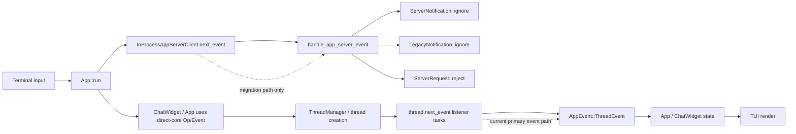

# Codex App-Server Consumption Comparison

更新时间：2026-03-16

## 目的

梳理两条链路：

1. `openrelay` 当前如何消费 `codex app-server`
2. `codex cli` 的 TUI 目前如何消费 `app-server`

目标不是泛泛描述协议，而是回答一个更具体的问题：两边各自把 `app-server` 放在调用链的什么位置，哪些层真正消费了它，哪些层仍然没有迁过去。

## 结论

- `openrelay` 已经把 `codex app-server` 放在正式主路径上。
- `openrelay` 的展示层并不直接消费 `app-server` 原始 method / params，而是先把 protocol 映射成统一 `RuntimeEvent`，再经 reducer 归约成 `LiveTurnViewModel`，最后由 presenter 产出 Feishu 展示快照。
- `codex cli` TUI 在官方 `main` 分支上已经内嵌 `InProcessAppServerClient`，并在主循环里监听它的事件流。
- 但截至 2026-03-16，TUI 仍处于 hybrid migration period：当前 `app_server_adapter.rs` 对 `ServerNotification` 和 `LegacyNotification` 不做处理，对 `ServerRequest` 直接 reject；主 UI 事件仍主要来自 direct-core 的 `ThreadManager` / `thread.next_event()`。
- 官方仓库已经有多条开放 PR，在把 fresh / resume / fork thread lifecycle 逐步迁到 app-server，因此 TUI 的现状应理解为“正在迁移中”，而不是“已经完全基于 app-server”。

## Openrelay 当前链路

### 调用关系

```mermaid
flowchart LR
  A[Feishu IncomingMessage] --> B[RuntimeOrchestrator.dispatch_message]
  B --> C[BackendTurnSession.run_with_agent_runtime]
  C --> D[AgentRuntimeService.run_turn]
  D --> E[CodexRuntimeBackend.start_turn]
  E --> F[CodexSessionClient.start_turn]
  F --> G[CodexRpcTransport.request]
  G --> H[codex app-server RPC<br/>thread/start|resume + turn/start]

  H --> I[app-server notifications<br/>thread/started turn/started item/*]
  I --> J[CodexTurnStream.handle_notification]
  J --> K[CodexProtocolMapper.map_notification]
  K --> L[Unified RuntimeEvent]
  L --> M[AgentRuntimeService event_hub + turn_registry]
  M --> N[LiveTurnViewModel]
  N --> O[LiveTurnPresenter.build_snapshot]
  O --> P[Feishu streaming card / final reply]
```

### 分层解释

#### 1. 入口层

`RuntimeOrchestrator.dispatch_message()` 接收 Feishu 消息，完成 session 解析、串行化控制和 stop / follow-up 处理，然后进入 turn 执行主路径。

关键代码：

- `src/openrelay/runtime/orchestrator.py`

#### 2. turn 执行层

`BackendTurnSession.run_with_agent_runtime()` 通过 `AgentRuntimeService.run_turn()` 驱动统一 runtime，而不是直接操作某个 provider-specific 协议。

这一层的重要点是：

- 运行时只知道 `TurnInput`
- backend 返回的是统一 runtime event 流
- 展示刷新由 runtime event 驱动

关键代码：

- `src/openrelay/runtime/turn.py`
- `src/openrelay/agent_runtime/service.py`

#### 3. Codex backend 适配层

`CodexRuntimeBackend.start_turn()` 会拿到对应的 `CodexSessionClient`。  
`CodexSessionClient.start_turn()` 负责：

- 必要时先 `thread/start` 或 `thread/resume`
- 再发 `turn/start`
- 订阅 notification / server request
- 把流式协议事件交给 `CodexTurnStream`

关键代码：

- `src/openrelay/backends/codex_adapter/backend.py`
- `src/openrelay/backends/codex_adapter/client.py`
- `src/openrelay/backends/codex_adapter/transport.py`
- `src/openrelay/backends/codex_adapter/turn_stream.py`

#### 4. 协议归约层

`CodexProtocolMapper` 不让上层直接面对 `thread/started`、`item/agentMessage/delta`、`item/commandExecution/requestApproval` 这些 provider-specific method。

它把 protocol 映射成统一语义：

- `assistant.delta`
- `reasoning.delta`
- `tool.started`
- `tool.completed`
- `approval.requested`
- `turn.completed`

因此 `openrelay` 真正消费的不是原始 app-server protocol，而是 mapper 归约后的统一 runtime event。

关键代码：

- `src/openrelay/backends/codex_adapter/mapper.py`

#### 5. 展示层

`AgentRuntimeService` 通过 event hub + reducer 维护 `LiveTurnViewModel`。  
`LiveTurnPresenter` 再把统一状态转换成 Feishu 卡片快照和最终回复文本。

这意味着 presentation 层不依赖 `app-server` 的 method 名称和 params 形状。

关键代码：

- `src/openrelay/agent_runtime/service.py`
- `src/openrelay/presentation/live_turn.py`

### openrelay 的结构特征

- `app-server` 是正式 transport，不是旁路。
- protocol 在 backend adapter 边界被收口。
- runtime / presentation 消费统一状态，不消费原始协议。
- approval 也已经走 `app-server` server request -> 统一 interaction -> response 的闭环。

## Codex CLI TUI 当前链路

### 当前主线判断

官方 `main` 分支已经引入：

- `codex_app_server_client::InProcessAppServerClient`
- `app_server.next_event()`
- 专门的 `app/app_server_adapter.rs`

但当前 adapter 文件仍明确声明它处于 temporary adapter / hybrid migration period。

### 调用关系



### 分层解释

#### 1. app-server 已经进入主循环

`App::run()` 的 `select!` 里已经显式监听 `app_server.next_event()`，这说明 TUI 不是完全不知道 app-server。

同时，它仍在监听：

- `thread_manager.subscribe_thread_created()`
- `thread.next_event()`

这说明 direct-core 事件源仍然在主路径里。

#### 2. 当前 adapter 还没有真正消费 app-server 事件

`app/app_server_adapter.rs` 当前逻辑是：

- `Lagged`：记 warning
- `ServerNotification`：忽略
- `LegacyNotification`：忽略
- `ServerRequest`：直接 reject

因此从“谁在驱动 UI 变化”这个问题来看，当前 TUI 还没有把 app-server notification / request 真正接进主展示链。

#### 3. 当前主展示链仍偏 direct-core

`handle_thread_created()` 仍然会：

- 通过 `self.server.get_thread(thread_id)` 取 thread
- 起一个 listener task
- 循环 `thread.next_event().await`
- 转成 `AppEvent::ThreadEvent`
- 再驱动 `App / ChatWidget`

从结构上看，这条 direct-core 事件链仍是当前主 UI 的事实来源。

## 两条链路的核心差异

| 维度 | openrelay | codex cli TUI（截至 2026-03-16） |
| --- | --- | --- |
| `app-server` 角色 | 正式主 transport | 已接入，但仍处于迁移态 |
| protocol 消费位置 | backend adapter 层 | 目前尚未完整进入主展示链 |
| 上层是否直接消费原始 method | 否 | 当前主路径也不是直接消费 app-server method，而是继续消费 direct-core event |
| 展示层输入 | `LiveTurnViewModel` | `AppEvent` / `EventMsg` / `ChatWidget` 内部状态 |
| approval 处理 | 已形成 server request 闭环 | 当前 adapter 对 server request 直接 reject |
| 架构趋势 | 已完成 protocol -> runtime 归约 | 正在从 direct-core 向 app-server 迁移 |

## 设计含义

这两条链路最本质的区别，不是“有没有拉起 app-server”，而是“谁在真正消费它”。

### openrelay

`openrelay` 已经完成了下面这件事：

`app-server protocol -> backend-neutral runtime semantics -> presentation`

因此它的展示层、交互层、session binding 都不再绑定 `codex app-server` 的 method 细节。

### Codex CLI TUI

当前官方 TUI 更像：

`app-server wiring introduced -> direct-core still drives UI -> migration continues`

也就是说，TUI 已经开始把 thread lifecycle 往 app-server 收，但“app-server 成为唯一主事件源”这件事仍在进行中。

## 对 openrelay 的启发

如果 `openrelay` 的目标是“尽量像原生 TUI”，正确对齐对象不应该是“照抄当前 TUI 的临时混合态实现”，而应该是对齐它正在收敛的方向：

- 让 `app-server` 只停留在 backend adapter 边界
- 不把展示层写成 protocol method switchboard
- 让交互、审批、流式状态都消费统一 runtime 语义

从这个角度看，`openrelay` 当前主线实际上比官方 TUI 的迁移中间态更收敛。

## 证据

### openrelay 仓库内代码

- `src/openrelay/runtime/orchestrator.py`
- `src/openrelay/runtime/turn.py`
- `src/openrelay/agent_runtime/service.py`
- `src/openrelay/backends/codex_adapter/backend.py`
- `src/openrelay/backends/codex_adapter/client.py`
- `src/openrelay/backends/codex_adapter/transport.py`
- `src/openrelay/backends/codex_adapter/turn_stream.py`
- `src/openrelay/backends/codex_adapter/mapper.py`
- `src/openrelay/presentation/live_turn.py`

### 官方外部资料

- `codex app-server` README  
  <https://github.com/openai/codex/blob/main/codex-rs/app-server/README.md>
- TUI app-server adapter  
  <https://github.com/openai/codex/blob/main/codex-rs/tui/src/app/app_server_adapter.rs>
- TUI 主循环  
  <https://github.com/openai/codex/blob/main/codex-rs/tui/src/app.rs>
- 开放 PR: `feat(tui): migrate TUI to in-process app-server`  
  <https://github.com/openai/codex/pull/14018>
- 开放 PR: `feat(tui): route fresh-session thread lifecycle through app-server`  
  <https://github.com/openai/codex/pull/14699>
- 开放 PR: `feat(tui): route resume and fork thread lifecycle through app-server, eliminating DirectCore transport`  
  <https://github.com/openai/codex/pull/14711>
- 开放 PR: `Move TUI on top of app server (parallel code)`  
  <https://github.com/openai/codex/pull/14717>

## 限制与时效性说明

- `codex cli` TUI 的结论是基于 2026-03-16 查询到的官方 `main` 分支源码和当日仍处于 open 状态的 PR。
- 由于这部分正处于快速迁移期，如果后续这些 PR 合并，本文对 TUI 现状的描述可能会很快失效。
- `openrelay` 部分结论基于当前仓库代码，时效点同样为 2026-03-16。
