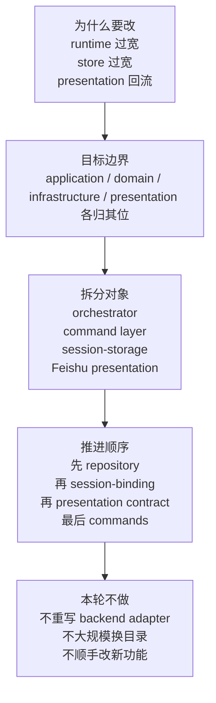
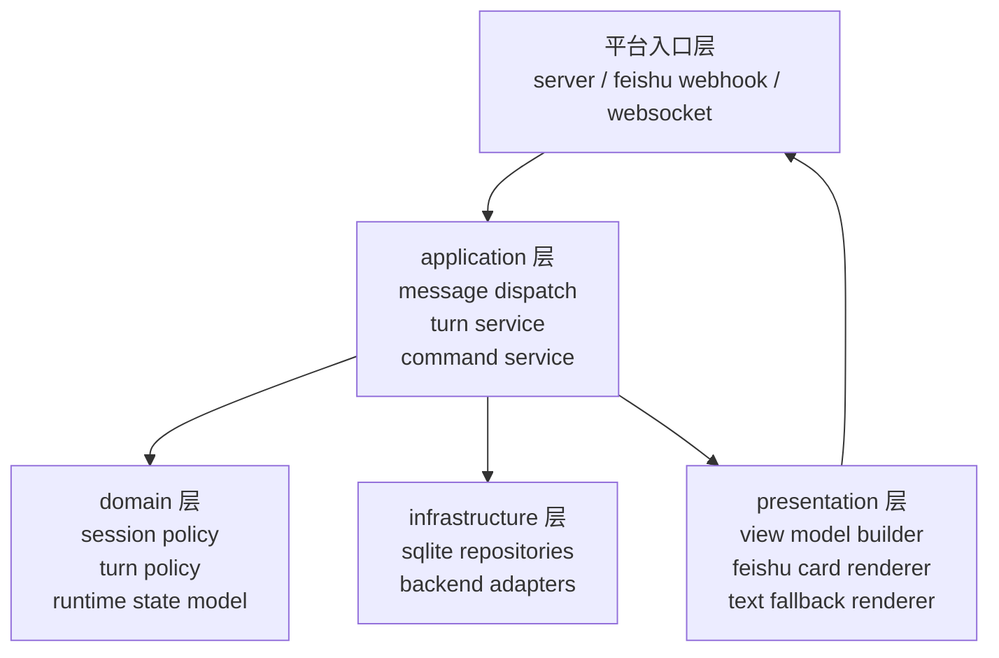
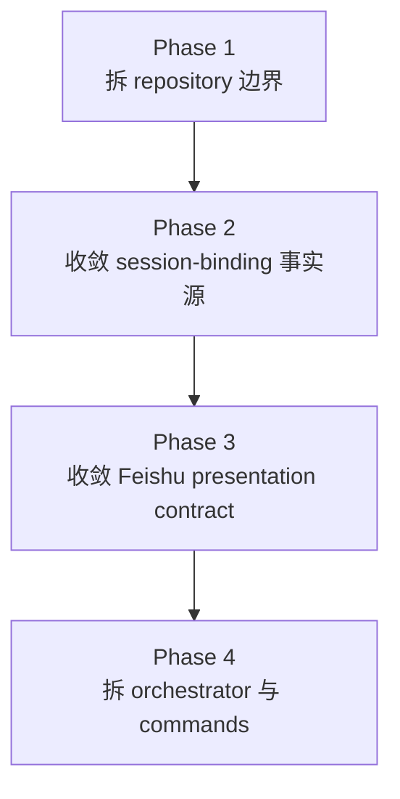
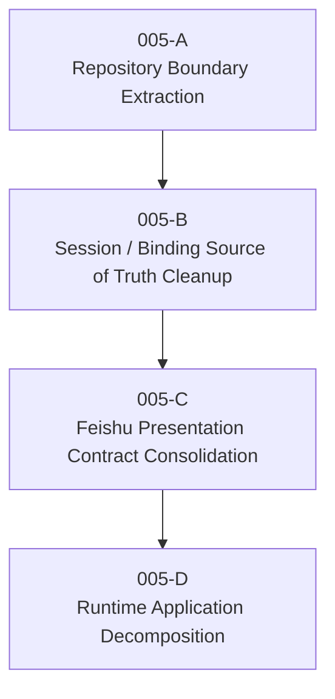

# OR-TASK-005 Runtime Boundary Refactor Overall Plan

更新时间：2026-03-18

## 这份文档回答什么

这份文档不再重复代码实勘细节，而是作为 `OR-TASK-005` 进入实现前的总体方案，集中回答五个问题：

1. 为什么要改。
2. 改完系统边界变成什么样。
3. 哪几块要拆。
4. 先做什么，后做什么。
5. 哪些事情这轮明确不做。

如果要继续看现状证据、问题定位和代码级观察，回到 `docs/design/or-task-005-runtime-boundary-refactor-design.md`。

## 一页看懂

## 为什么要改

`openrelay` 当前不是单点 bug，而是主路径边界已经持续漂移。继续直接叠需求，结构会越来越不稳定。

核心原因有四个：

- `RuntimeOrchestrator` 已经同时承担装配、编排、平台策略、回复选择和一部分业务规则，接近总入口 god object。
- `StateStore` 同时承载 repository、migration、scope policy、dedup、transcript、高层查询语义，已经不是单纯存储层。
- `presentation` 反向参与 `session` 和 `release` 语义，导致展示层不再是最外层。
- `SessionRecord` 和 `SessionBinding` 都在表达一部分“当前真实后端状态”，于是只能靠同步补丁维持一致。

如果不先收敛这些边界，会直接产生三类后果：

- 新需求会继续堆进 `runtime/orchestrator.py`、`runtime/commands.py`、`storage/state.py`。
- 流式 turn、session 管理、Feishu 呈现三个方向的修改会互相牵连。
- 代码看似还能跑，但系统真实边界越来越模糊，后续每次改动都需要更大上下文。

## 改完之后系统边界应该是什么样

目标不是“目录更漂亮”，而是把主路径重新压回清晰的依赖方向。

边界收敛后的基本约束：

- `runtime` 只保留 application orchestration，不再直接拥有 Feishu 卡片拼装细节。
- `session` 和 `release` 只表达领域规则与应用动作，不再依赖 `presentation`。
- `presentation` 只消费整理后的 view model 或 reply result，不再反查 session/browser/store。
- `storage` 只提供清晰 repository，不再暴露一个万能 `StateStore` 给上层直接加功能。
- `SessionRecord` 和 `SessionBinding` 各自有唯一职责，不再双向同步。

## 哪几块要拆

这轮建议拆四块，但不是四块并行大改，而是按依赖关系逐段推进。

### 1. Session / Storage 边界

目标：把“万能 `StateStore`”拆成明确 repository 边界。

要拆出的核心对象：

- `SessionRepository`
- `SessionBindingRepository`
- `MessageRepository`
- `DedupRepository`
- `ShortcutRepository`
- `SessionAliasRepository`

这一步解决的是存储职责过宽，不直接改用户可见行为。

### 2. Session State / Backend Binding 事实源

目标：让 relay session 信息和 backend attachment 信息各归其位。

要收敛的核心问题：

- `SessionRecord` 只保留 relay 视角的稳定 session 配置和归属。
- `SessionBinding` 成为 backend thread / native session attachment 的唯一事实源。
- 删除 `_sync_session_record()` 这类反向同步补丁。
- 重新梳理 placeholder control session 语义，避免读路径启发式修补。

### 3. Runtime Application 层

目标：把 `RuntimeOrchestrator` 和 `RuntimeCommandRouter` 从“大而混”收回到薄编排层。

建议拆出的应用服务：

- `MessageDispatchService`
- `TurnApplicationService`
- `CommandApplicationService`

职责原则：

- orchestrator 只做入口装配和转发。
- command router 只做解析和 handler 分发。
- 业务执行放入独立 service / handler，不再混在入口大文件中。

### 4. Feishu Presentation Contract

目标：把 Feishu 呈现收敛成真正最外层的一套 contract。

建议收敛出的结构：

- backend-neutral reply/view model builder
- Feishu card renderer
- Feishu text fallback renderer
- 统一的 `RenderedReply` 或同类回复对象

这一步要解决的不是“UI 好不好看”，而是：

- card JSON 只在一个边界里生成。
- fallback text 只维护一套语义。
- runtime 不再直接决定具体卡片结构。

## 先做什么 后做什么

顺序必须按依赖收敛，而不是按文件看起来最乱的地方下手。

### Phase 1：先拆 repository 边界

先做这一步，因为这是后续几乎所有重构的地基。

输出应包括：

- 上层不再直接依赖万能 `StateStore`。
- `session`、`runtime`、`release` 改为依赖明确 repository 接口。
- sqlite 细节仍可保留在一处，但不再外溢为总服务对象。

### Phase 2：再收敛 session-binding 事实源

这一步在 repository 边界稳定后做，避免“一边拆存储一边改事实源”混成一次大 patch。

输出应包括：

- 明确 `SessionRecord` 与 `SessionBinding` 的字段所有权。
- 删除双向同步补丁。
- control session 的创建与可见规则明确化。

### Phase 3：然后统一 Feishu presentation contract

这一步在 session/storage 基础稳定后做，因为呈现层需要消费稳定的上游结果，而不是继续直接反查 store。

输出应包括：

- help / panel / live turn / approval 的回复 contract 收敛。
- card 与 fallback text 从“分散拼接”改为“统一渲染结果”。
- `presentation` 不再回头查询 session/browser/store。

### Phase 4：最后拆 orchestrator 与 commands

放在最后，不是因为它不重要，而是因为它依赖前面三步的边界已经稳定。

输出应包括：

- orchestrator 退化为薄入口。
- commands 从总路由器改成解析 + handler 分发。
- turn / command / interaction 主路径更容易单测和演化。

## 哪些事情这轮不做

为了保证 `005` 真正收敛边界，而不是顺手做一次大杂烩，这轮明确不做下面这些事情。

### 1. 不重写 backend adapter

`codex_adapter` / `claude_adapter` 不是当前主问题。它们可以继续作为既有基础设施层存在，不进入这轮重构主线。

### 2. 不顺手做飞书体验新功能

例如新的 transcript 效果、更多卡片样式、额外交互控件，这些属于体验层演进，不应该和边界重构绑在同一轮。

### 3. 不大规模改目录名或包名

先让职责稳定，再决定是否需要目录级搬迁。不要把“移动文件”误当成“完成重构”。

### 4. 不引入长期双轨兼容

如无明确必要，不保留旧 store 路径和新 repository 路径长期并存，也不保留旧 card contract 和新 contract 双轨维护。

### 5. 不在同一轮同时推进 storage、runtime、presentation 三条线的大范围行为改动

每一轮实现必须只解决一个收敛问题，并形成可独立提交的结果。

## 建议的实施任务切分

为了让后续实现能保持提交粒度清晰，建议把 `OR-TASK-005` 拆成以下执行任务：

每个子任务都应满足：

- 能独立提交。
- 能独立验证。
- 不把多个边界问题混成一个 patch。

## 完成后的验收口径

当 `OR-TASK-005` 真正完成时，至少要满足下面这些结构结果：

- `session` 和 `release` 不再依赖 `presentation`。
- `presentation` 不再直接查询 `store` 或 `session browser`。
- `StateStore` 不再承担 repository 之外的高层职责。
- `SessionBinding` 不再通过回写 `SessionRecord` 保持一致。
- Feishu reply contract 收敛到最外层。
- `RuntimeOrchestrator` 明显退化为薄入口，`commands.py` 不再承载大量业务逻辑。

## 与现有设计稿的关系

两份文档分工如下：

- `or-task-005-runtime-boundary-refactor-design.md`
  - 负责记录现状、证据、问题和详细重构方向。
- `or-task-005-runtime-boundary-overall-plan.md`
  - 负责作为进入实现前的总纲，回答范围、边界、阶段和非目标。
